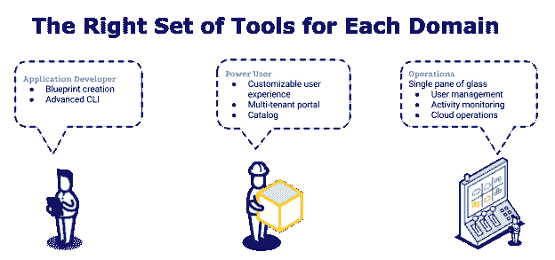
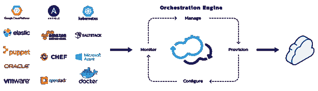
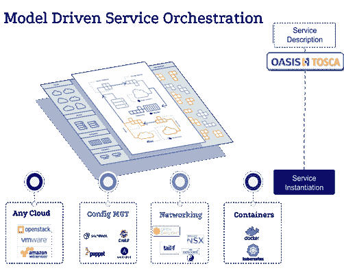

# 借助模型驱动的服务编排创建下一代云计算管理平台

> 原文：<https://thenewstack.io/creating-next-generation-cloud-management-platform/>

[Nati Shalom](http://cloudify.co/)

[Nati Shalom 负责定义 Cloudify 产品的技术路线图和愿景，并负责与技术合作伙伴建立战略关系。Nati 为 Cloudify 带来了他在分布式计算方面的多年经验，他是大规模部署中所涉及的挑战和解决方案方面的行业专家。作为云计算领域的思想领袖，Nati 是 cloud.org.il 联盟的创始人，经常出席行业会议，并积极参与宣传基于空间的架构、数据网格模式和大数据应用的实时分析。](http://cloudify.co/)

在这个新兴的[devo PS](/category/devops/)时代，企业 IT 协作的呼声达到了白热化。不幸的是，传统的云管理平台(CMP)和多种云环境已经在软件交付流程中创造了 IT 孤岛，更不用说业务部门和中央 IT 部门之间的不信任了，这阻碍了生产力和创新。

在最近的一篇博文[中，我比较了云应用程序管理的替代方法——云管理平台、平台即服务和流程编排框架——并得出结论，没有一种方法可以同时服务于业务部门和中央 IT 部门，而不会造成重大损失。](http://cloudify.co/2017/04/26/the-end-cloud-management-as-we-know-it.html)

这需要新的思维:我们需要下一代 CMP——一个以通用工具集和集中管理为特色，旨在为协作、高效的 IT 环境提供动力的 CMP。

## 满足所有企业 IT 用户的需求

让我们首先考虑企业 IT 的三种角色，以及每种角色对下一代 CMP 的需求:

企业 IT 中的三个角色(Cloudify)。

在业务部门，我们通常会发现两种类型的用户。第一类是最终用户，他们希望通过简单的点击体验获得所需的服务，而不必担心基础架构的管理。相比之下，超级用户是应用程序的所有者，负责确保应用程序的性能和配置；这个超级用户需要对基础设施有更大的控制权。

在中央 IT(运营)部门，我们的用户是组织中的云服务提供商，负责管理公共环境，并确保所有业务部门都能运营和交付其应用程序。运营部门还负责提供一组不依赖于特定应用程序的通用服务，如数据库服务、分析服务、自动化和监控，并负责解决安全性、法规和成本等问题。

## 下一代 CMP 有什么不同？

下一代 CMP 考虑了企业 IT 中所有三种角色的需求，因此满足以下要求:

*   让业务部门在选择云、基础架构资源甚至应用框架方面拥有更高的灵活性。
*   提供容器支持，因为云原生应用是作为一组[微服务](/category/microservices/)构建的，而不是作为一个整体应用。
*   集成了用于监控、计费和日志记录的同类最佳开源解决方案，为用户提供即插即用的单一控制台体验。
*   简化并加快新框架和应用程序的采用，通过托管服务(例如数据库即服务、报告即服务和应用程序服务器即服务)消除管理应用程序的复杂性。
*   使用通用工具实现一切自助服务，允许中央 IT 部门快速交付所需服务。
*   提供应用驱动的关键性能指标(KPI)和活动监控，例如部署的应用数量、每个云的实例数量以及每个部署的规模和状态，业务部门的应用用户可以通过 API 轻松访问所有这些内容。
*   分享关于成本和利用率的可行见解，从而触发适当的响应，例如故障切换、扩展或关闭未使用的资源。
*   将网络和应用程序管理结合在一起，使网络跟随应用程序，不仅由网络运营商配置和控制，也由应用程序所有者配置和控制。

## 由模型驱动、编排优先的方法带给你

实现上述要求的关键促成因素是采用模型驱动、流程优先的云管理方法，而不是像传统云管理那样采用基础架构优先的方法。这实质上意味着使用通用模型和自动化流程编排将应用程序转变为自我管理的服务。它是这样工作的:

编排提供了一个通用的自动化引擎(Cloudify)。

1.  使用模型驱动的模板，开发人员定义应用程序描述和特定的目标堆栈，包括管理它的方式，而 orchestrator 负责将这些模板映射到与底层资源交互的自动化执行计划中(见上文)。
2.  作为共享多云环境的服务提供商，中央 IT 使用 orchestrator 来控制应该向应用程序开发人员公开哪些资源以及如何公开(见下文)。

模型驱动的编排提供了业务单元和中央 IT (Cloudify)之间的接口。

## 了解下一代 CMP 的工作情况

这里，用更实际的术语来说，是下一代 CMP 如何为所有企业 IT 用户提供价值的几个例子:

### 应用程序开发人员:选择您的堆栈和环境

*   **Catalog:** 为开发人员提供了一种通过自管理服务选择和激活目标环境的简单方法。
*   **为流行的云环境提供内置集成和支持:**在不暴露“最小公分母”的情况下提供支持这包括 Docker 和 Kubernetes 等容器框架以及数据库即服务(DBaaS)等服务。
*   **简单的 CLI 体验:**允许开发人员通过命令行界面从本地桌面环境运行应用程序进行开发和测试。

### 超级用户:对环境及其资源行使更大的控制权。

*   **模型驱动的蓝图:**提供了自动化关键工作流的接口，这些工作流是管理应用程序和与底层资源交互所必需的。
*   **模型驱动设计**:提供对 CMP 中暴露的资源的 Restful API 访问，从基础设施资源到监控系统。
*   **通过插件的扩展**:提供一个接口来扩展 CMP，以支持任何需要成为应用程序生命周期一部分的资源或 API 端点。
*   CLI 接口:与构建系统集成的流行选择。

### 中央 IT 操作员:管理和控制资源组合

*   **多租户、自助服务门户**:提供一个中央界面来控制访问和资源分配。
*   **应用/服务报告和洞察**:跟踪每个应用的关键 KPI。
*   **活动监控**:监控一段时间内每个应用程序的每个用户的活动。

## 最后一点:开发者自由也就是商业成功

中央 IT 在企业中的现代角色是支持和授权业务单元中的开发人员；相反，开发人员必须作为主动的合作伙伴而不是中央 IT 的被动消费者进行协作。此处描述的下一代 CMP 通过提供一个通用平台和一组自我管理的服务来实现这种富有成效的合作关系，为开发人员提供了更高的自由度，使他们能够随时访问推动业务成功所需的资源。

图片由 [Cloudify](http://cloudify.co/) 提供。

<svg xmlns:xlink="http://www.w3.org/1999/xlink" viewBox="0 0 68 31" version="1.1"><title>Group</title> <desc>Created with Sketch.</desc></svg>