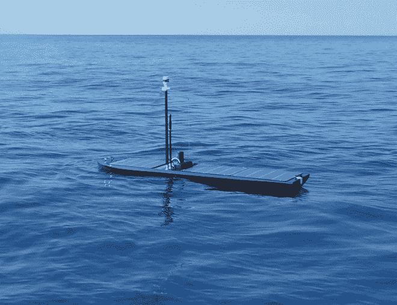
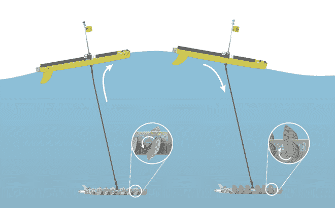
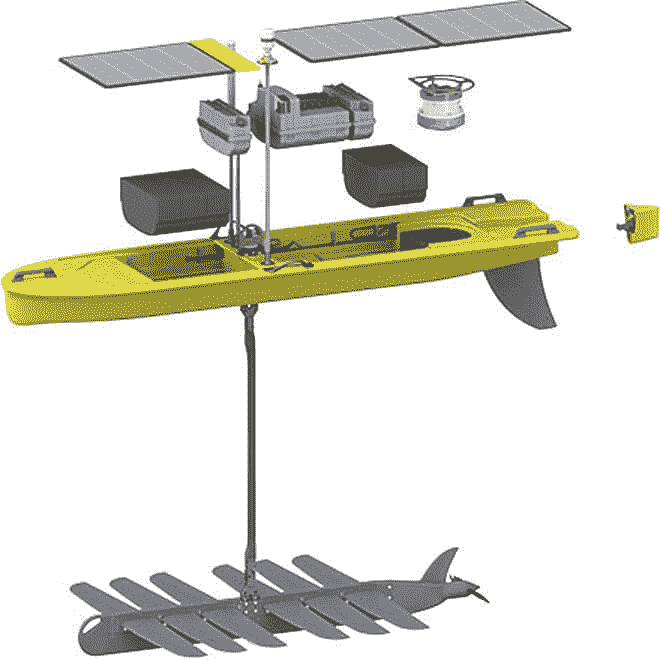

# Creating Ocean Networks with Drones That Roam the Seas

> 原文：<https://thenewstack.io/creating-ocean-networks-with-drones-that-roam-the-seas/>

While drones have been mostly associated with military applications during the last decade, they are now slowly making their way into the mainstream. We’ve written before about how new developments in drone technology and [machine learning](https://thenewstack.io/whats-store-machine-learning-2016/) can be deployed to help [improve crop yields](https://thenewstack.io/bee-inspired-autonomous-robots-improve-crop-yields/), besides delivering [groceries](https://thenewstack.io/self-driving-grocery-delivering-robots-ready-roll-door/) *and* [medical supplies](https://thenewstack.io/drones-deliver-life-saving-medical-supplies-rwanda/).

But all this may be just the tip of the iceberg in this new era of the drone. These remote-controlled, unmanned vehicles may also help stem the tide of illegal wildlife poaching that decimating not only animals on the land but in the waters of the oceans as well, where they may very well play a huge part in the future of ocean surveillance. One example is the wave- and solar-powered [Wave Glider](http://www.liquid-robotics.com/platform/how-it-works/), an autonomous surface vehicle (USV) for the ocean that recently completed a four-month long surveillance mission covering 2,808 nautical miles (3,231 miles)through the South Pacific.

The aim of the voyage was to help the UK Foreign & Commonwealth Office (FCO) protect the [Pitcairn Island Marine Sanctuary](https://www.theguardian.com/environment/2015/mar/18/pitcairn-islands-marine-reserve-budget-2015), touted as the world’s largest, continuous marine reserve, established last year. Besides accomplishing an impressive 213-day journey without the need to refuel, the mission gathered 9,516 instances of meteorological, oceanographic, and marine biodiversity data in remote, inaccessible areas rarely traveled by humans. The data is being used by the U.S. Department of State-sponsored [Fishackathon](http://www.fishackathon.co/), a program that brings developers together to create new technologies to stop illegal fishing.

该项目不仅仅是在遥远的水域中击落一架隐形无人机。波浪滑翔机由加州桑尼维尔公司 [Liquid Robotics](http://www.liquid-robotics.com/) 开发，该公司希望利用正在改变我们陆地生活的相同技术——传感器、大数据、物联网连接和云计算——来创建一个“海洋网络”，覆盖我们海洋的广阔、未知的前沿。

Liquid Robotics 的联合创始人兼首席技术官罗杰·海因(Roger Hine)说:“波浪滑翔机往返于偏远任务区的能力是我们客户的真正游戏规则改变者。这使他们能够从以前无法到达的水域收集实时数据，而无需支付载人部署或回收任务的费用。这是一个非常强大的工具，可以帮助我们的客户抓住海上新机遇。”

https://youtu.be/jSnFrJqqW_E

https://youtu.be/Hx5sntHLpu4

## 收集数据的“海洋路由器”

受创始人罗杰·海因和约瑟夫·里齐最初试图制造一台可以记录鲸鱼歌曲的机器的启发，Wave Glider 本质上是一个数据和能量收集机器人，或者正如该公司所描述的那样，是一个“持久的移动数据收集平台”，能够全天候收集数据。由于它由海浪和阳光中的可再生能源提供动力，它能够在长达一年的时间里无需人工干预就能自行推进。

这台机器实际上由两部分组成:一部分浸没在水中，另一部分漂浮在水面上。总的来说，这些部件正在不断地将海浪上下运动获得的动能转化为向前的推进力，尽管它以每小时 3.5 英里的速度缓慢前行。

当海洋过于平静而无法产生足够的能量时，无人机的太阳能备用系统就会接管，使用储存在电池中的太阳能。此外，太阳系可以在意想不到的情况下(想想飓风、高流速和其他海洋风暴)提供更多的推力，并负责为传感器供电。

## 开放式建筑

波浪滑翔机的自主导航系统将允许实时通信，以及部署协调的滑翔机舰队的能力。无人驾驶飞机充当水下声学通信和水上无线电传输之间的一种中介，将水面无线电天线和调制解调器与水下对应设备配对。与其他可能发送数据太慢或不允许足够移动的解决方案相比，Wave Glider 的系统允许数据更快地发送和接收。

“我们认为[波浪滑翔机]将成为海洋的路由器，”海因斯告诉洛杉矶时报。“一旦你开始将事物网络化，然后拥有无处不在的通信和定位，事情就会变得有趣起来。”

除了这种增强的海洋连接性，波浪滑翔机还使用了开放式传感器和有效载荷集成架构，其特点是灵活的设计，允许以“即插即用”的方式更换不同的传感器模块，用于不同的应用，从天气预报，收集生态和地球物理数据，提供卫星通信点，以及从事[监测和防御](http://www.latimes.com/business/la-fi-adv-underwater-drones-20160722-snap-story.html)的工具。

现在知道这些类型的自动驾驶车辆将产生什么样的大规模影响还为时过早，但与已经到位的缓慢、分散且往往不可靠的海洋探索和监视系统相比，像波浪滑翔机这样的海洋无人机可以彻底改变对海洋的科学认识，此外还可以为政府提供可行的工具来阻止过度捕捞。这些技术有可能建立一个可互操作和无缝联网的海洋物联网的想法也非常诱人；毕竟，这些机器人正在收集的数据无疑将在未来海洋领土政策和国际协议的形成中发挥作用。对于我们的海洋来说，这是一个勇敢的新世界，无人机正在帮助引领方向，希望是更好的。

在[液体机器人](http://www.liquid-robotics.com/)了解更多信息。

图片:液体机器人

<svg xmlns:xlink="http://www.w3.org/1999/xlink" viewBox="0 0 68 31" version="1.1"><title>Group</title> <desc>Created with Sketch.</desc></svg>