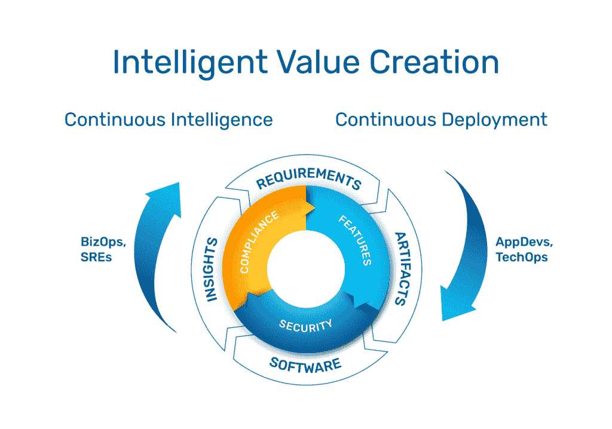

# 通过持续交付为您的企业创造价值

> 原文：<https://thenewstack.io/creating-value-for-your-enterprise-with-continuous-delivery/>

 [安德鲁·巴克斯

安德鲁是军械库的工程副总裁，也是该公司的第一名员工。在过去的六年里，他建立了 Armory platform，作为一个可靠的企业软件交付平台，并建立了一个世界级的工程团队。他之前是@ShareThis 的一名工程师，在那里他从事大数据工作并构建内部开发工具。在此之前，他经营自己的 IT 咨询业务。](https://www.linkedin.com/in/robertandrewbackes/) 

成功和繁荣的公司明白创新和为客户创造价值是多么重要。在数字经济中，这意味着缩短软件发布的时间间隔。历史上，发布之间的时间间隔是以月甚至年来衡量的，这限制了创新和生产力。

随着云原生软件成为常态，客户期望高质量的软件和服务能够满足他们的需求，跟上市场的步伐，并且可靠、安全。一个持续满足这些需求的企业通过让他们的团队(谁)在正确的时间(何时)在正确的地点(在哪里，例如在云中)做正确的事情(做什么)来创造价值。

为客户创造价值需要客户的早期和频繁反馈。这种反馈被区分优先级，并映射到开发、测试、交付、支持和维护软件的团队的需求。赋予这些团队现代软件开发能力，包括持续交付的平台，有助于他们快速响应反馈。快速的反馈-响应弧产生更好的客户反馈，这启动了反复接收和响应反馈的良性循环。这种最佳数字体验与连续交付(CD)的共同创造让客户愉悦并创造价值。

当您改进和扩展 CD 功能时，网络安全对于保护您的企业创造的价值至关重要。当然，交付给客户的软件需要是安全的，并根据适当的安全和遵从标准进行验证。然而，软件交付管道也需要是安全的。这意味着 CI/CD 登录、基础架构、构建、集成、测试、平台和映像必须按照安全团队审查和批准的程序和实践进行管理，包括安全测试和合规性保证。

在满足客户的共同使命的激励下，团队之间的协作不断地改进他们交付的软件，即使他们扮演不同的角色，拥有不同的技能，并从不同的角度看待 CD。这些人是谁？他们是如何走到一起用 CD 创造价值的？他们是做什么的？他们关心什么？让我们从人开始，应用程序开发、站点可靠性工程和操作团队的队友，了解他们做什么和如何做。

## **应用开发者(AppDevs)**

应用程序开发人员关心新特性的交付和他们软件的质量，正如 QA 团队所评估的那样。他们希望通过集成的自动化平台频繁交付和按需部署。AppDev 团队的黄金标准是通过每天从可重用的软件管道部署几十到几千次来实现精英速度。实现精英稳定同样重要。在许多市场中，这意味着 99.9%的部署必须一次成功，并且随着时间的推移同样可靠。因此，elite 稳定性相当于每年不到 9 个小时的停机时间。

应用程序开发人员必须在他们编写软件时创造价值的好处与交付新的创新产品或更新生产中的产品相关的安全风险之间进行平衡。他们依靠安全团队的指导来设计、实施和验证“一切如代码”的安全性，包括 CI/CD 工作流和在其中运行的软件。因此，CD 的一部分是风险管理框架内的持续风险评估。由于安全性和隐私性都在 CI/CD 管道中左移，AppDevs 必须通过预测威胁和解决漏洞以及保护配置和数据库来确保所有代码和数据的安全性和合规性。因此，AppDev 团队需要大量的自动化，因为从数据库到应用程序，目标环境(where)通常是短暂的。

## **现场可靠性工程师**

根据谷歌的《网站可靠性工程》一书，SREs 知道什么会出错，并有强烈的愿望去阻止它。他们专注于扩展软件和服务，并解决出现的运营问题。他们希望基于应用程序类型和部署目标构建模板，这样他们就可以在工具中开发可重用的模块。衡量它们的标准是它们在监控关键性能指标(KPI)和遵守服务级别协议(SLA)的同时，能够在很少或没有人工干预的情况下无缝地将应用交付到生产环境中。这些活动需要将第三方产品深度集成到自动化平台中，以生成有关策略、性能和错误率的数据，从而建立显示在仪表板上的决策支持标准。

当客户因为软件故障而无法做他们需要做的事情时，他们会变得不高兴。sre 负责生产中软件的可靠性和稳定性，以最大限度地减少这些故障的影响。当事件发生时，快速有效的事件响应和较短的平均恢复时间(MTTR)取决于与其他团队的协作。当您的 SRE 团队最大化正常运行时间并最小化 MTTR 时，精英稳定性得以实现，因此价值得以创造。

当生产中出现问题时，SREs 是第一道防线。这种防御的一部分是主动的，帮助带有 CD 的应用程序开发人员最小化部署失败的百分比。这种防御的另一部分是事件响应，通过调度必要的资源来恢复和解决手边的故障，从而解决生产中的故障。然而，这种失败的根本原因分析通常是困难的，因为来自不同团队的部署可能会触发生产中的问题，而这些问题在集成或测试期间并不存在。

## **操作(Ops)**

运营团队可以专注于技术，也可以专注于业务。技术运营团队希望为其他团队创造高效、一致的工作方式。它们通过为 AppDev、QA 和 SRE 团队提供安全的基础设施平台来创造价值，并为高层问题提供决策中心，例如重要功能的一致用户体验以及对安全和隐私标准的遵从。他们致力于自动执行任务，以提高一致性、控制成本并简化向客户交付软件的过程。

在当今世界，安全是每个人工作的一部分，SRE 和技术运营团队也必须寻求安全团队的指导和帮助。它们一起将持续交付的应用程序工件和基础设施目标打包到安全标准中，以帮助您的企业和客户保护自己免受网络攻击。例如，通过遵循 NIST 网络安全框架，这些团队实施主动和被动的网络安全最佳做法，检查流量并自动评估威胁情报，以便在发现异常时采取必要的对策。平台、软件和目标环境都应该得到管理，以暴露安全策略违规，并防止不符合安全或合规性要求的工件被提升。

业务运营团队通过提供其他团队成功所需的领导、管理和支持来创造价值。在某种程度上，这些团队专注于分配预算和资源，为公司实施正确的平台，以保持收入目标，提供创新的软件和服务，并建立公司能够实现路线图目标的信心，从而具有竞争力。

这些团队将关于什么平台是必要的决策委托给那些更接近于维护软件持续交付的可靠性、稳定性、安全性和合规性的人。最终，这些平台将增加收入，同时降低成本，并以企业规模交付软件。

总之，在您的企业中发展客户和价值驱动的文化的一个重要组成部分是为 CD 选择正确的平台，并确保它们提供您的 AppDev、SRE 和 Ops 团队所需的反馈。有了正确的平台，你的团队将迭代地设计、实现、调整和改进你的软件交付管道，并使它更容易为你的客户创造价值。

### **关于军械库**

[Armory](https://armory.io) 利用我们的企业级多云持续交付平台和 24/7 专家支持，通过可靠地大规模部署软件，帮助企业开启创新。

<svg xmlns:xlink="http://www.w3.org/1999/xlink" viewBox="0 0 68 31" version="1.1"><title>Group</title> <desc>Created with Sketch.</desc></svg>