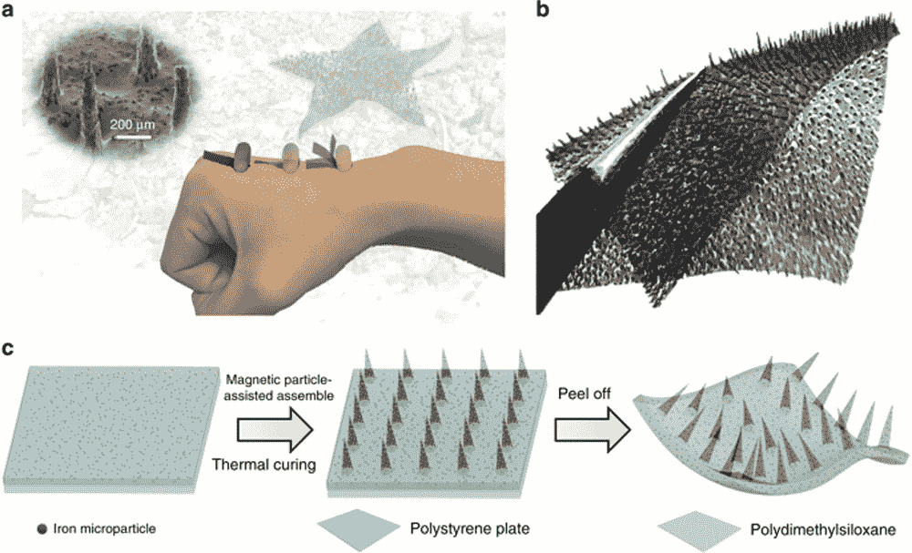
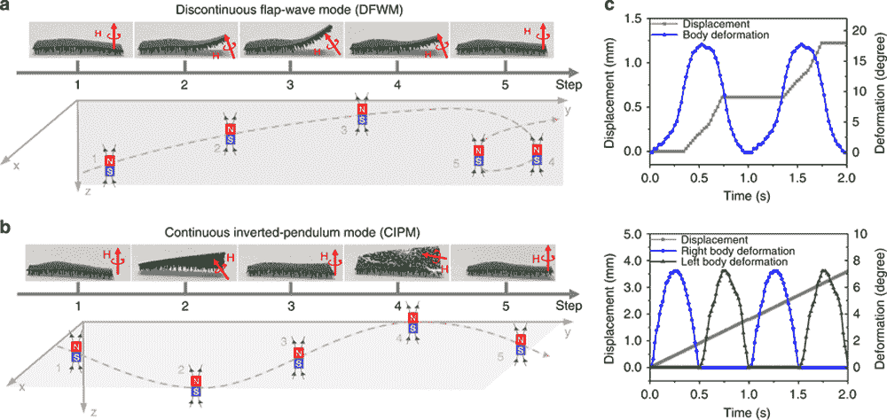
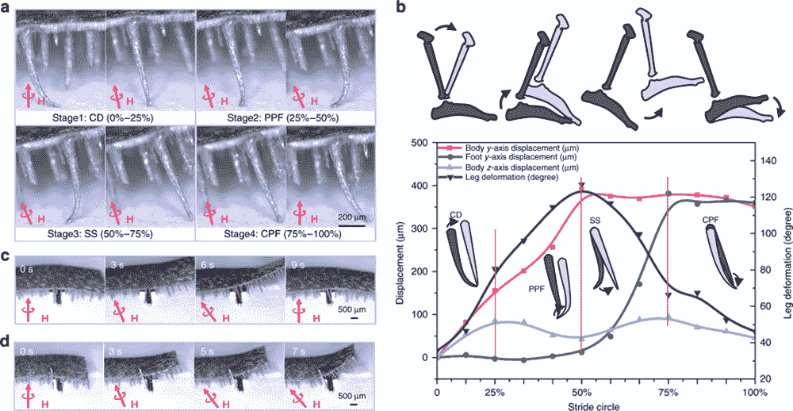

# 蠕动式履带机器人在人体内输送药物

> 原文：<https://thenewstack.io/creeping-caterpillar-robot-delivers-drugs-in-human-body/>

随着研究人员找到实现小型机器人的新方法，小型机器人越来越受到关注，无论是在毫米级的高速精密制造中；或者使用[微流体机器人进行精密手术](https://thenewstack.io/spider-like-microfluidic-soft-robot-is-built-for-precision-surgery/)，或者[海藻制成的抗癌机器人](https://thenewstack.io/biodegradable-micro-robots-made-algae-help-fight-cancer/)。

现在，香港城市大学的研究人员已经设计出一种微小的毫米级软体机器人，看起来有点像毛毛虫，可以在潮湿和干燥的恶劣环境中爬行，例如在人体内，以便输送药物或执行医疗程序。看一看:

[https://www.youtube.com/embed/4cn7xLfrfec?feature=oembed](https://www.youtube.com/embed/4cn7xLfrfec?feature=oembed)

视频

正如你所看到的，这个令人毛骨悚然的机器人能够四处走动是因为它有许多大约 1 毫米长的尖尖的小腿。这款机器人长 17 毫米，宽 7 毫米，高约 1 毫米(0.7 x 0.3 x 0.03 英寸)，其尺寸经过精心设计，以模仿多腿、抱紧地面的动物的腿部结构，特别是这些腿与身体的比例，以及它们之间的比例差距。

“大多数动物的腿长和腿间距之比为 2:1 到 1:1。所以我们决定用 1:1 的比例来创造我们的机器人，”该论文的主要作者，生物医学工程助理教授沈博士在[科学日报](https://www.sciencedaily.com/releases/2018/09/180926082724.htm)上解释道。

特别是，这种受生物启发的设计通过显著减少表面接触面积，与类似的无腿机器人相比，摩擦减少了 40 倍。

这种黏糊糊的设备是由一种叫做聚二甲基硅氧烷(PDMS)的硅材料制成的，这种材料使机器人能够排斥水，使用了一种“改进的磁性粒子辅助成型方法”将硅与己烷和磁性颗粒混合，并放入模具中。在固化过程中，使用外部磁场来“拉”出并形成那些微小的腿，然后将物体与基底分离。

## 磁力运动

为了使它移动，以不同的模式施加磁力，使这个嵌入磁体的设备以特定的方式移动。例如，可以在“拍打推进”模式中施加磁力，迫使它以拍打运动的方式向前移动，而在“倒立摆”模式中施加的磁力将使它通过交替向一侧移动，然后向另一侧移动来“摆动”自己。

“当施加磁场时，会产生磁转矩和拉力，”该团队在他们的论文中写道，论文发表在[自然通讯](https://www.nature.com/articles/s41467-018-06491-9)T3。“因此，锥形的脚变形并与磁通量的方向一致，机器人在磁力的共同作用下向前移动，展示各种姿态。”

这种机器人是专门制造的，当它被部署在诸如人体解剖的多样化内部景观中时，它将解决潜在的问题。

“人体内部不同组织的粗糙表面和不断变化的纹理使得运输具有挑战性。我们的多足机器人在各种地形中表现出令人印象深刻的性能，因此在体内给药方面有着广泛的应用，”机械工程教授王钻凯说，他协助了该项目的构思。

有趣的是，机器人的设计赋予了它多才多艺的能力，帮助它克服看似不可逾越的障碍。例如，它能够将自己弯曲到 90 度角，以便越过比其腿长大十倍的障碍物。此外，当施加的电磁场频率增加时，机器人也可以相应地加快运动速度。此外，该机器人的承载能力比其微小的尺寸要大得多:根据该团队的实验，它可以举起比自己重 100 倍的重量(给你一个更好的比喻，这就像一个人举起一辆迷你巴士)。

根据该团队的论文，与以前的小型软体机器人相比，这种机器人相对于其柔软的身体表现出了异常强大的负载和自支撑能力，即使在潮湿或充满障碍的麻烦环境中也是如此。与类似的毫米大小的设备相比，这个机器人移动的自由度更大，但需要的能量更少。在未来，该团队计划用可生物降解的材料制造机器人，并测试不同的形状和功能设计。

图片:香港城市大学

<svg xmlns:xlink="http://www.w3.org/1999/xlink" viewBox="0 0 68 31" version="1.1"><title>Group</title> <desc>Created with Sketch.</desc></svg>