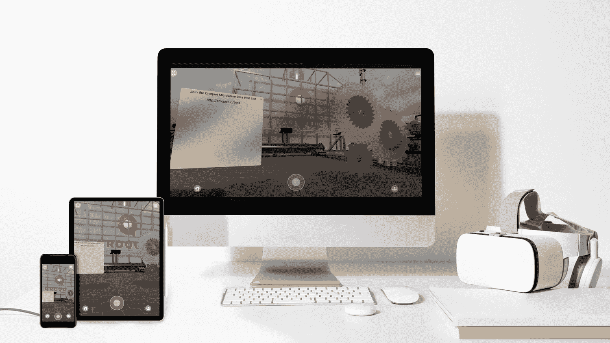
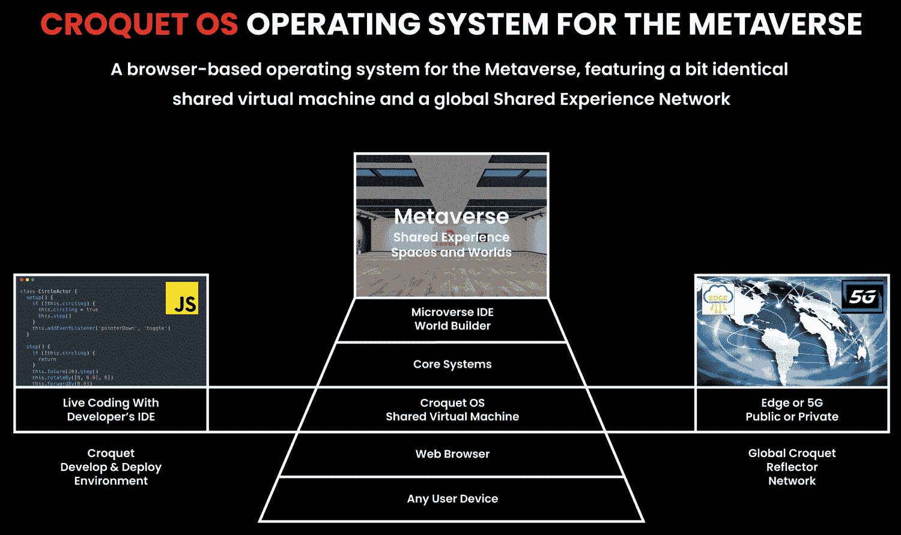
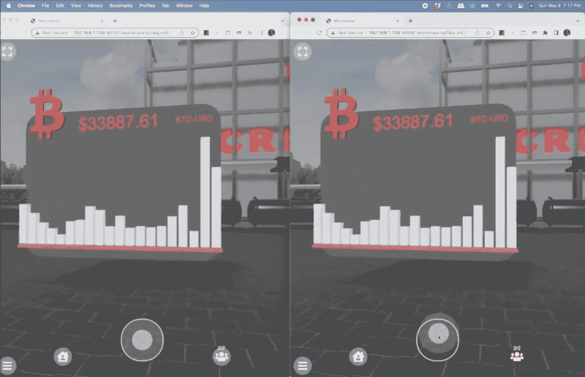
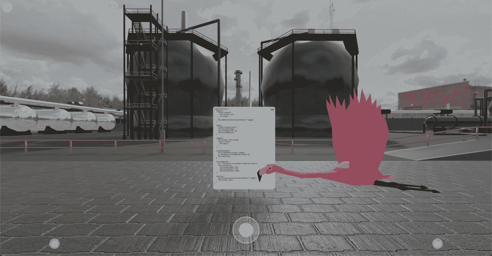

# 槌球游戏用基于网络的元宇宙吸引 JavaScript 开发者

> 原文：<https://thenewstack.io/croquet-woos-javascript-devs-with-a-web-based-metaverse/>

Croquet 是一个有趣的基于浏览器的新系统，用于创建 3D“微世界”，被描述为“在元宇宙上创建的独立、互联的基于网络的空间和世界”这项技术是由[大卫·a·史密斯](https://en.wikipedia.org/wiki/David_A._Smith_(computer_scientist))开发的，他是一名计算机科学家，在 VR 和 AR 行业拥有 30 年的经验——包括创建詹姆斯·卡梅隆 1989 年电影《深渊》背后的 set 可视化软件。

在对史密斯(CTO)和该公司首席执行官[约翰·佩恩](https://www.linkedin.com/in/johnpayne/)的采访中，我发现了 Croquet 是如何工作的——包括它的 JavaScript 前端——以及为什么创始人认为网络将支撑新兴的元宇宙。

我将在本文中概述 Croquet 的几个方面:用户看到的虚拟世界、JavaScript 开发人员用来为其创建内容的“microverse IDE”以及运行系统的“反射器网络”。我们先来看看虚拟世界。

## 浏览器操作系统

据该公司称，用户居住的 3D 世界是通过“在浏览器中运行的虚拟机”来工作的——这就是为什么它被称为 OS(操作系统)。用户“使用网络、移动或 AR/VR 设备，从任何 URL 或二维码[…]进入虚拟世界。”

在史密斯和佩恩进行的演示中，我点击了他们给我的一个网址，在我电脑的浏览器上进入了一个 3D 世界，然后通过扫描二维码，用我手机的浏览器进入了同一个场景。用户体验让人想起《第二人生》,除了使用 Croquet，你不需要下载特殊的 3D 浏览器软件程序——一切都在浏览器中。

槌球可以跨设备工作。

“我们将元宇宙视为网络和移动的延伸，”佩恩说，“而不是每个人都在头上戴着虚拟现实耳机跑来跑去，撞到东西。我们的客户告诉我们，他们想要一个完全的云平台解决方案，任何人使用任何设备都可以随时登录。”

顺便说一下，他们的客户最初是企业——例如，日本企业集团日立(Hitachi)正在将 3D 空间用作不同地理位置的员工的“采矿设施控制室”。但是佩恩说，最终他们希望普通人也能使用槌球。

“十年后，网络将会是一个 3D 的地方，”他说。“拥有网站的人可以建立一个虚拟世界——它可能是一个展示珠宝的橱窗，可能是一个培训室……它可以是一堆不同的东西——然后将其发布到他们网站运行的同一网络服务器上，将其作为一个链接或按钮或门户网站公开。”

## 反射体

槌球有着悠久的历史。据史密斯说，他第一次产生这个想法是在他遇到艾伦·凯的时候，艾伦·凯是 20 世纪 70 年代早期在 PARC 施乐工作的个人电脑先驱。史密斯在 90 年代初遇到了他，当时凯是苹果公司的高级研究员。

“他和我开始思考计算的下一步是什么，”史密斯说。“很明显，我在 3D 方面做了很多，但我们俩都很清楚:这不仅仅是 3D，而是协作 3D，互动 3D。”

在其网站的[起源故事页面](https://www.croquet.io/origin/)中，Croquet OS 表示，1994 年是 Smith 创建“后来成为 Croquet 的第一个原型”的一年，并将其描述为“第一个 3D 协作空间，展示了实时共享视频和智能协作对象。”2001 年，当史密斯、凯和另外两个人(大卫·里德和安德烈亚斯·拉布)成立了“开放槌球项目”，旨在“创建第一个复制计算平台”时，凯又回到了人们的视野中。

[重复计算](https://en.wikipedia.org/wiki/Replication_(computing))是当前槌球系统的关键部分，它通过被称为“反射器”的软件来实现这一点在其文档中，Croquet 将这些反射器描述为“位于云中的无状态公共消息传递服务”。它们托管在 edge 或 5G 网络上。

“我们已经在全球四大洲部署了我们称之为反射器网络的系统，”佩恩解释道。“那是什么，基本上是一大堆小型微服务器，它们协调并同步参与会话的每个人的活动。”

槌球系统图。

在我们的演示中，Payne 和 Smith 位于美国，而我在英国(距离伦敦大约 150 英里)。离我最近的反射器在伦敦，所以我在槌球虚拟世界中的参与是协调一致的。但受益于 reflector 网络的不仅仅是不同大陆的用户，它还意味着一个用户可以使用多种设备参与进来。在演示中，我被要求在手机和电脑上打开虚拟世界(这有点令人困惑，因为我有两个独立的视图——但我是一个用户)。

史密斯将此描述为“一个共享的模拟系统”当用户与它交互时，他说，“信息被发送到反射器，再从反射器反射到所有其他参与者。因此，当你在电脑上与它互动时，这条信息也会出现在你的手机上。”

## IDE

最后，让我们来看看 [Microverse IDE](https://www.croquet.io/microverse-ide/) ，开发者可以通过它来创建 3D 体验。

为了在 Croquet 的 IDE 中编程，需要学习新的词汇。这个虚拟世界中的物体被称为“卡片”(受 20 世纪 80 年代和 90 年代著名的苹果 Macintosh 程序 HyperCard 的启发)，它“可以通过简单地将 SVG 或 3D 模型放入世界中来构建。”与卡的交互由“行为”定义，而“连接器”使卡能够“访问外部数据流”

“比尔·阿特金森的计算模型和事物应该如何工作具有巨大的影响力，”史密斯说，他指的是 HyperCard 的创始人。“艾伦·凯是他在苹果公司的主要支持者。我们认为[模型]是创造和构建虚拟世界的正确方式。这就是为什么我们称它为卡片。我们可能会改名字。”

在演示的后期，史密斯向我展示了比特币价格的 3D 显示。他告诉我，这个物体由三张卡组成:一张卡连接到实时比特币价格，一张卡显示比特币标志。

槌球中的比特币图表。

“HyperCard 的想法是，你可以把这些东西插在一起，这就是目前的情况，”史密斯说。“所有这些的好处在于，你不必明确地将这些事情联系起来。你所要做的就是说:这是该卡的父卡，然后你使用发布-订阅模式，以便他们(父卡)可以监听正在发生的事情。因此，创建这些应用程序非常简单快捷。”

在引擎盖下，Croquet 的前端使用了 web sockets、REST 接口、 [Three.js](https://threejs.org/) (一个 3D JavaScript 库)、WebGL(一个渲染 3D 图形的 JavaScript API)。WebGPU 也即将出现。3D 物理是用[剑杆物理引擎](https://rapier.rs)完成的，这是一个开源的基于 Rust 的引擎，运行在 Croquet 从一开始就支持的 WebAssembly 中。其他使用的技术包括 [Crypto.js](https://code.google.com/archive/p/crypto-js/) (一组用 JavaScript 实现的加密算法)，通过 AES-CBC 与 HMAC-SHA 的端到端加密，以及用于空间声音的[谐振音频](https://resonance-audio.github.io/resonance-audio/)。

“该系统的真正想法是，它应该始终是活的，始终是协作的，不仅在部署方面，甚至在开发方面也是如此，”Smith 说。"例如，你和我可以结对编程."他举了一个例子，我放入一个新的 3D 对象，然后他会为它编写脚本。

槌球内部编码的例子。粉色火烈鸟可选。

## 一个开放、协作的 3D 世界？帮我报名！

Croquet 是一个复杂的平台，演示并非没有技术故障。但我非常钦佩这是一个基于网络的系统。该公司的目标是让槌球成为 Meta 等公司的开放“微球”替代品，并实现其单一、更大(可能是专有的)元宇宙的梦想。

我也喜欢 Croquet 平台的交互性，开发者可以用它在虚拟世界中与其他开发者合作。这一愿景不仅与艾伦·凯和 20 世纪 70 年代初的施乐 PARC 团队一致，也与他们在斯坦福国际研究所的前辈道格拉斯·恩格尔巴特(Douglas Engelbart)领导的团队一致(道格拉斯·恩格尔巴特在《槌球起源》的故事中被提到，是一个灵感来源)。

万维网本身已经最接近实现恩格尔巴特最初的设想，也许槌球将有助于使网络适应新兴的 3D 世界。

<svg xmlns:xlink="http://www.w3.org/1999/xlink" viewBox="0 0 68 31" version="1.1"><title>Group</title> <desc>Created with Sketch.</desc></svg>