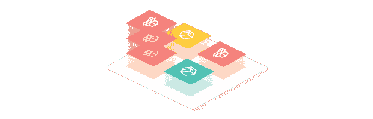

# 交叉平面:一种基于包的平台构建方法

> 原文：<https://thenewstack.io/crossplane-a-package-based-approach-to-platform-building/>

大型企业中新供应商的入职过程漫长而艰辛。虽然组织经常有一套统一的检查，任何软件在被采用之前都必须经过这些检查，但是这个过程不可避免地会导致一些特殊情况，这些特殊情况对于每个供应商来说都是独特的。这就产生了一个持续数月的低效迭代周期——在此期间，供应商本可以为客户提供价值。

如果供应商能够以一种允许他们轻松集成到现有客户平台的方式来包装他们的产品，采用将会大大提高效率。

## 交叉平面包和 API 依赖关系

[交叉平面](https://www.crossplane.io/)是构建控制平面的框架。大型云提供商提供一套服务，这些服务在物理计算上提供不同级别的抽象。为了构建能够为成千上万的客户提供这些服务的平台，云提供商拥有一个底层控制平台，确保客户请求的基础架构的理想状态与实际状态保持一致。

如果它们还没有对齐，控制平面将驱动两个状态对齐。简而言之，控制平面就是将暴露给用户的接口转化为满足用户请求所需的动作。平台是控制平面公开的 API。


在 Crossplane 中，接口或 API 以及翻译逻辑被分组到[包](https://docs.crossplane.io/v1.10/concepts/packages/)中。既包含 API 又包含逻辑的包被称为[提供者](https://marketplace.upbound.io/providers)，而那些从抽象接口严格转换成更细粒度接口的包被称为[配置](https://marketplace.upbound.io/configurations)。

很像编程语言中的库，包可以[声明对其他包的依赖](https://docs.crossplane.io/v1.10/concepts/packages/#configuration-packages)并建立在它们的 API 上。当在运行 Crossplane 的 Kubernetes 集群中安装一个包时，包管理器将评估它的依赖项，并安装任何不存在的兼容版本。

```
apiVersion:  meta.pkg.crossplane.io/v1
kind:  Configuration
metadata:
  name:  my-org-infra
spec:
  crossplane:
    version:  ">=v1.0.0"
  dependsOn:
    -  provider:  xpkg.upbound.io/upbound/provider-aws
      version:  ">=v0.23.0"

```

例如，如果用户想要构建一个配置包，为请求 MySQL 数据库的用户提供一个开发人员友好的接口，他们可以定义一个从该接口到由 [provider-aws](https://marketplace.upbound.io/providers/upbound/provider-aws/latest) 提供的 [RDS API](https://marketplace.upbound.io/providers/upbound/provider-aws/latest/resources/rds.aws.upbound.io/Instance/v1beta1) 的翻译，然后声明对 provider-aws 的依赖，带有可选的版本约束。当他们的配置包安装后，Crossplane 将确保 provider-aws 也存在。

如果另一个用户希望在他们的控制平面中包含 MySQL API 和其他 API，他们可以直接安装 MySQL 配置包，或者从安装的另一个包声明对它的依赖。无论哪种方式，Crossplane 都将遍历依赖关系树，确保具有健康包的控制平面将以期望的行为响应任何 API 实例的创建。

## 用根包定义平台

虽然 Crossplane 允许用户同时安装多个包，但是已经出现了一种定义单个“根”包的常见模式，它是在控制平面中安装的每个其他包的祖先节点。这样做可以通过安装一个包来使整个 API 表面区域可再现。随着组织的成长和发展，可以通过定义新的 API 或建立新的依赖关系来扩展这个包。


此外，因为使用根包是一种约定而不是技术约束，所以不违反可组合性的属性。以前面提到的 MySQL 配置包为例，一个用户可能将它作为 MySQL 数据库控制平面的根包安装，而另一个用户可能将它作为内部云平台等用例的更大 API 表面的一个组件。

## 声明供应商依赖关系

虽然交叉平面封装的属性使平台构建者能够快速地将功能添加到他们的控制平面，但它们也为供应商提供了一种独特的分发机制。当您的客户都建立在一个共同的基础上时，您只需要瞄准那个基础。此外，您提供给客户的 API 不必是“一刀切”的——在界面的前端和后端都有定制的空间。

```
apiVersion:  meta.pkg.crossplane.io/v1
kind:  Configuration
metadata:
  name:  my-org-infra
spec:
  crossplane:
    version:  ">=v1.0.0"
  dependsOn:
    -  provider:  xpkg.upbound.io/upbound/provider-aws
      version:  ">=v0.23.0"
    -  configuration:  xpkg.upbound.io/cool-vendor/dev-envs
      version:  ">=v1.0.0"

```

例如，开发者工具供应商可以向管理托管开发环境的企业客户提供产品。服务需要以一种可以在客户选择的云提供商上运行的方式分发，并且部署开发环境的界面需要支持客户可能需要的所有配置选项。通常，这需要脚本、部署清单和文档的组合。

但是，当捆绑为交叉平面包时，供应商可以指定对外部基础架构的依赖，如关系数据库或内存缓存，并依赖客户的控制平面来提供它们。



具体来说，在 AWS 上部署上述托管开发环境产品的配置包可以建立对 provider-aws 的依赖，并包括创建 RDS 实例的组合。当客户将配置包作为依赖项添加到根包中时，Crossplane 将验证其控制平面中是否存在兼容版本的 provider-aws。

当客户与供应商产品包提供的 API 进行交互时，在集群中创建 RDS 实例对象将导致在客户的 AWS 帐户中提供 RDS 实例，受他们已有的所有策略和约束的约束。因为供应商的部署最终取决于客户的控制平面已经提供的 API，所以成功的部署意味着遵从。

类似地，客户不需要通过供应商提供的接口与供应商的产品进行交互。Crossplane 社区中的一个常见模式是采用一个 API，并将其包装在一个更高级别的抽象中，可选地包括将与原始资源一起提供的附加资源。

例如，如果客户希望在每次部署开发人员环境时创建针对其组织定制的监控和警报策略，他们可以将供应商的开发人员环境 API 和他们的监控 API 包装在更高级别的抽象中，并且只允许开发人员访问与抽象 API 的交互。

## 发现您的下一个平台组件

要构建像这篇文章中描述的平台，客户需要一个发现包的地方，供应商需要一种分发的方式。Crossplane 社区利用了自动 API 文档和 [Upbound Marketplace](https://marketplace.upbound.io/) 的健壮发现特性。搜索您的下一个平台组件或发布您自己的组件，如果您有任何问题，请随时联系 [Crossplane Slack](https://slack.crossplane.io/) ！

<svg xmlns:xlink="http://www.w3.org/1999/xlink" viewBox="0 0 68 31" version="1.1"><title>Group</title> <desc>Created with Sketch.</desc></svg>