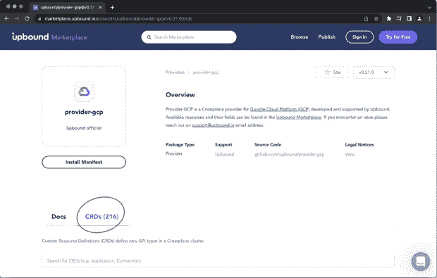

# 交叉平面好奇？Marketplace 让入职变得简单

> 原文：<https://thenewstack.io/crossplane-curious-marketplace-makes-onboarding-easy/>

[Crossplane](https://www.crossplane.io/) 从根本上改变了游戏规则，它允许组织将所有需求(应用程序、基础架构以及两者之间的一切)聚合到一个平台上。如果你以前没有听说过 Crossplane，想了解更多关于它的核心概念，我推荐皮特·伦比斯的博文 [Crossplane，运营商的新挚友](https://blog.upbound.io/crossplane-operators-new-bff/)。

那些至少涉猎过 Kubernetes 并听说过 Crossplane 的人可能仍然会发现这两者之间有一个学习曲线。人们经常想知道如何通过设计自己的 API 开始构建自己的平台。 [Upbound Marketplace](https://marketplace.upbound.io/) 对于踏上跨平台之旅的用户来说是一个必不可少的工具，我将展示为什么。

### 上行市场的导游参观

市场是零日交叉平面用户的重要工具。在用户开始构建他们的 API 之前，首先根据入站需求勾勒出他们的 API 的轮廓是很重要的。让我们假设用户有这些需求:

*   他们的组织主要在谷歌云平台(GCP)上运行。
*   他们的目标是提供一个平台，其他团队可以使用它来创建已经配置为符合他们公司策略的 VM 实例。其他应用程序团队不希望搞清楚哪些属性要设置，哪些大小不符合公司政策。他们只需要一台虚拟机来托管他们的应用程序。
*   他们决定只要求应用团队指定他们想要小型、中型还是大型虚拟机。他们还将为应用团队提供选择地区的选项:美国东部或美国西部。

根据这些需求，用户知道他们需要在 GCP 的计算引擎服务(VMs)之上构建 API 抽象。因此，他们的第一个目标是检查是否有交叉平面提供商提供他们想要构建的云服务。这就是上行市场已经开始出现的情况。

### 提供商发现

上行市场是发现(和发布)提供商和配置的中心。

市场在首页宣传一组流行的提供商，GCP 交叉平面提供商恰好是其中之一。用户还可以使用搜索栏浏览近 30 个交叉板提供商的目录。如果用户搜索“Google”，会返回两个结果:一个是由 Upbound 维护的实现(好处在这篇[博客文章](https://blog.upbound.io/first-official-providers/)中有解释)，另一个是由 Crossplane 社区维护的。

Upbound Marketplace 已经有了像 AWS 和 Azure 这样受欢迎的提供商，Crossplane 社区每周都在继续构建更多的 Crossplane 提供商，使 Crossplane 更容易上手。

### API 发现

如果用户点击进入 GCP 官方网站，他们会被带到一个页面，在那里用户可以浏览该网站提供的内容。该页面允许用户探索可供他们构建的 API 类型。

回想一下前面提到的要求，如果用户在计算引擎虚拟机上构建平台，他们可以使用 CRDs 窗格中的搜索栏来查找“实例”*注意:您可能需要尝试几个搜索词。市场根据 CRD(自定义资源定义)公开的几个字段进行搜索。例如，如果您搜索“VM”，您将不会得到任何结果，但是“instance”会得到准确的结果。*

如果用户单击“compute . GCP . up bound . io”API 组下具有“Instance”种类的 CRD，用户将能够阅读 CRD 提供的描述，并将看到“Instance 是 Instances API 的模式。管理 GCE 中的 VM 实例资源。确信他们已经找到了正确的基础 CRD 来构建，用户现在可以熟悉 CRD 的 API 文档，尤其是“spec”字段。

Upbound Marketplace 使得了解哪些字段是“forProvider”字段下的必需对象变得容易。这告诉用户，当他们作为 API 抽象的一部分实例化这些字段时，需要设置这些字段。例如，当扫描实例 CRD 的字段时，用户可以看到“引导磁盘”、“机器类型”、“网络接口”和“区域”是必需的。

machineType 是必需的，而 minCpuPlatform 不是必需的

如果必填字段是“对象”类型，用户可以递归地展开对象的字段，并查看该嵌套对象的必填字段。

### API 示例

市场还能够为每个 API 提供示例。这些例子正在发挥作用。yaml 配置用户可以直接提交到他们的控制平面，以创建这个 CRD 的实例作为托管资源。这是一个有用的工具，给用户一个写作的跳板。yaml 配置

### 发现配置

市场对零日交叉平面用户有用的第三种方式是它可用于发现交叉平面配置。市场上的许多配置都是带有许可许可证的参考实现。可以通过向下滚动主页或使用搜索栏来发现配置。如果您使用搜索栏，请确保将过滤器类型更改为“配置”

用户可能希望构建一个已经有实现的 API(比如 Kubernetes 集群或 PostgreSQL 实例)。这是公平的做法，使用这些作为发射台，因为他们已经有一些完全完成的组成。如果您单击“platform-ref-gcp”配置，您可以探索构成该配置的 XRDs 和组合。

这些例子只是 Upbound Marketplace 引导平台构建者的知识并加速他们开始使用 Crossplane 构建的几种方式。Crossplane 用户还可以探索更多市场，比如发布自己的配置和提供商。如果这是你第一次听说 Crossplane，并且你想了解更多，请查看[入门](https://docs.crossplane.io/v1.9/)指南或加入 [Crossplane slack](https://crossplane.slack.com) 的社区。

<svg xmlns:xlink="http://www.w3.org/1999/xlink" viewBox="0 0 68 31" version="1.1"><title>Group</title> <desc>Created with Sketch.</desc></svg>