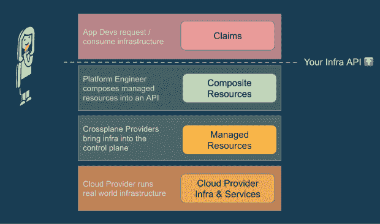
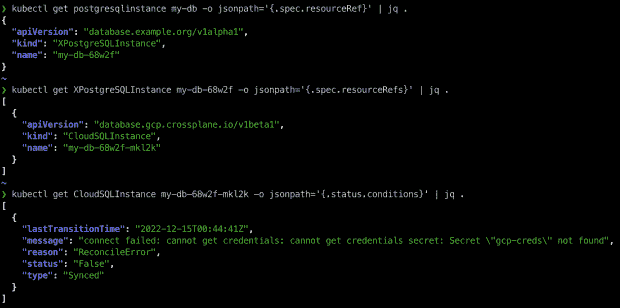

# 交叉平面:大多数人犯了什么错误(以及如何改正)

> 原文：<https://thenewstack.io/crossplane-what-most-people-get-wrong-and-how-to-get-it-right/>

[Crossplane](http://crossplane.io) 是一个流行的开源云原生计算基础项目，它提供了一个框架来帮助您构建自己的自以为是的云原生控制平面，包括对您的组织非常重要的所有策略、最佳实践和配置。一个充满活力和健康的社区已经聚集在该项目周围，作为一个中立的地方，让供应商和个人走到一起，合作实现一种新的方法来管理您的所有资源。

我们所说的交叉平面是一个框架是什么意思？Crossplane 包含逻辑、机制和可重复使用的组件，可以组装这些组件来实现您的组织的独特愿景，即高效、可靠地将基础架构和应用程序交付到生产中。您可以将该框架视为创建专用和定制平台的“构建块”。

虽然这种框架方法提供了极大的灵活性来涵盖各种独特的用例，但这意味着没有适合所有人的一刀切的“解决方案”。由[交叉平面](https://thenewstack.io/upbound-universal-crossplane-wants-to-replace-infrastructure-as-code/)框架提供的功能单元必须被构建到一个更大的画面中，并且在没有一些帮助的情况下，这通常是具有挑战性的。

今天，让我们一起迈出第一步，探索一些介绍性材料，这些材料将立即帮助您利用 Crossplane 提高工作效率。

## 临界交叉平面概念

当交叉面板社区的新成员开始了解它的关键概念时，他们可能会对各种架构组件的责任和目的感到困惑。一个真正有助于理解交叉平面功能区域的心理模型是一系列“层”,如下图所示。

从图中的底层开始，我们有:

1.  **云提供商基础设施和服务**是您在选择云提供商并浏览他们提供的可用服务时想到的所有资源，如亚马逊 S3 桶、谷歌 CloudSQL 数据库、Azure AKS 集群等。这些存在于 Crossplane 之外的真实世界。
2.  [**托管资源**](https://docs.crossplane.io/v1.10/concepts/terminology/#managed-resource) 是下一层，是 Crossplane 如何将这种现实世界的基础设施引入控制平面，以将其作为 Kubernetes API 的扩展。就像 Kubernetes 为 pod、ConfigMap 和 deployment 提供内置对象一样，Crossplane 为 S3、CloudSQL、AKS 等提供对象。
3.  [**复合资源**](https://docs.crossplane.io/v1.10/concepts/terminology/#composite-resource) 由平台工程师构建在托管资源之上。他们将多种资源以及配置和策略组合到自己的自定义抽象或 API 中，然后向开发人员公开，以实现对基础架构的自助式访问。
4.  [**声明**](https://docs.crossplane.io/v1.10/concepts/terminology/#composite-resource-claim) 是功能的最高层，是最终用户开发者直接使用的。当他们的应用程序需要基础架构时，他们只需创建一个声明，底层将确保提供一个真实的实例供使用。

既然我们已经弄清楚了 Crossplane 的关键概念之间的关系，我们将留给您另一个成功采用这个资源模型的技巧。交叉平面就是用代表现实世界基础设施和服务的新类型来扩展控制平面。类似地，您为您的平台定义的[复合资源](https://thenewstack.io/composing-a-platform-by-patching-crossplane-resources/)也扩展了控制平面 API 的表面区域，因此将这些抽象也视为 API 的一等公民是有帮助的，就像 Pods 和 ConfigMaps 一样。

## 弄脏我们的手

开始内化这些概念的最有效的方法之一是通过亲自尝试 Crossplane 来看它们的实际应用。交叉平面文档有一个[入门指南](https://docs.crossplane.io/v1.10/getting-started/)，它将带您完成一个使用我们刚刚一起探索的所有功能层的实践练习。

让我们来分解一下在本指南结束时您将完成的任务:

*   **将**交叉板安装到您的集群中，以扩展具有基础设施管理功能的控制平面
*   **将控制平面连接到您选择的云提供商，以便它可以代表您供应和管理云中的资源**
*   为 Postgres 定义一个新的自定义抽象,它将基础设施资源组合在一起，并作为一个简单的声明式 API 向开发人员公开
*   **使用您定义的新 API 提供一个新的 Postgres 实例，以及一个使用这个新数据库的应用程序**

这个简单流程的一个重要但经常被忽略的细微差别是，它融合了几个不同的角色。Crossplane 支持在平台构建者和平台消费者之间分离关注点[。作为 API 的一部分，构建者拥有配置和组合粒度资源到抽象中的完全权限，而消费者只能有限地访问这些 API，允许他们根据其平台构建者指定的防护栏为其应用提供新的基础架构。当您第一次在这个流线型的流程中使用 Crossplane 时，注意这种分离和多个角色是很有帮助的。](https://blog.upbound.io/developers-and-operators-complicated-relationship/)

## 当事情没有按计划发展时

配置云提供商基础设施和服务可能是一项复杂的任务，并不总是一次成功。我们看到新用户有时很难找到他们在构建平台时遇到的运行时问题的根本原因，所以我们想分享一些技巧来帮助你找到问题的根源。

*   **状态和条件** — Crossplane 对于控制平面内的所有对象都有一个非常一致的资源模型，因此您可以预期每个资源都有一个状态部分，它将为您提供关于现实世界中最近观察到的状态的最新详细信息。这个状态部分应该是您检查错误的第一个地方，尤其是条件列表，它可以让您深入了解为什么资源没有被配置或进入“就绪”状态。

*   **事件讲述一个故事**——像许多表现良好的 Kubernetes 对象一样，所有 Crossplane 对象都将发出事件，详细描述其生命周期中值得注意的里程碑。这些事件将讲述该对象的历史，通常有助于您了解最近采取的行动及其结果。

*   **遵循参考链** —我们之前看到 Crossplane 有多个“层”最重要的故障排除概念之一是，有时您需要遵循层之间的引用来找到根本原因。例如，从面向开发人员的声明开始，您通常需要检查它引用的复合资源，然后检查组成它的托管资源。您应该始终尝试[遵循这个参考链](https://docs.crossplane.io/v1.10/reference/composition/#troubleshooting-claims-and-xrs)，就像剥洋葱的层一样，以更深入地了解交叉平面的分层功能的较低层中的对象。

## 

## 走，爬…跑？

我们已经介绍了一些关于交叉板架构和构建一个非常简单的平台的基础知识，现在让我们来谈谈在您的交叉板之旅中继续前进的后续步骤。此时，您可能在脑海中形成了一个宏伟的愿景，您的控制平面将如何自动化整个组织中所有基础设施的生命周期。这很令人兴奋，但明智的做法是将范围缩小到一个更实际、更快实现的目标。

当您从文档和指南过渡到您自己的定制平台时，我们建议您从一个有形但范围合理的场景开始。例如，您可以从希望向开发团队公开的单个基础设施资源开始，并在继续处理进一步的资源需求之前首先使其工作。或者，您可以从一个小的“峰值”功能开始，例如为这些应用程序提供一个应用程序集群和一个数据库来存储它们的状态。

这个应用集群和数据库“尖峰”正是 Upbound 的 AWS 参考平台[中实现的。在这个详细的示例中，您可以看到资源是如何抽象并向开发人员公开的，来自开发人员的有限配置细节是如何修补到受管资源的，以及整个平台是如何打包到一个](https://github.com/upbound/platform-ref-aws/)[交叉平面配置](https://marketplace.upbound.io/configurations/upbound/platform-ref-aws/v0.5.0)中，以便在多个团队中重用和分发。

我们鼓励您更深入地研究这个 AWS 参考平台，以更好地了解如何确定您的第一个实际平台场景的范围，并查看一些合成创作的高级示例。

## 与专家一起规划路线

在本文中，我们揭开了 Crossplane 的关键概念和层次，学习了深入观察控制平面运行时的技术，并探索了开始构建自己的平台的第一个具体步骤。随着您继续定义您的平台并考虑如何在关键的生产环境中部署和运行它，您可能还会考虑如何加快这项工作。

[Upbound](https://www.upbound.io/) 在 2018 年创建了 Crossplane 项目，其愿景是将云原生空间提升到一个新的水平。作为这项技术的发明者，Upbound 的人员拥有丰富的知识和理解，能够有效地利用 Crossplane 的功能，形成满足您特定需求的完整解决方案。他们已经准备好并且非常乐意成为[您的专家向导](https://www.upbound.io/contact)，确保您的平台是根据最佳实践构建的，并且适合生产需求。

如果你有兴趣在无需担心操作问题的情况下利用控制平面的功能，或者管理底层基础设施，请申请加入 Upbound 的私人预览等待列表，并通过[填写此表格](https://www.upbound.io/upbound-preview)了解更多信息。他们非常期待你的消息。

<svg xmlns:xlink="http://www.w3.org/1999/xlink" viewBox="0 0 68 31" version="1.1"><title>Group</title> <desc>Created with Sketch.</desc></svg>