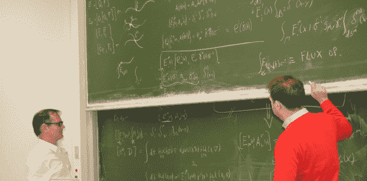

# 众筹是一种“万物理论”

> 原文：<https://thenewstack.io/crowdfunding-theory-everything/>

阿尔伯特·爱因斯坦“用了他生命的最后 30 年来寻找关于宇宙的最深层问题的答案:支配所有现实的基本原理存在吗？”根据两位丹麦学者的研究。爱因斯坦制定了广义相对论，而亚原子粒子似乎受到电磁和其他形式的吸引力的影响。但是目前的科学智慧认为广义相对论和量子场论“T0”不可能都是正确的。通常，一种理论适用于分子交易，而另一种适用于大质量。但这仍然留下了一些无法解释的东西——比如黑洞(以及大爆炸理论的一部分)。

理论物理学家 Jesper Moller Grimstrup 和数学家 Johannes Aastrup 称之为“现代物理学的圣杯”，他们花了 10 年多的时间研究这个问题，并在 2013 年发现了一个丰富而简单的数学原理，他们认为最终可以提供这个难以捉摸的答案。他们的“[量子全息理论](https://jespergrimstrup.org/quantum-holonomy-theory/)”从未被研究过，他们相信“如果我们的假设是真的，它将不仅在物理学上，而且在整个科学领域甚至更广的范围内带来革命性的变化。”

现在他们希望汇集宇宙的力量——如果他们能在互联网上聚集一群捐赠者的话。他们在 Indiegogo 上发起了[活动，募集 30，000 美元](https://www.indiegogo.com/projects/a-theory-of-everything#/)，251 名捐赠者已经捐赠了近 27，000 美元(还有一个月)。

几乎与他们的理论同样有趣的是，理论物理学的下一章可能需要一个众筹网站。但是 Jesper Mø ller Grimstrup 在页面上说，他已经卖掉了他在哥本哈根的公寓，以资助他们继续研究——还动用了他的个人储蓄。“我们对我们的研究深信不疑，”竞选页面上写道，“对最终理论的渴望也深信不疑。我们已经竭尽全力走到这一步了。”他们解释说，可能需要长达五年的时间来完成他们的工作，并且很难为这样一个长期的项目获得资金，因为它超出了理论物理的主流。“这让我们处于一种不寻常的境地，我们取得了非常强劲的业绩，但同时资金却在枯竭。”

这类似于[天文学家报告的一个问题，他们在意识到被资助的项目“通常是‘安全’的，有确定和立即的回报”后转向 Kickstarter](https://thenewstack.io/probing-mysterious-star-galaxy-kickstarter/) 这场运动的页面甚至引用了一位加州理工学院教授的话，他预测我们将会看到更多理论物理项目的众筹，“鉴于当前将大学转变为企业商业机器、年级工厂和购物中心的险恶趋势，基础研究(以及任何有知识价值的东西)的资金将迅速消失。”

但看到前沿研究人员在网上兜售学术出版物中的提及，还是有点不和谐。一位捐助者已经认捐 10，000 美元，以获得该运动的最高津贴——他们的贡献将在未来出版物的扉页上得到承认，还有两位捐助者认捐 1，000 美元，以在出版物的其他地方得到承认。三位捐赠者承诺捐赠 500 美元用于在一本书的封面上致谢，这本书是关于这项研究的。

当然，他们的研究总有走进死胡同的可能，但他们的活动页面上写着“然而我们确信，无论发生什么，这个项目都会产生稳定的科学产出。”

但是，最终，有一个共同的好奇心驱使着捐赠者和研究者。“量子力学与爱因斯坦的相对论的调和是现代理论物理学中最重要的未解决问题，”他们在该运动的页面上写道，并补充说，该理论“被认为是宇宙及其起源的一些最深之谜的关键。”

从该运动的官方视频中，你可以感觉到这是一次非常私人的旅程。“我认为所有这些问题都是我们人类基本好奇心的不同表现，”杰斯珀在视频中解释道。“我是说，这是我们 DNA 的一部分。我们只是寻求知识。我们想知道。我们想了解…

“这就是我们。”

<svg xmlns:xlink="http://www.w3.org/1999/xlink" viewBox="0 0 68 31" version="1.1"><title>Group</title> <desc>Created with Sketch.</desc></svg>