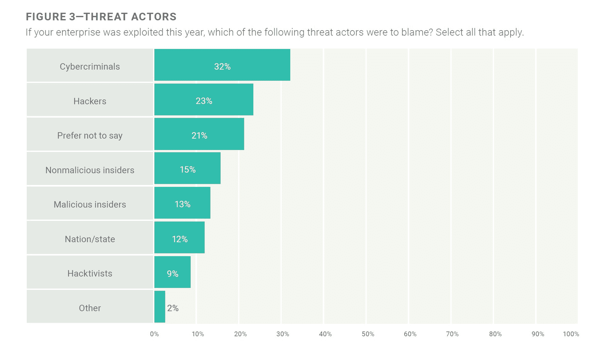
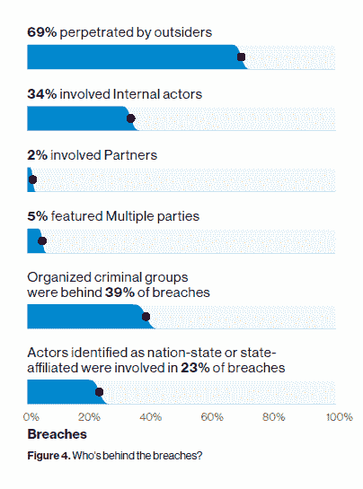
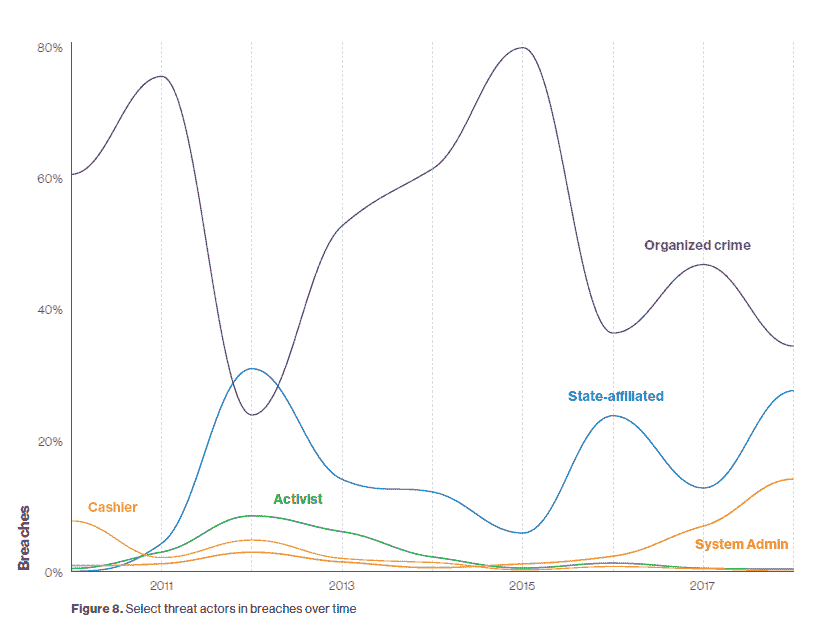
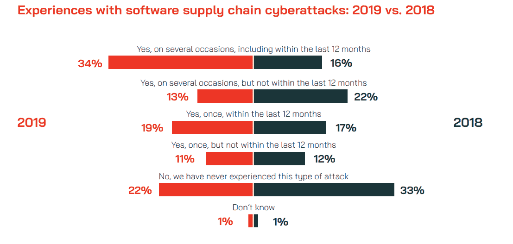

# 众包攻击和民族国家对网络安全的威胁:事实与炒作

> 原文：<https://thenewstack.io/crowdstrike-and-the-nation-state-threat-to-cybersecurity-facts-vs-hype/>

根据最近发布的由 [CrowdStrike](https://www.crowdstrike.com/) 委托的[报告](https://www.crowdstrike.com/resources/reports/global-security-attitude-survey-2019/)显示，国家支持的网络攻击远比大多数人想象的要普遍，该报告发现 1900 名高级 IT 领导和安全专业人员中有 81%同意这种观点。当被问及什么会促使一个民族国家发动攻击时，只有 5%的人认为他们的组织没有风险。调查还得出结论，73%的人认为国家支持的攻击有可能在 2020 年对他们的组织构成最大的威胁。这些数据引人注目，这项研究的发起人也是如此。

CrowdStrike 臭名昭著，因为其事件响应小组报告称，俄罗斯在 2016 年入侵了民主党全国委员会(DNC)。美国总统唐纳德·川普(Donald Trump)及其盟友断言，乌克兰、中国、另一个民族国家，甚至“[某个坐在他们 400 磅](https://www.theatlantic.com/international/archive/2018/07/trump-russia-hack/565445/)的床上的人”也可能负有责任。安全专家担心安全的政治化将会削弱人们对行业最佳实践的信心。CrowdStrike 试图保持非政治性，同时利用免费宣传为其猎鹰产品创造需求，该产品将终端相关事件关联起来，以支持威胁搜索和威胁情报。

来源:《2019 CrowdStrike 全球安全态度调查》。在列举的所有动机中，56%担心“与我们政府的密切关系”的人可能最能理解问题的范围。

让我们穿过虚假信息和竞争动机。民族国家是一种威胁，但网络罪犯更有可能进行黑客攻击。事实上，根据 ISACA 的“[State of network security 2019](https://www.isaca.org/info/state-of-cybersecurity-2019/index.html)”调查，在 2018 年被“利用”的公司中，只有 12%受到了民族国家的攻击，相比之下，有 32%受到了网络犯罪分子的攻击。

来源:ISACA 的《2019 年网络安全状况》

威瑞森的“ [2019 数据泄露调查报告](https://enterprise.verizon.com/resources/reports/dbir/)”超越了调查和分析报告的事件(危及信息资产的完整性、机密性或可用性的安全事件)和泄露(导致数据被确认泄露(不仅仅是潜在暴露)给未授权方的事件)。在确定了威胁参与者的违规中，69%涉及外部人员。三分之一与外部人员相关的违规行为(占所有违规行为的 23%)涉及国家或国家附属实体。此外，71%的入侵是出于经济动机，而 25%的入侵是出于获取战略优势(间谍活动)的动机。威瑞森还发现，62%的网络间谍相关违规行为是由公共部门组织实施的。

证明外国政府参与黑客攻击可能很难，但大多数黑客攻击通常发生在公共部门参与的时候。尽管人们普遍担心企业间谍活动，但很难确定一个民族国家是否应该为此负责。总的来说，民族国家是威胁，但 CrowdStrike 夸大了这种威胁。

## 文章引用的报告中的相关图表

来源:威瑞森《2019 数据泄露调查报告》。内部行为者与 34%的已识别违规事件有关。

来源:威瑞森《2019 数据泄露调查报告》。与国家有关的违规行为有所增加，但更值得注意的是，有组织犯罪和活动分子不太可能对这些攻击负责。

来源:“2019 CrowdStrike 全球安全态度调查。”55%的受访者在过去 12 个月中经历过软件供应链网络攻击，高于去年调查中的 33%。在有这种经历的组织中，40%的组织支付了某种形式的赎金来检索加密数据，高于 2018 年调查中的 14%。我们不知道受访者认为什么是软件供应链攻击。

通过 Pixabay 的特征图像。

<svg xmlns:xlink="http://www.w3.org/1999/xlink" viewBox="0 0 68 31" version="1.1"><title>Group</title> <desc>Created with Sketch.</desc></svg>