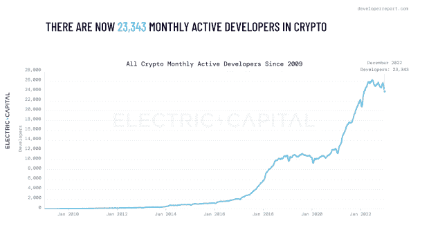
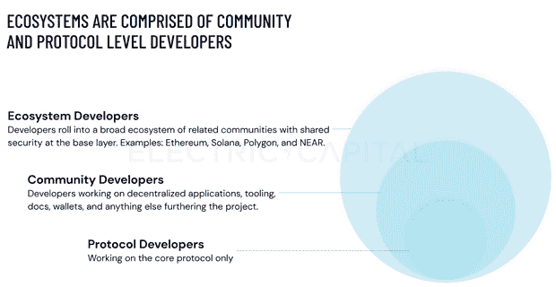
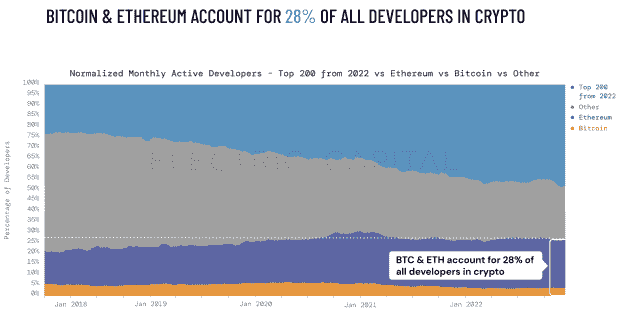
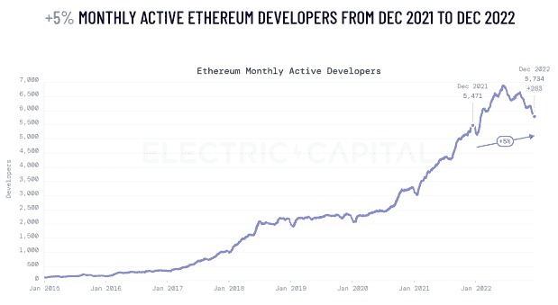
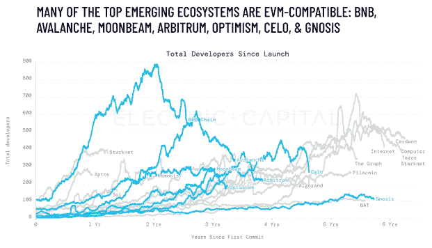

# Crypto Winter 阻碍了 Web3 开发者的发展

> 原文：<https://thenewstack.io/crypto-winter-puts-dampener-on-web3-developer-growth/>

根据风险投资公司 Electric Capital 的数据，去年 1 月，Web3 生态系统中每月活跃的开发者超过 18，000 人。该公司刚刚发布了一份[后续报告](https://www.developerreport.com/developer-report)，报告称截至 2022 年 12 月，每月有 23343 名开发者。这个数字在 2022 年 6 月超过了 26，000 大关，但在 2022 年剩余时间里，加密货币的“价格下降了 70%以上”，阻止了向上增长曲线。Electric Capital 表示，它为新报告“跟踪了 9000 多个生态系统和 163000 多个专门用于加密的存储库”。

总的来说，每月活跃开发者的数量同比增长了 5%——考虑到加密崩溃，这并不坏，但这也部分是由于所有开发者的自然增长率。

在我们仔细查看开发者活动统计数据之前，有趣的是注意到了 Web3 中不同类别的开发者:

该报告指出，72%的月度活跃开发者在比特币和以太坊生态系统之外工作。Solana、NEAR 和 Polygon 尤其受欢迎，同比增长 40%。

按市值计算，比特币和以太坊这两种最大的加密货币加起来仅占每月开发者总数的 28%，这反映了过去几年有多少区块链项目启动——数以千计。

## 以太坊仍然占主导地位，但索拉纳和其他人的增长

就开发者活动而言，所有其他区块链与以太坊相比相形见绌，以太坊比其最接近的开发对手大近三倍。开发人员排名前五的区块链是以太坊、Solana、Polkadot、Cosmos 和 Polygon，它们都有超过 1000 名开发人员。比特币排名第六，略低于 1000。

索拉纳是去年最大的推动者，开发者总数增加了 74%。也就是说，索拉纳去年也因为错误的原因出现在新闻中——安全问题让人们怀疑，[它真的有多安全？](https://thenewstack.io/how-secure-is-solana-really-industry-analysts-weigh-in/)

以太坊的图表似乎密切反映了整体图表，从 2020 年年中到 2022 年年中，它急剧上升，然后在最近的加密冬天之后暴跌。

## EVM、DeFi 和 NFTs

[以太坊在 Web3 开发者市场的影响力](https://thenewstack.io/ethereums-big-day-how-the-merge-will-impact-web3-developers/)甚至比乍看之下更占优势。根据该报告，“许多顶级新兴生态系统都是 EVM 兼容的”——这意味着他们使用“以太坊虚拟机”(EVM)平台。所以一个用 Solidity 写的“d app”(去中心化 App)，也就是以太坊 dApp 用的，也将能够在 Avalanche 上运行。电气资本指出，EVM 现在是 Web3 的“核心技术”。

不出所料，DeFi(去中心化金融)和 NFTs 是 Web3 开发的两大用例。目前有 3901 名“每月活跃的开源开发者”在 DeFi 工作，而 929 名在 NFTs 工作。后者在 2022 年上半年确实有所上升，几乎达到了 1200 大关，但年底持平-与 2021 年 12 月的开发者数量相同。

NFT 开发者的活动出奇的少，但是注意 NFT 在用户端的活动要多得多。该报告指出，2022 年，80%的加密钱包的第一笔交易与 NFTs 有关。正如该报告所言，“相对较少的开发人员可以构建可重用的组件，并且相对于社区参与而言，编写的智能契约代码的数量将会很少。”

## 结论

总体而言，自 2022 年年中加密冬天开始以来，开发者活动逐渐减少并不奇怪。至少在接下来的几个月里，它可能会继续下跌。

Web3 也失去了一些它的宣传价值，T2 的人工智能已经成为硅谷的热门话题。有人认为，除非加密货币的价格大幅反弹，否则在今年剩下的时间里，Web3 将很难重新赢得开发者的兴趣。但这将由金融市场决定，而不是科技行业。

正如我去年所做的，同样值得强调的是，与其他更成熟的编程环境相比，Web3 开发人员社区是多么的小。根据 Slashdata11 月[的报道，JavaScript 是世界上最大的编程语言社区，估计有 1960 万开发者在使用它。人工智能开发中大量使用的 Python 以 1690 万位居第二。因此，与大多数其他开发者生态系统相比，Web3 仍然是一个微小的利基。](https://www.slashdata.co/blog/state-of-the-developer-nation-23rd-edition-the-fall-of-web-frameworks-coding-languages-blockchain-and-more)

*作者注:感谢[劳伦斯·赫克特](https://thenewstack.io/author/lawrence-hecht/)，他帮助研究并为本文提供见解。*

<svg xmlns:xlink="http://www.w3.org/1999/xlink" viewBox="0 0 68 31" version="1.1"><title>Group</title> <desc>Created with Sketch.</desc></svg>