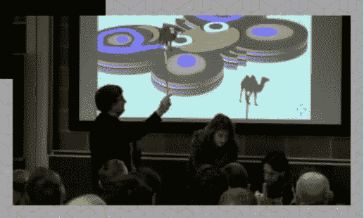
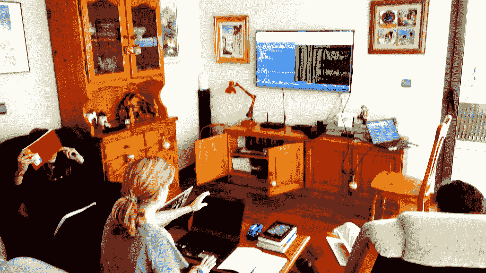

# 一位计算机科学教授上演了一出戏来教他的家人 Perl 6

> 原文：<https://thenewstack.io/cs-professor-tries-teaching-family-perl-6/>

白天，JJ·梅雷洛是格拉纳达大学的计算机架构教授。但是现在他报道了一个在他自己十几岁的女儿身上进行的激进教育实验。他用新语言 [Perl 6](https://thenewstack.io/perl-back-ready-roll-big-data/) 教他们三个计算机编程，以及 [Unicode](http://unicode.org/charts/) 的乐趣。

为了让这一切更有趣，他们还合作了一部 Perl 6 舞台剧。

“一段时间以前，我发现我不喜欢编程的教学方式，”Merelo 在 1 月写道[。"我也有一些关于如何重新启动编程教学方式的想法."](https://medium.com/@jjmerelo/some-time-ago-i-found-i-did-not-like-the-way-the-way-programming-was-taught-3786e60882c#.9ongo27cs)

上周，他就自己的哲学提供了更多细节。“为什么不以这样一种方式来教授 Perl 6，即使那些不打算在云的微服务架构中部署 Perl 6 的人也可以使用它并从中受益？”他问。但即使是在一月份，他承诺要实现这一切。

“想法就是想法，属于风。你必须将它们付诸实践。”

Merelo 已经决定教他自己卑微的家庭如何专门编程，他的三个十几岁的女儿(17 岁、18 岁和 18 岁)。作为激励，他承诺他们可以陪父亲参加他的下一次科技会议，分享他们的成果。

“在旅行结束后，我的三个女儿带着去异国他乡展示体验的诱惑签了名，”他写道。当实验最终结束时，他分析了自己的发现。它包括一些可预见的教训:“学习比忘记容易”和“你不用接触程序就能学到很多编程知识”。你首先要有编程的愿望。”

但最重要的是，学习如何编写代码的经历必须充满乐趣。"否则你为什么要浪费假期中一个完全有用的小时去做这件事呢？"

这让他们产生了一起写剧本的想法。这给了他们一个共同的目标——在即将到来的免费和开源开发者大会上，在 Perl 开发室进行演示。他们会展示“一个小游戏来谈论 Perl 6 和向新一代非程序员教授编程。”

梅雷洛甚至可以*记录他们的合作*，共享一个链接，链接到他家庭其他成员的所有[拉请求](https://github.com/JJ/perl6em/pulls?q=is%3Apr+is%3Aclosed)。使用 [Fountain](https://www.fountain.io/) 标记语言编写脚本(他说这种语言对 [Emacs](https://www.gnu.org/software/emacs/) 文本编辑器有很大的支持)，他们都帮助编写了一个简单的双人剧，然后在知识共享许可下发布。

“它需要 t 恤和一些道具，”梅雷洛写道，尽管剧本本身表明“除了将被投射到屏幕上的东西，没有任何道具。”事实上，剧本还将这部剧描述为“真正的极简主义，旨在用于贸易会议之类的。”

在 Perl 会议上做一些非常聪明的演示已经有很长的历史了。“我记得有人打扮成星际舰队学员，人们用克林贡语演讲，真正的表演，”梅雷洛一度写道。但他也表示，他对扩大该语言的社区是认真的。“Perl 6 主要是向唱诗班宣讲的。它是一种新的语言，有很大的特点，但主要是作为第三或第四语言呈现给人们。我的观点是，它可以而且应该被用作第一语言，就像你学习的第一语言一样。”

Perl 6 官方徽标由拉里·沃尔设计， [cc Artistic](https://commons.wikimedia.org/w/index.php?curid=6902287) 2.0

这实际上符合 Perl 创造者[拉里·沃尔](http://www.wall.org/~larry/)自己对这种语言的渴望。“到目前为止，Python 社区在进入低层次教育方面做得比我们好得多，”他告诉 Linux Voice。“我们也想在这个领域做点什么，这也是我们使用蝴蝶标志的部分原因，因为它会吸引 7 岁的女孩！”

那么梅雷洛家族的这部剧 [中的*到底是什么？*](https://github.com/JJ/perl6em/releases/download/v0.1/perl6musical.pdf)它从一个 Perl 5 程序员开始，对 [Perl 6 降临节日历](https://perl6advent.wordpress.com/category/2015/page/2/)对所有可用字符串类型选择的描述感到绝望(在第 7 天)。他想做的只是写一个脚本(使用 Fountain)，但现在他必须决定是否需要使用一种叫做[字形](http://www.perl.com/pub/2012/05/perlunicook-string-length-in-graphemes.html)的东西。

然后卡梅莉亚出现了。

正如所有优秀的 Perl 程序员所知，Camelia 也是 Perl 6 官方标志中蝴蝶的名字。她手持一根魔杖，介绍自己是仙境传说团队的领导者。她用六个神奇的词结束了开发者的项目——“git push dash dash force story。”

然后皮影就出来了。

一个是骆驼，代表 Perl 5，但另一个影子木偶是蝴蝶。“很久以前，有一个贝多因人叫巴布-埃尔·拉里-本-沃尔，”卡梅利亚解释道。贝多因人 ben-Wall 首先为系统管理和 web 编程创造了一只骆驼——“骆驼做的通常的事情”——但随后出现了诸如 web(和 web 框架)和 Unicode 之类的东西。

这只骆驼越来越大——“它速度快，被广泛使用，受到尊重”——但尽管人们发现它很有帮助，贝多因人拉里想要更多，“本着后来让人们每周二都创建 JavaScript 框架的精神。”

所以贝多因人拉里决定创造一些新的东西——“用于生物黑客、星际旅行、脑浆倾倒和许多其他还不存在但实际存在时会压垮骆驼的东西。

但是 Perl 5 开发者并不相信。因此，就像在《圣诞颂歌》中一样，Camelia 承诺他将受到三种精神的拜访——测试版、第一版的精神，以及“Perl 6 最终发布时的圣诞节精神”

剧本确定第一个鬼魂是比利·穆雷——或者至少是“一个穿着合适的比利·穆雷 t 恤的人”(可怜的开发者对鬼魂说的第一句话是“你还没死呢！”)这不是一次特别有成效的谈话，但当第二个幽灵出现时，事情看起来更有希望了。开发商说“好的，我明白了。在这里，你将向我展示我过去是如何拒绝 Python 和 C#等漂亮而高效的语言的，我是如何说 vi 和 Fedora 的坏话的，以及我是如何失去所有朋友和咨询工作等诸如此类的东西的。”

幽灵不同意，说 Python 很酷，但似乎在暗示它也属于《四季往事》的幽灵。忠实于原版《圣诞颂歌》的情节，这个幽灵也允许窥视此时此地被围困的人们——在这种情况下，是一个名叫埃琳娜的不幸少年(以梅雷洛现实生活中的女儿命名)。

“编程应该是很酷的，但现在它是我必须学习的另一门学科。比如几何。或者，喘气，物理。”

然后是第三个可怕的幽灵向每个人展示了一个可怕的未来——人们只用 Python 编程。然后整件事就结束了，埃琳娜,*已经让*学会了编程，她说事实证明 Perl *很酷，很容易学，而且非常有用。*

接下来是大结局的时候了——或者至少是一首胜利的说唱歌曲:

***梅雷洛:**到你好世界我们说再见*
***女儿**:我在编程，高如天空*
***梅雷洛**:她 gits 了，emacs 了，她连试都没试*
***女儿**:还有地图，还有 grep，还有 Z 和 X 和 Y*

随着会议的临近，梅雷洛越来越担心。“不用说，我很害怕实际做这种事情，而不是你通常用要点和漂亮的点缀着迷因的幻灯片来看我去年圣诞节做了什么，”他写道。

但他也补充道，“我也很开心。”

上周在 FOSDEM，当他和他的女儿走上舞台并向世界其他地方首演他们的戏剧时，重要的时刻终于到来了。(视频开始大约 6 分钟。)

这是一件不起眼的事情——在某一点上有一张莱娅公主乐高迷你图的幻灯片，不清楚剧本本身是否有教育意义。(它最初的一句台词是“你是穿着比利·穆雷 t 恤的我爸爸，你想让我认真对待这件事？”)但最终，整个制作清楚地表明了 Merelo 对乐趣在吸引新程序员方面的重要性的承诺。

他在另一篇文章中写道[“一些新兴语言，就像这种语言，通常是卖给已经懂一种或几种语言的人的，可以说是向露天看台布道。这使得整个编程变成了一场零和游戏:你有得必有失，你无法吸引新的人加入这个社区。”](https://medium.com/@jjmerelo/some-time-ago-i-found-i-did-not-like-the-way-the-way-programming-was-taught-3786e60882c#.fgvew7e1t)

最后，他还为自己给女儿们提供了一种新工具而感到自豪——因为在他看来，编程首先是生活帮。

* * *

# WebReduce

图片来自 JJ·梅雷洛。

<svg xmlns:xlink="http://www.w3.org/1999/xlink" viewBox="0 0 68 31" version="1.1"><title>Group</title> <desc>Created with Sketch.</desc></svg>