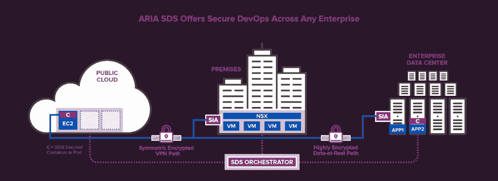

# CSPi 将容器安全的重点放在保护数据上，而不是基础设施上

> 原文：<https://thenewstack.io/cspi-puts-security-focus-protecting-data/>

网络设备供应商 [CSPi](http://www.cspi.com/) 的高性能产品部门总经理 [Gary Southwell](https://www.linkedin.com/in/gary-southwell-6222b31/) 表示，安全应该专注于保护数据，而不是支撑基础设施，这种方法可以使入侵变得无关紧要。

例如， [Equifax 事件](https://thehackernews.com/2017/09/equifax-apache-struts.html)，其中[未能修补 Apache Struts 库](https://thenewstack.io/equifax-data-breach-shows-perils-not-patching-timely-manner/)泄露了 1.455 亿人的个人数据，这本来是可以避免的。“如果它保护了数据本身，这就不是问题了。黑客得到的只是加密的胡言乱语，”他说。

“你不能阻止人们做勒索软件和其他事情，但有备份策略，”他说。“我们不应该担心一年失去五六次每个人的社会保障号码。”

随着公司采用 [DevOps](/category/devops/) 实践来努力更快地交付软件，开发者[从 GitHub](https://thenewstack.io/week-numbers-uniqueness-rare-github/) 获取组件来在公共云上构建应用。他解释说，这些应用程序调用来自企业数据中心的数据，当部署时，会暴露更多的攻击面。

CSPi 着手开发一个解决方案，开发人员可以在每个阶段应用加密，并应用由 infosec 团队管理的策略。

其软件定义的安全平台 [ARIA](https://www.cspi.com/aria-software-defined-security/) 专为所有环境中的容器或虚拟机而设计，可在内部、私有数据中心或公共云中运行。它会在每个实例生成时自动为其分配适当的安全策略，几乎不需要手动干预。

它是部署在 Docker 容器中的轻量级代理，充当基于 Kubernetes 的 orchestrator 的灯塔。例如，orchestrator 可以检查容器映像是否来自经批准的存储库，然后允许或不允许容器进入生产环境。 [Kubernetes](/category/kubernetes/) 是由[云原生计算基金会](https://www.cncf.io/)管理的开源项目。

开发人员将能够通过连接到这些服务来设置它们，管理员可以说，“我想要这种级别的加密，我想要这种类型的微分段，我想要这种类型的静态数据加密，无论它是存储到 S3 存储还是返回到我的数据中心。我可以为不同的堆栈设置不同的策略，”索思韦尔说。

“这听起来很简单，但当你有很多容器冒出来并需要相互通信时，这就不简单了，”他说。

该软件旨在保护容器通信时的静态数据和动态数据。他说，它还将结合第三方技术来保护使用中的数据，这样社会安全号码和其他敏感数据就不会被打印出来，也不会意外或故意在设备之间发送。

据该公司称，ARIA 将在未来几个月推出。

## 保护加密密钥

马萨诸塞州洛厄尔。基于的 CSPi 成立于 1968 年，在网络安全和 IT 管理服务方面有着悠久的历史。2013 年，它收购了超高性能万兆以太网产品制造商 Myricom。

去年春天，it 部门[推出了](http://www.crn.com/news/security/300085151/crn-exclusive-cspi-seeks-new-channel-partners-after-launching-security-product-line.htm) Myricom nVoy 系列 10-Gbit 数据包记录器和 Myricom nVoy 系列 1-to-100-Gbit 数据包代理，使安全团队能够隔离和密切监控对个人身份信息或知识产权等重要数据的访问。

它在网络安全上加倍努力，在 8 月宣布了网络安全卓越中心(CoE)项目，研究解决网络安全挑战的新方法。

为了帮助组织保护数据并保持内部工作负载的性能，该公司还推出了 Myricom ARC 系列安全智能[适配器](https://globenewswire.com/news-release/2017/11/09/1178668/0/en/CSPi-Announces-Next-Generation-Myricom-ARC-Series-Secure-Intelligent-Adapter.html)，这是一种 10/25 智能网络接口卡(NIC)，用于卸载 CPU 密集型安全功能，如加密、身份验证和入侵防御。

组织还可以将加密密钥存储在那里，而不是存储在服务器上，这样一来，密钥就会被泄露，并在运行该应用程序的任何设备上重复使用。

Southwell 讲述了一家拥有数千台服务器的金融服务公司，当该公司应用加密时，由于高 CPU 需求，其应用程序崩溃。它的服务器更新需要 38 个月，所以当 CSPi 建议使用网卡时，它决定等那么久再加密。

该公司计划以后推出更高速的卡。

一连串的新公司都在关注“[安全私有化](https://thenewstack.io/the-devopsification-of-security/)诸如 [Illumio](http://www.illumio.com/) 、 [Guardicore](http://www.guardicore.com/) 、 [CloudPassage](http://www.cloudpassage.com/) 、 [vArmour](http://www.varmour.com/) 和 [Threat Stack](http://www.threatstack.com/) 等厂商旨在提供对数据中心和/或云中异常行为的更好的可见性。 [ProtectWise](http://www.protectwise.com/) 、 [Darktrace](http://www.darktrace.com/) 和 Niara 采取以网络为中心的方式； [Prevoty](http://www.prevoty.com/) 、[对比安全](http://www.contrastsecurity.com/)、 [tCell](http://www.tcell.io/) 和 [Stackrox](http://www.stackrox.com/) 以 app 为中心；而弹性梁和[42 cronch](https://www.42crunch.com/)则侧重于 API 安全。

云本地计算基金会是新堆栈的赞助商。

通过 Pixabay 的特征图像。

<svg xmlns:xlink="http://www.w3.org/1999/xlink" viewBox="0 0 68 31" version="1.1"><title>Group</title> <desc>Created with Sketch.</desc></svg>