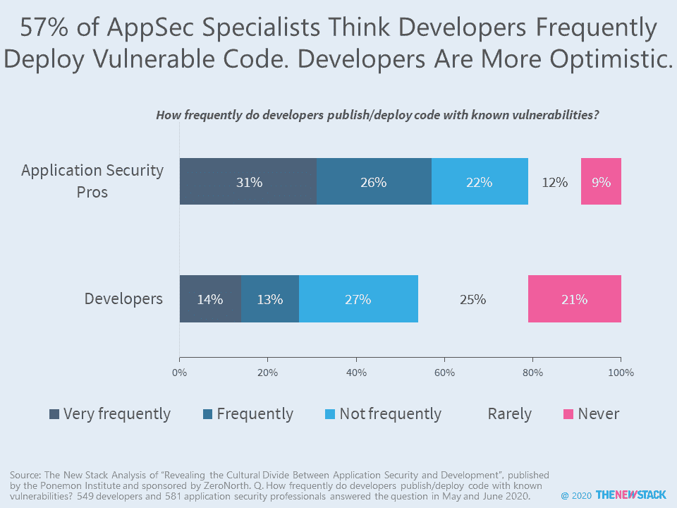

# 文化、弱点和预算:为什么 Devs 和 AppSec 不一致

> 原文：<https://thenewstack.io/culture-vulnerabilities-and-budget-why-devs-and-appsec-disagree/>

开发人员和安全专业人员经常发生冲突，在作者看来，这种情况不会很快改变。现在这里有一些关于当前事态的事实。

Ponemon Institute 在 2020 年 5 月和 6 月进行了两次由 [ZeroNorth](https://www.zeronorth.io/) 发起的[调查](https://www.zeronorth.io/ponemon-report-revealing-cultural-divide-application-security-development/)，其中一次由 581 名应用安全(AppSec)专业人员发起，另一次由 549 名应用开发者发起。四分之三的 AppSec 受访者认为他们和开发者之间存在文化差异，而只有 49%的开发者对 AppSec 功能有同感。观点的不同并不是因为 DevSecOps 更有可能在开发人员中扎根——在两类受访者中采用率几乎相同。

几乎一半(48%)的开发人员已经接受了他们的组织正在积极帮助开发人员和安全团队一起工作的想法。在 32%的情况下，AppSec 持更加怀疑的态度。人们不禁要问，这是因为公司领导层无所作为，还是因为安全专家对过去的经验感到厌倦？开发人员对许多其他安全话题更加乐观，尤其是应用程序漏洞。

与 AppSec 专业人员相比，开发人员认为其组织中的应用程序安全风险增加的比例要低得多(39%对 60%)。问题的核心是，AppSec 的专业人士认为开发团队很难合作，因为他们会推出带有已知漏洞的代码，许多人还抱怨说，如果开发者认为某个应用会大卖，他们就会接受缺陷。开发人员是否真的提出了许多严重的漏洞有待讨论，但他们的自我认知与他们的 AppSec 同行有着难以置信的不同——只有 27%的开发人员表示代码经常被发布有已知的漏洞，相比之下，57%的应用程序安全专家也有类似的估计。

开发人员认为 AppSec 同样难以使用，但实际上这对他们来说似乎不是什么大问题。他们主要抱怨的是缺乏对他们在截止日期前完成任务并同时创造创新产品的需求的理解。当他们对安全团队的流程感到沮丧时，如果可能的话，他们只是暂时避开它们。

一年前，Puppet 和[《2019 年 DevOps 状态报告》](https://puppet.com/resources/whitepaper/state-of-devops-report)证明了将安全集成到软件开发生命周期对于安全专业人员来说一直很困难，尤其是在 DevOps 成熟的中期阶段。一年后，疼痛仍在继续。在开发生命周期的早期转移安全工作是有帮助的，但是这种方法本身并不是万灵药。购买和设置测试也不是，不管销售人员告诉你技术有多复杂。但是，即使在这个问题上砸钱是可行的，AppSec 也有超过 25%的可能性说预算不足限制了组织的应用程序安全状态的有效性。

最后的困难来了。安全专家对开发人员的关心给予了肯定，因为 81%的人认为开发部门至少对安全负有一些责任。然而，这份报告[再次证实](https://thenewstack.io/problems-with-sharing-responsibility-for-security/)尽管开发者对安全负有一定的责任，但责任止于安全团队。三分之二(67%)的 AppSec 受访者认为安全团队对应用程序的安全性负有最终责任，相比之下，只有 39%的开发人员这样认为。开发人员抱怨安全性降低了他们的速度，但实际上，AppSec 对他们来说只是一个麻烦。

解决这一持续混乱局面的办法不是领导层做出更多努力，让人们理解彼此的观点。也不是对顶级命令的严格执行。相反，这是两个社区之间关于两到四个可用于衡量成功的通用指标的协议。如果没有这一基本步骤，我们将陷入关于漏洞在世界各地的应用程序中出现的数量、频率和严重程度的争论。

专题图片[通过](https://commons.wikimedia.org/wiki/File:NYCC_2012_-_Spy_vs_Spy_(8117616249).jpg)维基媒体。

<svg xmlns:xlink="http://www.w3.org/1999/xlink" viewBox="0 0 68 31" version="1.1"><title>Group</title> <desc>Created with Sketch.</desc></svg>