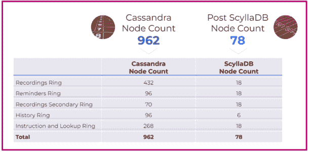
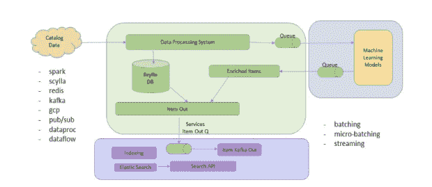
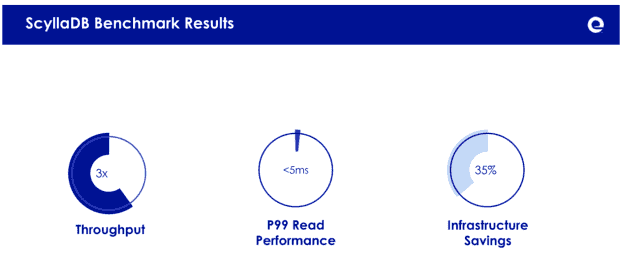
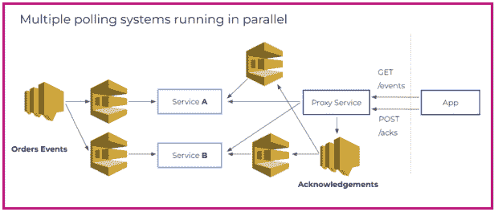

# 削减数据库成本:康卡斯特、乐天、Expedia 和 iFood

> 原文：<https://thenewstack.io/cutting-database-costs-comcast-rakuten-expedia-and-ifood/>

处理基础设施成本通常不是 R&D 团队的优先事项。但是现在不是典型的时候，降低成本不幸地成为已经超负荷工作的团队的又一个负担。

对于那些负责数据密集型应用程序的人来说，降低数据库成本可能是显著降低成本的唾手可得的果实。如果您正在管理每秒数百万次读/写操作的数 TB 到数 Pb 的数据，那么运行高可用性数据库并保持其正常运行的总成本可能会非常高，无论您使用的是开源的内部部署、完全托管的数据库即服务还是介于两者之间的任何方式。太多的团队在他们的数据库中投入了太多。但是，从好的方面来看，这意味着重新思考您的[数据库策略](https://thenewstack.io/the-database-takes-the-wheel-in-driving-developer-productivity/)会有很多收获。

为了获得一些启发，我们来看看几个开发团队如何在实际提高数据库性能的同时显著降低了数据库成本。

## Comcast:通过更换 962 个节点+ 60 个高速缓存服务器节省了 60%的成本

> “我们将 P99、P999 和 P9999 的延迟降低了 95%，从而实现了更快的界面，同时降低了资本支出和运营支出。”**——菲尔·齐米克，康卡斯特的高级工程总监**

康卡斯特是一家全球性的媒体和技术公司，有三个主要业务:康卡斯特有线电视，美国最大的视频、高速互联网和住宅客户电话提供商之一；NBC 环球及其英国电信子公司 Sky。

### **挑战**

Comcast 的 Xfinity 服务为 1500 万个家庭提供服务，每天有超过 20 亿个 API 调用(读/写)和超过 2 亿个新对象。在七年的时间里，该项目从支持 30，000 台设备扩展到超过 3，100 万台设备。

它首先从 Oracle 开始，然后转移到 Apache Cassandra(通过 DataStax)。当 Cassandra 的长尾延迟在公司快速增长的规模中被证明是不可接受的时，团队开始探索新的选择。除了降低延迟，他们还希望降低复杂性。为了向用户掩盖 Cassandra 的延迟问题，他们在数据库前放置了 60 个缓存服务器。让这个缓存层与数据库保持一致给管理员带来了很大的麻烦。

### **解决方案**

转移到 ScyllaDB 使 Comcast 完全消除了外部缓存层，提供了一个简单的框架，其中数据服务直接连接到数据存储。其结果是降低了复杂性，提高了性能，部署模型也更加简单。

### **结果**

由于 ScyllaDB 的架构充分利用了现代基础设施的优势，允许其纵向扩展和横向扩展，Comcast 能够用 78 个 ScyllaDB 节点取代 962 个 Cassandra 节点。

他们提高了整体可用性和性能，同时完全消除了 60 台缓存服务器。结果是:延迟提高了 10 倍，能够以极低的成本处理两倍以上的请求。这相当于比 Cassandra 节省了 60%的运营成本，每年为**节省 250 万美元**的基础设施成本和员工管理费用。

[**更来自康卡斯特**](https://resources.scylladb.com/cost-efficiency/comcast-on-sprinting-from-cassandra-to-scylladb)

## Rakuten:通过减少 75%的节点，基础设施成本降低了 2.5 倍

> “Cassandra 肯定是可横向扩展的，但它的成本很高。大约两年前，我们开始在内部意识到，卡珊德拉不是我们下一阶段增长的答案。” **— Hitesh Shah，乐天的工程经理**

乐天允许其 15 亿会员在超过 3500 家商店购物时获得现金返还。商店向乐天支付会员佣金，乐天与会员分享佣金。

### **挑战**

乐天目录平台提供机器学习(ML)丰富的目录数据，以改善搜索、推荐和其他功能，为会员和业务合作伙伴提供卓越的用户体验。他们的数据处理引擎为其全球运营标准化、验证、转换和存储产品数据。

虽然业务部门期望该平台能够以卓越的最终用户体验支持极端增长，但团队却在与 Apache Cassandra 的不稳定性、不一致的大规模性能和维护开销作斗争。它面临着 JVM 问题、长时间的垃圾收集(GC)暂停和超时——此外，它还经历了一个缓慢的节点会导致整个集群停机的惨痛教训。

### **解决方案**

Rakuten 用 ScyllaDB 的 6 个节点替换了 Cassandra 的 24 个节点。ScyllaDB 现在位于其核心技术栈的核心，该栈还涉及 Spark、Redis 和 Kafka。数据经过 ML-enrichment 后，会存储在 ScyllaDB 中，并发送给合作伙伴和内部客户。ScyllaDB 每天处理超过 2.5 亿个项目，每个节点每秒读取查询(QPS)为 10k-15k，每个节点每秒写入 QPS 为 3k-5k。

增加 Rakuten 数据库成本节约的一个 ScyllaDB 特有的功能是增量压缩策略(ICS)。ICS 比标准的 Cassandra 压缩策略允许更大的磁盘利用率，因此同样数量的总数据需要更少的硬件。使用传统的压缩策略，用户需要留出总存储的一半用于压缩。借助 ICS，Rakuten 可以将 85%或更多的总存储空间用于存储数据，从而大大提高硬件利用率。

### **结果**

乐天现在发布商品的速度提高了五倍，加快了目录变更的速度。这对于像黑色星期五这样的购物高峰期尤为重要。可预见的低延迟使该公司能够致力于令人印象深刻的内部和外部 SLA。此外，在减少了 4 倍的节点后，该公司的基础架构成本降低了 2.5 倍。

[更多来自乐天](https://www.scylladb.com/presentations/rakutens-catalog-platform-migration-from-cassandra-to-scylladb/)

## Expedia:通过替换 Redis + Cassandra 节省了 35%的成本

*“我们再也不用担心‘停止世界’的垃圾收集暂停了。此外，我们能够在每个节点上存储更多数据，并实现更高的吞吐量，从而为公司节省大量资金。”— Singaram Ragunathan，Expedia 集团的云数据架构师*

[Expedia](https://thenewstack.io/how-expedia-prepped-for-superbowl-sized-spikes-of-traffic/) 是全球领先的全方位服务在线旅游品牌之一，通过各种度假套餐、航班、酒店、度假租赁、租车、邮轮、活动、景点和服务，帮助旅行者轻松规划和预订整个旅程。

### **挑战**

Expedia 的一个核心应用程序提供了关于地理实体及其关系的信息。它聚合来自多个系统的数据，如酒店位置信息、第三方数据等。这个丰富的地理数据集使用一个简单的 REST API 支持不同类型的数据搜索，目标是一位数毫秒 P99 读取响应时间。

该团队使用多层方法，将 Redis 作为第一个缓存层，将 Cassandra 作为第二个持久数据存储层，但是他们对 Cassandra 的技术挑战越来越失望。管理垃圾收集并确保针对手头的工作负载进行适当的调整需要大量的时间、精力和专业知识。此外，突发流量和工作负载峰值缩短了 P99 的响应时间，需要缓冲节点来处理峰值容量，这推高了基础设施成本。

### **解决方案**

该团队从 Cassandra 迁移到 ScyllaDB，没有修改他们的数据模型或应用程序驱动程序。正如 Expedia Group 的云数据架构师 Singaram Ragunathan 所说:“从 Apache Cassandra 代码库，开发人员可以顺利地转换到 ScyllaDB。不需要任何数据模型的改变。ScyllaDB 驱动程序是兼容的，是 Cassandra 驱动程序依赖性的替代物。通过对我们提供 Apache Cassandra 集群的自动化框架进行一些调整，我们能够提供 ScyllaDB 集群。”

### **结果**

对于 Cassandra，P99 读取延迟以前很高，每天从 20 到 80 毫秒不等。对于 ScyllaDB，它始终保持在 5 毫秒左右。ScyllaDB 的吞吐量接近 Cassandra 的三倍。此外，ScyllaDB 节省了 35%的基础设施成本。

[更多来自 Expedia](https://resources.scylladb.com/cost-efficiency/expedia-groups-migration-journey-from-apache-cassandra-to-scylladb)

## iFood:从 DynamoDB 迁移到规模，成本节省 9 倍

> “这里真正相关的一件事是我的食物长得有多快。在不到两年的时间里，我们从每月 100 万份订单增加到每月 2000 万份订单。”— **Thales Biancalana，iFood 后端开发人员**

iFood 是拉丁美洲最大的食品配送公司。它最初是一家巴西初创公司，现在已经成长为明显的领导者，拥有 86%的市场份额。在巴西成为“送餐”的代名词后，iFood 将其业务扩展到了哥伦比亚和墨西哥。

### **挑战**

简短的回答是:使用 PostgreSQL 和 DynamoDB 进行大规模在线订购。

每个在线订单在其数据库中代表大约五个事件，每月产生超过 1 亿个事件。这些事件通过 iFood 平台发送到餐厅，该平台使用简单通知服务(SNS)和简单队列服务(SQS)。由于巴西的互联网连接不稳定，它依赖于一种基于 HTTP 的轮询服务，每 30 秒为每台设备发送一次。这些轮询中的每一个都会调用一个数据库查询。

在该公司每月达到 1000 万订单并经历了多次 PostgreSQL 失败后，该团队决定探索其他选项。他们搬到了 NoSQL，并选择 DynamoDB 作为 iFood 的连接轮询服务。他们很快发现 DynamoDB 的自动缩放对于他们的尖峰流量模式来说太慢了。午餐和晚餐时间，iFood 的日内流量自然会激增。缓慢的自动扩展意味着他们无法满足每日激增的需求，除非他们保持较高的最低吞吐量(这很昂贵)或自行管理扩展，这是他们试图通过购买完全托管的服务来避免的工作。

### **解决方案**

iFood 将其连接轮询服务转移到 ScyllaDB Cloud。该团队能够保持从 PostgreSQL 迁移到 DynamoDB 时构建的相同数据模型。尽管 DynamoDB 使用基于文档的 JSON 符号，ScyllaDB 使用类似 SQL 的 Cassandra 查询语言(CQL ),但它们可以在两者之间使用相同的查询策略。

### **结果**

iFood 的 ScyllaDB 部署轻松满足了其吞吐量要求，并使该公司实现了中期目标，即通过一台设备支持 500，000 个联网商户。此外，迁移到 ScyllaDB 将连接轮询服务的数据库成本从 54，000 美元降低到 6，000 美元，节省了 9 倍**。**

[**更出自 iFood**](https://resources.scylladb.com/cost-efficiency/ifood-on-delivering-100-million-events-a-month-to-restaurants-with-scylla)

## 包裹

这些例子仅仅是开始。有很多方法可以减少您的数据库开销:

*   使用更强大的硬件和数据库来提高您的性价比，例如 ScyllaDB 的高效内核碎片架构和自定义压缩策略，以最大限度地提高存储利用率。
*   通过简化您的基础架构(消除外部缓存、减小集群大小或迁移到需要较少调整和临时照看的数据库)来降低管理成本。
*   利用[工作负载优先级](https://www.scylladb.com/2019/05/23/workload-prioritization-running-oltp-and-olap-traffic-on-the-same-superhighway/)等技术，在同一集群上运行 OLTP(事务处理)和 OLAP(分析)工作负载，而不会牺牲延迟或吞吐量。
*   将[数据库即服务选项](https://www.scylladb.com/product/scylla-cloud/)考虑在您的云支出中实现灵活性，而不是将您局限在一个供应商的生态系统中。
*   转向价格更符合您的工作负载、数据集大小和预算的 DBaaS 提供商(使用此 [DBaaS 定价计算器](https://www.scylladb.com/pricing/#pricing-calc)比较多家供应商的价格)。

如果你想知道这些选项中哪一个更适合你的团队的特定工作负载、用例以及生态系统，ScyllaDB 的架构师会很乐意提供[技术咨询](https://lp.scylladb.com/technical-consultation/)。

<svg xmlns:xlink="http://www.w3.org/1999/xlink" viewBox="0 0 68 31" version="1.1"><title>Group</title> <desc>Created with Sketch.</desc></svg>