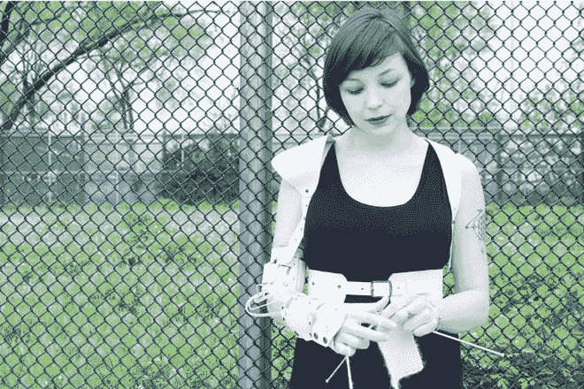
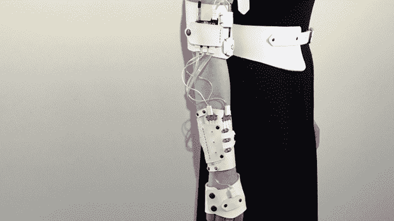
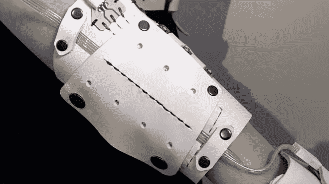
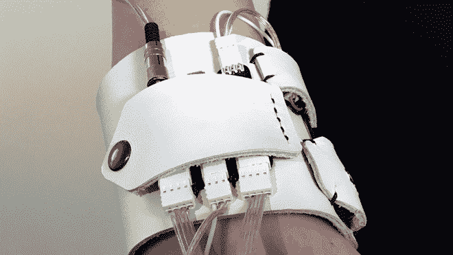

# Cyberknitics 将针织翻译成空灵的电子音乐

> 原文：<https://thenewstack.io/cyberknitics-translates-knitting-ethereal-electronic-music/>

手工编织一直以来都是一门手艺，不仅是自给自足的家庭制作自己的服装所必需的。近年来，由于制造者和 DIY 运动，人们对这门手艺的兴趣有所复苏。虽然这主要被认为是一种低技术爱好，在一个被它们淹没的世界里缺乏令人耳目一新的小工具，但布鲁克林的交互设计师和自称“电路裁缝”的 Teresa Flour Lamb 创造了 Cyberknitics，这是一种可穿戴的背带，可以将编织的节奏转化为可听的音乐。

Cyberknitics wearable(当然是对单词“ [cybernetics](https://en.wikipedia.org/wiki/Cybernetics) ”的恰当发挥)由包裹在用户手臂上的皮革覆盖物组成。覆盖手的部分缝有加速度计和陀螺仪，可以跟踪手的细微运动。这种接口连接到前臂组件，包括一个 Teensy，一个基于 USB 的微控制器和一个锂聚合物电池充电器。

这些组件然后被连接到缠绕在上臂的厚皮革带，该带容纳了一个微小的音频适配器板，该适配器板继续向上连接到隐藏在肩垫后面的小扬声器。整个电路板系统——有些是预制的，有些是兰姆自己设计的——是用导电线手工缝制的，并被制成模块化、灵活和舒适的。观看网络编织技术的应用:

这里的想法是将编织过程中的手部动作转换成编织者可以听到的空灵的电子音乐。“当穿着者编织时，他们可以听到自己的节奏并做出反应，”兰姆说。前臂上的按钮允许用户改变声音。产生的声音可以通过扬声器或耳机听到。”

虽然这看起来像是一个很棒的小发明，但这里有比仅仅通过编织动作来制作音乐更深刻的东西。正如研究交流、调节和反馈过程的控制论一样，Cyberknitics 项目试图让用户更加意识到编织产生的动态运动，兰姆解释说:“音乐旨在激发编织者和他们的过程之间更强的联系，并邀请观众参与从无到有创造东西的精神实践。”

## 编织作为代码

正如兰姆所了解到的，当人们在其背景下看待编织行为时，这个项目就有了深度。令人惊讶的是，兰姆是针织行业的新手，出于需要，他对这一行业产生了兴趣。从佛罗里达搬到纽约大学后，她开始编织自己的冬装。在加入编织圈的过程中，她发现了一种新的社区意识，以及编织本身带来的平静、冥想的效果。她也看到了编织和编码过程的相似之处。

“当我开始在(NYU 互动电信项目)学习编程时，我发现了编织和编程之间的紧密联系，”她写道。"有一个非常相似的逻辑，有数组、算法和简写."

随着兰姆继续学习更多关于编码和用户研究的知识，她希望将这些新观点应用到她认为最有吸引力的编织方面:它促进正念和放松、公共分享和授权的方式，因为编织是一种非常实用的表达形式。兰姆说:“(编织)满足了人类超越其实用性的基本欲望。”。

兰姆的论文《网络编织学背后》也探讨了编织者的未来发展:他们将会是谁？未来工匠的身份、动机和工具会是什么？

这个问题引发了另一个问题:未来的电子人和其他增强人类还会在这种发声针织系统发出的咔嗒声和和谐旋律中找到慰藉吗？兰姆设想，像今天的编织社区一样，明天的电子人编织圈可以使用类似于电脑编织系统的东西来编织在一起，产生悦耳的公共体验，这种体验将继续抚慰和赋予权力。

见下面特蕾莎·兰姆的论文陈述，并访问[特蕾莎·面粉·兰姆](http://teresaflourlamb.com/)。

图片:特里萨面粉羊肉

<svg xmlns:xlink="http://www.w3.org/1999/xlink" viewBox="0 0 68 31" version="1.1"><title>Group</title> <desc>Created with Sketch.</desc></svg>