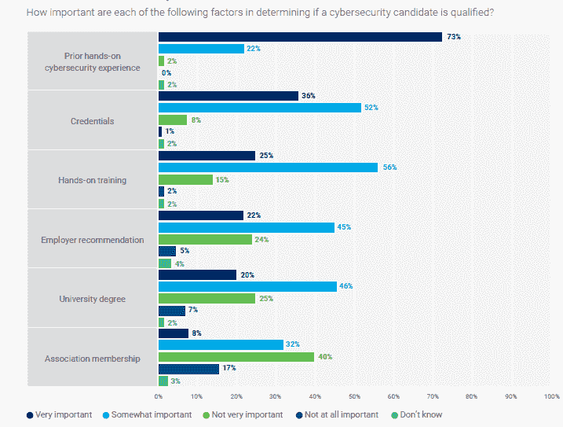

# 网络安全学徒制不能解决核心问题

> 原文：<https://thenewstack.io/cybersecurity-apprenticeships-dont-address-core-issues/>

在冻结招聘的经济消息中，信息、T2、安全和其他相关工作将会持续短缺。人们离开这个行业的原因和获得新员工的方法数不胜数，但一个根本问题是，网络安全工作需要经验丰富、技能娴熟、受过良好教育的专业人士。

学徒制提供了大学之外的另一种选择，但它们更有可能提供进入信息技术劳动力的途径，而不是专门针对网络安全工作。

来自美国政府和商业界的领导人在[会面，讨论长期存在的网络安全职位空缺的问题。拜登政府公布了一项新计划，该计划基本上是现有劳动力发展计划的两倍，重点是学徒制。从现在起到 11 月中旬，白宫将公布国家网络安全教育倡议(NICE)的注册学徒计划。](https://thenewstack.io/the-us-govt-and-corps-look-to-fill-700k-cybersecurity-jobs/)

NICE 数据库中的 100 多个项目是针对那些不打算从四年制大学毕业的人的。在很大程度上，他们为网络安全领域的“支线”工作提供培训，比如服务台和网络管理。这些工作是你在获得入门级网络安全工作之前获得的。

根据 NICE 参与的一个公私合作机构 Cyberseek 的调查，50%的 IT 支持工作清单在工作要求中没有要求大学学位。网络和系统管理员通常会逐步完成他们的工作，因此，默认情况下，他们会绕过这些要求。大多数其他进入网络安全的工作都需要大学文凭。

为了获得学位，学徒也是必须的。根据 Equinix 最近对 IT 决策者的调查，全球有 34%的公司与高等教育机构合作进行学位培训。

对于求职者来说，网络安全的实践经验至关重要。根据 ISACA 最近的一项研究，与大学学位相比，大学学位被认为对确定网络安全工作候选人的资格非常重要的可能性是大学学位的三倍。然而，52%的受访者表示，大学学位仍是初级安保工作的必要条件。证书被视为证明技能的方式，但每个级别的认证通常都是根据其自身的优点来看待的。

学位对那些已经拥有学位的人来说最重要。然而，[根据 Linux 基金会的一项调查](https://www.linuxfoundation.org/tools/the-10th-annual-open-source-jobs-report/)，在负责招聘开源专业人员的非大学学历招聘经理中，只有 22%的人认为这非常重要，而有学位的人中有 49%的人这么认为。

## 公司招聘技术人才的地方

[“Equinix 2022 全球技术趋势调查”](https://www.equinix.com/resources/infopapers/equinix-tech-trends-survey)基于 3 月份从 2900 名受访者那里收集的数据，这些受访者由来自全球 29 个不同市场的 100 名 IT 领导者组成。它显示，85%的公司正在将员工重新培训到技术型岗位。大多数时候，他们专注于回收现有的技术工人——对其他 IT 和相关行业的人进行再培训。

这项广泛研究的其他相关收获包括:

*   欧洲、中东和非洲(EMEA)公司为其他技术工作培训技术行业人员的可能性远低于全球平均水平(51%对 62%)。欧洲公司可能会依靠政府项目来进行培训。
*   除了已经在 IT 相关部门工作的人，只有 31%参与技术再培训工作的公司实际上在寻找其他部门的雇员。
*   亚太地区的公司更有可能从非科技行业招聘人才，为科技工作寻找人才。
*   当被问及重新获得技能的员工通常扮演什么角色时，最常见的答案是“IT 技术人员”，尤其是在美洲国家。来自亚太地区的人更可能说，重新获得技能的工人正在获得安全架构师、安全管理员和人工智能或机器学习的工作。
*   调查追踪的培训和学徒情况有很大差异。与高等教育机构合作开展培训项目很常见，41%的公司都有这样的项目。只有 31%的 EMEA 调查参与者说他们以这种方式与学院和大学合作。

来源:Equinix 2022 年全球技术趋势调查

## 学位以上的经验价值

ISACA 的[【2022 年网络安全状况，全球劳动力工作更新】](https://www.isaca.org/state-of-cybersecurity-2022) 基于对 2031 名网络安全责任人的调查。虽然其中 90%是 ISACA 成员，但不到一半的人认为网络安全是他们的首要责任。该研究的相关收获有:

*   两年来，空缺的安全经理和高管职位的增长速度快于初级职位。
*   在 ISAC 的调查中，只有 20%的人认为大学学位在决定一个网络安全候选人是否有资格获得一份工作时非常重要，另外 45%的人认为大学学位也很重要。
*   相比之下，73%的人认为之前的网络安全实践经验非常重要，另有 22%的人认为这有点重要。
*   52%承担安全责任的受访者表示，他们的公司要求入门级安全工作需要大学学历。

来源:国际网络安全协会《2022 年网络安全状况，全球劳动力工作最新情况》

## 非大学生求职者青睐的证书

来自 Linux 基金会的“第十届年度开源工作报告”提供了大学毕业生和非大学毕业生之间的一些明显差异。(New Stack 也曾在之前的中写过这项研究。)

总体而言，19%接受调查的开源专业人士没有至少一个学士学位。Linux 基金会是上述白宫网络安全峰会的参与者之一。它目前提供的许多培训都是针对新一代 IT 工作者的，他们最终会成为网络安全专业人士。同样重要的是，它正在开发的安全相关课程专注于软件开发人员的需求。

调查结果包括:

*   大学毕业生认为拥有一个学位对于一个开源求职者来说非常重要的可能性是普通人的两倍。在接受调查的 482 名招聘经理中，只有 15%的人没有大学学历，但他们的观点大相径庭。
*   没有大学学位的调查参与者中只有 22%的人说，对于寻求开源职位的人来说，拥有大学学位非常或极其重要，另外 25%的人说这有点重要。(总共有 47%的人认为学位至少有些重要，相比之下，研究平均值为 75%)。
*   相比之下，在那些拥有学士学位或更高学位的调查参与者中，49%的人说学位至少非常重要，另有 33%的人认为它有点重要——总计 82%。
*   没有大学学位的开源专业人士更有可能将网络安全和 Linux 视为增长领域。值得注意的是，42%的人计划在下一年获得 Linux 基金会认证管理员(LFCS)认证，相比之下，27%的人拥有学位。

有关 Linux 基金会培训网络安全专业人员的更多信息，请查看最近一期的 New Stack Makers 播客，该播客是在 6 月份的北美开源峰会上录制的:

[https://www.youtube.com/embed/7fGy3lbHQzM](https://www.youtube.com/embed/7fGy3lbHQzM)

视频

<svg xmlns:xlink="http://www.w3.org/1999/xlink" viewBox="0 0 68 31" version="1.1"><title>Group</title> <desc>Created with Sketch.</desc></svg>