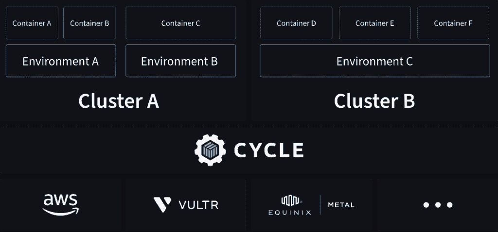

# Cycle.io:面向开发者的容器编排平台

> 原文：<https://thenewstack.io/cycle-io-a-container-orchestration-platform-aimed-at-developers/>

 [吐温泰勒

吐温是 Twistlock 的客座博主和 Fixate IO 撰稿人。他在谷歌开始了他的职业生涯，在那里，他参与了 AdWords 团队的技术支持。他的工作包括审查堆栈跟踪和解决影响客户和支持团队的问题，以及处理升级。如今，作为一名技术记者，他帮助 IT 杂志和初创公司改变团队构建和发布应用程序的方式。](https://twitter.com/twaintaylor) 

自从 Kubernetes[发布以来的几年里，各种组织都全力以赴开发容器编排解决方案，并将其推向了宣传的巅峰。许多业内人士称之为 K8s，它的采用将供应商和客户组织带到了一起，为实现应用程序可移植性的共同目标而努力。](https://thenewstack.io/a-kubernetes-documentary-shares-googles-open-source-story/)

虽然[云原生生态系统](https://thenewstack.io/category/cloud-native/)作为一个整体受益于容器编排中的这些进步，但这个故事还有另一面。在花费了数万美元之后，许多组织发现 [Kubernetes](https://thenewstack.io/category/kubernetes/) 过于复杂，需要太多的维护和保养。

由于这些持续的需求，组织最终放弃了安全补丁和更新，因为他们试图重新关注他们的核心产品和服务。

如今，这些组织中的许多都在寻求在不牺牲功能的情况下简化云操作，这已经成为过去。进入，[cycle . io](https://cycle.io)——一个“开发者友好的容器编排平台”

开发 Cycle 的目的是为了减轻采用 Kubernetes 带来的许多复杂性，目的是让开发人员重新关注代码，同时减轻开发过程中对大型 DevOps 团队的需求。

## 为什么要搬离 Kubernetes？

许多因为大肆宣传而购买 Kubernetes 的组织发现他们实际上很少使用 K8s 的功能。由于涉及到所有的维护，发现了价值大于价值的极端技术债务。然而，在更广泛的生态系统中，Kubernetes 正被试图解决各种问题的公司拉向许多不同的方向。因此，Kubernetes 成为焦点，分散了对轻松运行云原生应用程序这一基本目标的注意力。

同时，Cycle 采用了一种完全不同的方法，将容器编排的基本特性结合在一起。

Cycle.io 首席执行官兼创始人[杰克·华纳](https://www.linkedin.com/in/jakewarner)表示:

*“我们在容器编排方面采取了一种大胆的方法，专注于我们所说的‘80%规则’大多数公司不需要像 Kubernetes 这样的平台提供的大部分特性和功能。通过高度关注我们将时间花在何处，并优先考虑质量而不是数量，Cycle platform 能够为各种规模的公司提供坚实稳定的基础，而不会大幅增加技术债务或需要额外的团队来管理它。”*

## 循环方法

Cycle 是一个统一的层，它抽象了网络和基础架构的管理。该平台分为两个部分:核心和计算。核心完全由 Cycle 管理，包括从 API 和门户到构建系统等等的一切。管理容器、网络、负载平衡和一些其他关键任务的计算服务存在于用户基础设施上。

除了确保平台对开发者友好，Cycle 还有两个重点领域——自动更新和多云可扩展性。对于任何 Kubernetes 系统来说，这些都是传统的复杂问题，但是 Cycle 提供了一种替代方法。

### 1.自动更新

保持您的系统更新不仅对于操作简便性而且对于系统安全性都是至关重要的。尽管大多数托管的 Kubernetes 服务如 EKS 和 GKE 承诺自动更新，但这个过程实际上一点也不自动。另一方面，Cycle 平均每 10 到 14 天向所有客户发布一次更新，更新会自动应用，用户无需动手。

### 2.多云可扩展性

仔细想想，提供真正的多云可移植性违背了托管服务的最佳利益。他们为什么想让你去竞争对手那里？相反，他们会想方设法将您锁定在他们的托管服务中。

Cycle 采用了一种独立于供应商的容器编排方法，这样做的话，就实现了 Kubernetes 最初的承诺。该平台目前支持 AWS、Equinix Metal、Vultr，将来还会支持更多。Cycle 确保没有提供者锁定，事实上，它使得将容器实例从一个提供者移动到另一个提供者变得非常容易——在门户中单击几下，您就可以将容器移动到另一个提供者，而无需执行任何命令。

这种对底层基础设施进行抽象和标准化的方法是 Cycle 继续其简化跨不同提供商部署的使命的基础。该领域的任何供应商都没有展示这种强大的功能。

## 自行车是给谁的？

Cycle 正在初创公司和大型组织中得到采用，这些公司希望在不增加开发过程复杂性或成本的情况下实现增长。此外，许多 Cycle 的早期采用者是中小型开发团队，他们发现 Kubernetes 并不适合他们的组织，并通过 Cycle 在开发人员生产力、部署速度和平台功能方面获得了巨大的收益。

另外值得一提的是 Cycle 不适合谁。该平台限制对少数组件的访问，如主机操作系统，以确保 Cycle 能够可靠地推送更新，而不会遇到兼容性或不匹配问题。需要对基础设施的各个方面进行精细控制的组织或者运行高度定制的 Kubernetes 的组织并不适合 Cycle。Cycle 认为这是少数，许多组织最好专注于他们的产品，而不是管理 Kubernetes 的每个部分。

## 容器中的苹果

华纳碰巧向谷歌云的首席工程师凯尔西·海托华展示了该产品的早期版本，海托华打趣道，“Cycle 采用了类似苹果的容器方法。”他的观点是，使用 Cycle，您对自己不关心的事情(网络、更新和特定于供应商的功能)的控制更少。相反，您将获得更加完美的体验—更快的部署、跨云的可移植性、自动更新。Warner 确认“有了 Cycle，许多客户在不需要大型开发团队的情况下加倍扩展他们的开发团队。”

Kelsey Hightower 曾经在推特上写道:“Kubernetes 不是在云提供商之间运行相同的软件堆栈。它是关于抽象和自动化消除差异的。”

迄今为止，Kubernetes 还不能提供这种水平的可移植性和易用性。Cycle 有望填补这一空白。如果你在寻找 Kubernetes 的替代品，可以考虑 Cycle。

*披露:作者曾与 Cycle 做过一些咨询工作。*

<svg xmlns:xlink="http://www.w3.org/1999/xlink" viewBox="0 0 68 31" version="1.1"><title>Group</title> <desc>Created with Sketch.</desc></svg>