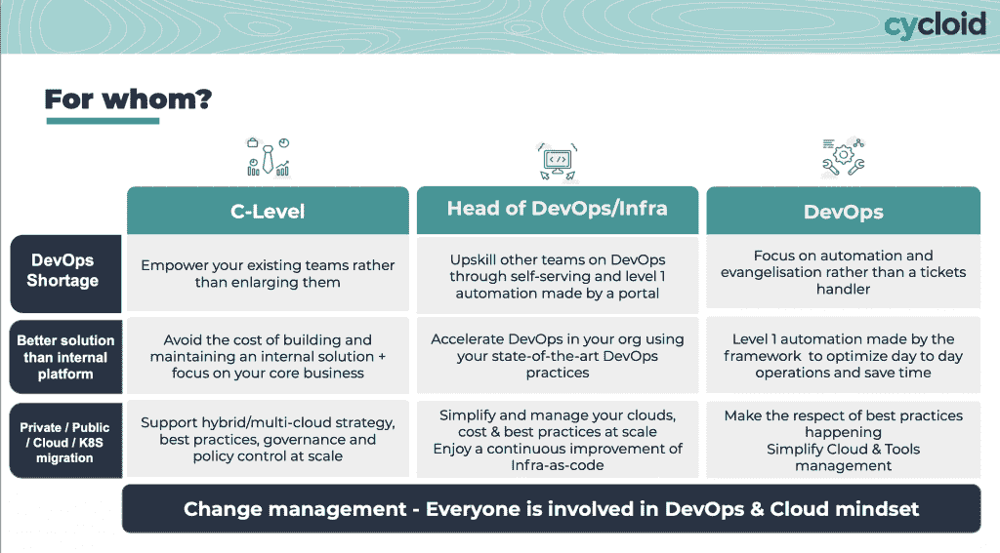
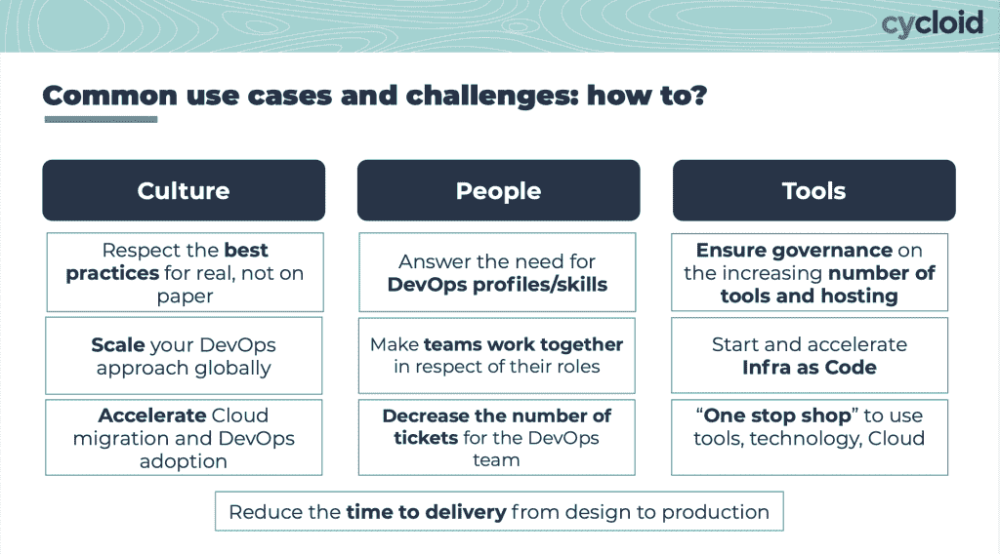

# 摆线解决了混合云的开发问题

> 原文：<https://thenewstack.io/cycloid-tackles-devops-for-hybrid-clouds/>

在为托管服务提供商工作的时候，甚至在人们开始谈论 DevOps 的早期， [Benjamin Brial](https://www.linkedin.com/in/benjamin-brial/) 就发现了三个问题:很难雇佣到拥有这些技能的人，这种情况一直持续到今天；沟通困难，因为双方谈论的内容不同；和困难，因为他们关注的问题不同。

有这么多的挫折，因为开发人员不断开罚单，而运营团队害怕给开发人员提供自动化访问，因为他们害怕会破坏东西。

与此同时，他发现他真的很喜欢 [Kubernetes](https://thenewstack.io/category/kubernetes/) ，尽管托管提供商的客户会直接把他们的应用程序放在云提供商那里，不需要任何重构。

“当谈到在 PaaS(平台即服务)上迁移时，这在当时是一个开放的转变，我们总是看到相同的情况。你知道，他们总是有理由(不)在 Kubernetes 上采取行动:‘我们已经没有提出申请的人了。’或者‘这太复杂了。\ ' \ '那会花很长时间。最后，“它对云提供商有效(事实上)，”即使他们支付更多。…因为它们确实会提升和移动。如果你不进行重构，那么你要付出比传统托管更多的代价，”他说。

“我发现我们真的需要让这些人一起工作，以一种更顺畅的方式，在这种没人理解的 DevOps 世界里。你知道，有一个人正在开发 DevOps，而世界上其他 99%的人不知道发生了什么。”

Brial，前[红帽](https://www.openshift.com/try?utm_content=inline-mention) EMEA 云经理，于 2015 年创建了总部位于巴黎的 [Cycloid](https://www.cycloid.io/) ，这是一个混合云管理平台，旨在帮助组织铺平开发和运营团队之间的道路，并增强现有员工的[开发运维](https://thenewstack.io/category/devops/)技能。

[https://www.youtube.com/embed/ZDH0wj_XG_A?feature=oembed](https://www.youtube.com/embed/ZDH0wj_XG_A?feature=oembed)

视频

## 解决 DevOps 的障碍

在 Puppet 的 [2021 年开发运维状况报告](https://puppet.com/resources/report/2021-state-of-devops-report#top)中，对 2，650 名 IT、开发和信息安全专业人员的调查发现，83%的人在一定程度上实施了开发运维实践。然而，只有 18%的受访者在拥有高度发展的自动化开发运维流程的组织中工作。

事实上，80%的组织未能扩大 DevOps 的采用，这个数字已经四年没有变化了。采用 DevOps 的最大障碍仍然是文化上的而不是技术上的。

其发现之一是，在 Puppet 的 DevOps 模型中，最高度进化的组织正在采用一种平台模型，这种平台模型[为开发人员实现自助服务](https://thenewstack.io/puppets-2020-state-of-devops-report-why-automation-and-self-service-are-key/)和现有的自动化，并管理开发人员的体验。

## 自助服务和治理

Cyloid 平台由服务目录组成，DevOps 专业人员在其中定义各种环境的基础架构以及应用于这些站点上的工作负载的治理。它为计划部署到这些站点的开发人员提供了自助服务，尽管他们不必了解这些部署背后的所有细节。

摆线使用了*栈*的[概念](https://docs.cycloid.io/immerse/concepts.html)，这是一种以代码形式构建和组织基础设施的方式。您为您的应用程序创建了一个通用描述，您将在所有项目和环境中使用它。这是一种服务目录，用户只需根据自己的需求使用几个可配置的参数。

与堆栈相关联的*配置*或配置详细说明了特定环境中使用的细节。它使用了一个 [LEMP 栈](https://github.com/cycloid-community-catalog/stack-lemp) (Linux，NGINX，MySQL，PHP)的例子，其中[栈概述了](https://docs.cycloid.io/immerse/concepts.html#stacks-template-blueprint)它将被使用的所有环境之间的所有公共元素，例如，IaC 服务器，在其上你安装了 Nginx web 服务器和 PHP，连接到数据库。

管道是堆栈的核心，描述其工作流、如何创建应用程序以及如何自动化和协调新版本的部署。

与此同时， *config* YAML 文件详细说明了特定环境的细节，例如 dev、staging、prod，在 LEMP 的示例中，这些环境可能在要创建的服务器的数量和大小上有所不同。

项目可能都使用相同的*堆栈*，但是*配置*可能会有所不同。栈和配置被存储为公共或私有的 git 存储库。

这创建了一个解决各种需求的选项目录，可以在项目和团队中一致地应用，以确保最佳实践。其服务目录功能提供了一系列由其社区创建的堆栈，以及一个存储您为团队创建的可重用资源的地方。

它创建了 [StackCraft](https://youtu.be/BiWsgwjSsXI) ，这是一个所见即所得的云可视化工具，可以让你拖放所需的云配置，查看抽象资源并与之交互。一旦你喜欢上了这一切，StackCraft 将生成一个基础设施的 Terraform 文件作为代码(IaC ),可用于在你选择的云提供商中创建基础设施。

Stackforms 为开发运维工程师和解决方案架构师提供了一种隐藏治理的方式，同时通过基于 HCL 或 YAML 的可定制小部件为基本环境的用户提供了自助服务选项。用户只看到与他们的工作相关的内容，而不必处理下面的预设螺母和螺栓。

它使没有特定 It 生产技能的项目经理能够根据 IT 预定义的治理规则(首选云、区域、虚拟机类型、规模等)创建和配置 IT 环境。

Orange Business Services [的](https://www.journaldunet.fr/web-tech/guide-de-l-entreprise-digitale/1502805-comparatif-des-plateformes-de-devops-github-se-demarque-cycloid-en-embuscade/) [Guillaume Renaud](https://www.linkedin.com/in/grenaud74/?originalSubdomain=fr) 在接受 JDN 采访时总结道:“通过一站式商店提供可配置资源的目录，首席信息官提供了完全控制 IT 和相关成本的方法。”。

## **强大的开源文化**

该公司已经开源了三个项目:

TerraCognita 基于社区构建的 Terraform 提供商，自动将现有云基础设施逆向工程为 Terraform 代码。到目前为止，它可以在 AWS、GCP 和 Azure 上运行，但与阿里巴巴、VMware 和 OpenStack 的集成正在进行中。

它是摆线的 Infra Import 工具的基础，这是一个基础设施代码生成器，可以将手动部署的云基础设施转换为 Terraform 文件和相关的 Git 模块。转换完成后，您可以创建堆栈来重用该技术，并使用 Terraform 的最佳实践来实施治理。

InfraView 以可视化的方式展示基础设施，帮助没有专业知识的人了解各种资源以及它们之间的关系。它使用 tfstate 或 HCL 文件生成特定于每个提供者的图形，只显示最相关的资源。

通过命令行界面，InfraCost 使用 Go 库在云项目上线前估算其成本。它旨在由能够访问 MySQL 兼容数据库和互联网的程序(API 或独立程序)导入和使用。

IT 领导经常在收到账单时才发现云中项目的[成本](https://thenewstack.io/cloud-cost-management-for-devops/)。像[利用](https://harness.io/blog/intelligent-cloud-cost-management)和[解开数据](https://thenewstack.io/unravel-data-adds-ai-to-prevent-cloud-migration-cost-hangovers/)这样的公司已经推出了成本估算工具，以及供应商，如[亚马逊网络服务](https://aws.amazon.com/?utm_content=inline-mention) ' [AWS 成本浏览器](https://aws.amazon.com/aws-cost-management/aws-cost-explorer/)。

“通过您的解决方案架构师或开发人员，您可以设计您的应用程序，然后您可能会知道它的成本。但这需要很多时间，每个人都要付出很多努力，”布里尔说。

摆线使用服务目录根据被部署的模式来设置成本，这种成本将随着变量的变化而变化。

“我们希望在这个世界中，在你以简单的方式部署项目之前，有能力进行一些成本估算，”他说。

## 使用现有工具

尽管有各种混合云管理平台，包括 CloudBolt、Morpheus Data、 [VMware](https://tanzu.vmware.com?utm_content=inline-mention) vRealize 和思科 CloudCenter，但 Brial 表示，Cycloid 最接近的竞争对手是那些公司内部构建的自己动手的平台。他说，这些需要大量的工作和维护，通常以失败告终。

客户或潜在的潜在客户倾向于将摆线与 GitHub 或 GitLab 进行比较，尽管 Brial 认为他们不是直接的竞争对手。他对 GitLab 的问题尤其在于它如何取代公司已经在使用的工具。他坚持认为这是行不通的，因为没有什么比开源更好的了。企业特别想谈论联合—整合他们已经拥有的东西。

“他们可能花了三年时间来整合詹金斯，包括詹金斯身上的好的和坏的东西。你不能说，‘我会换掉詹金斯，因为我做了更好的东西。’这是不可能的。你不只是关闭话题；他们不想重开它，”他说。

它下个季度的一个大项目是开发一个库存管理器，作为云提供商使用的信息的单一来源。他解释说，这并不像听起来那么简单。它还致力于与主要的 It 服务经理(如 ServiceNow)集成，以定义工作流和项目管理。

如今，他的 50 名员工完全处于偏远地区。它最近还开设了一个伦敦办事处。

“我们有一个强大的组织，我们相信传统的自上而下不再管用。如果你想要有忠诚的人…我们更喜欢授权给他们，一起工作，而不是他们为我工作。这是一个很大的不同，我相信这一点，但这也是一个挑战，”他说。

它的客户包括 [Orange Business Services](https://www.cycloid.io/customer-stories/orange-business-services) 、瑞士酒店服务提供商 [Hotel Spider](https://www.cycloid.io/customer-stories/hotel-spider) 和环球大西洋咨询公司 [Valiantys](https://www.cycloid.io/customer-stories/valiantys) 。

Orange Business Services 的托管服务主管 [Pierre-Emmanuel Klotz](https://www.linkedin.com/in/pierre-emmanuel-klotz-3020a931/?originalSubdomain=fr) 解释道:“我们管理着超过 120，000 台虚拟机，2，400 名 DevOps 专家在册，70 个数据中心分布在五个不同的位置，这是一个微妙且耗时的难题。

“摆线是我们所有工具的基石，为我们带来了展示我们以前不知道的东西的可见性，以及从我们以前没有掌握的东西中获得最大价值的框架。使用摆线，我们可以在项目上加快四倍的速度，并适应现有的工具，或我们的客户想要使用的任何工具，而不是强迫他们适应一套新的工具、标准和解决方案。”

<svg xmlns:xlink="http://www.w3.org/1999/xlink" viewBox="0 0 68 31" version="1.1"><title>Group</title> <desc>Created with Sketch.</desc></svg>