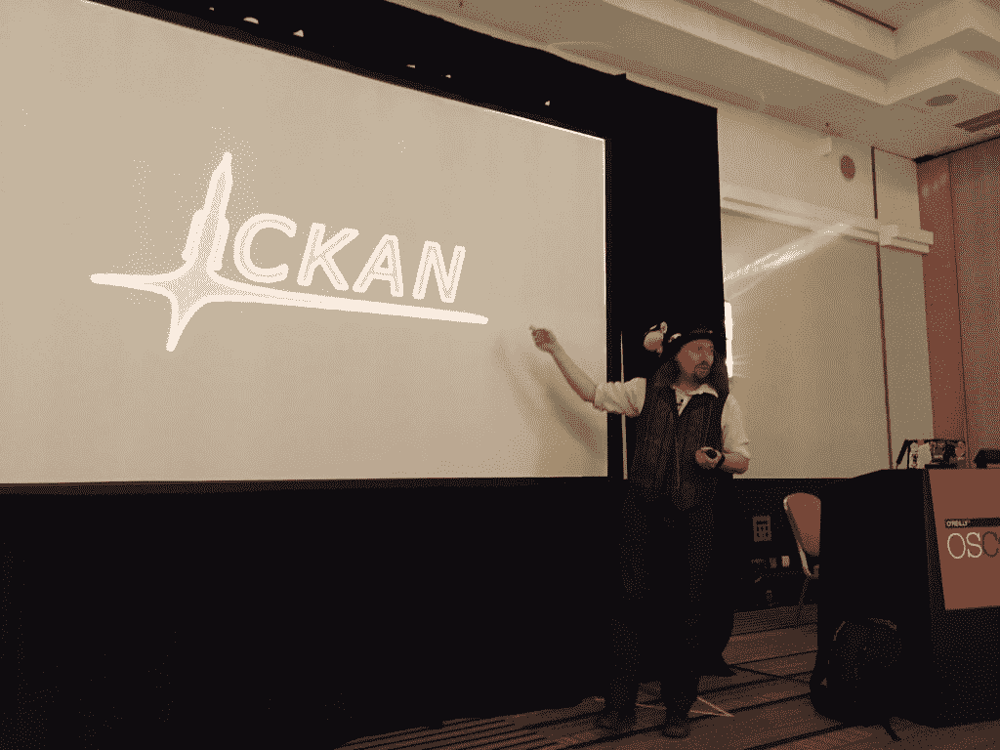

# 如何避免精疲力尽地管理一个开源项目

> 原文：<https://thenewstack.io/darker-side-open-source/>

不管你在栈中的什么位置工作，如果你使用开源软件，很可能有一段时间你会面临精疲力尽和其他与你在开源项目上的工作相关的不健康的副作用。在 OSCON 欧洲会议上的一些演讲正面谈到了开源工作的阴暗面。

[Katrina Owen](https://twitter.com/kytrinyx) 是 [GitHub](https://github.com) 开源团队的开发者倡导者，但她也是[exercisem . io](http://exercism.io/)的创建者，这是她演讲的重点，“T8 是开源的诱饵和开关。”

在推出[exercim . io](http://exercism.io/)的几周内，有几千人在使用它，他们开始提交错误报告和请求，这很棒，但这让她非常忙。她在所有的空闲时间都在做这件事，这成了一件苦差事，感觉她好像在无休止地工作。

第一步是聘请一位生产率教练，他对欧文按部就班的做事方式感到震惊。教练建议分批进行活动，但无济于事，她始终无法完成任务列表的末尾。委派是另一个建议，但是没有人将*委派给*。只是丢弃一些东西是另一个建议，但她不知道丢弃什么。

真正的转折点出现在一名记者打电话给她写一篇文章，这篇文章出现在《连线》的头版。她将接下来发生的事情描述为“扩展灾难”，产生了大量 GitHub 问题，“它们看起来都同等重要。”

处理这些问题成了一件“令人窒息的苦差事”，导致她想:“我讨厌我的生活，我讨厌我的项目。”有人让她坐下来和她谈论优先顺序和策略，这时她意识到她并没有真的有成千上万的问题。症状很多，但问题更少，这让她开始将它们分类成一堆堆，并给这些堆命名，以提出几个核心问题。

欧文说“贡献者很了不起。我总是很感激……即使有点疼，但这仍然很棒。”和贡献者一起工作很辛苦，你担心伤害别人的感情。虽然她想对你好，但是好和让别人欺负你是有区别的。但是在讨论别人可能不想听的事情时，你确实想表现得友好一些。

她还谈到要小心不要花费太多你自己的精力去寻找新的贡献者，因为“它只是没有规模；能量必须来自他们。”你可以让人们更容易做出贡献，迈出第一步，而不需要花费你太多的精力。

“人们想知道你是如何做到这一切的？…事实是我不知道。欧文承认，当人们试图平衡时间时，她认为工作/生活的平衡并不真正存在。她说你需要管理你的精力，而不是你的时间。

## 噪音噪音噪音

Owen 和许多其他开源项目负责人所经历的这种信息过载已经成为认知心理学研究的一个常见话题。在 OSCON 的另一场演讲中，“[侵入你的大脑:管理信息过载](http://www.slideshare.net/JoPearce5/hacking-your-head-managing-information-overload-45-mix)”、[乔·皮尔斯](https://twitter.com/jdpearce)谈到了来自[阿尔文·托夫勒](http://tofflerassociates.com/about/the-toffler-legacy/)1970 年的书“[未来的冲击](http://www.npr.org/2016/06/30/484215904/encore-future-shock-40-years-later)的观点，即人类机体能够吸收的变化量是有可发现的限度的。“如果不确定这些限制，我们可能会对自己和他人提出不合理的要求。

这种信息过载会导致焦虑、敌意、身体疾病、冷漠和抑郁，同时带来压力。有一个永无止境的信息流，我们不能指望在我们的有生之年消费，这导致了信息疲劳综合症，以及注意力不集中，普遍的敌意，倦怠，免疫反应降低，等等。

Pearce 谈到了“信息过载是一个学习问题”，当我们使用视觉提示(项目符号、段落和其他视觉指示器)向他人显示信息时，可以通过管理信息、将信息收集到更容易理解的块中以及创建模式来解决这个问题。

皮尔斯指出，信息疲劳综合症是软件开发中一个明显的现实危险。我们需要不断学习。认知心理学能告诉我们如何学习，也提醒我们能学多少是有限度的。

另一个关于在关注你的精神健康的同时引领开源项目的 OSCON 演讲来自[Paul Fenwick](https://twitter.com/pjf),[Perl Training Australia](http://perltraining.com.au/)的总经理。芬威克谈到了他对太空飞行模拟游戏“克巴尔太空计划”的贡献。虽然他是《[Kerbal 玩家指南](http://shop.oreilly.com/product/0636920035138.do)》的作者之一，但这次谈话是关于他写的安装程序，他将其描述为“用于 Kerbal 的 apt-get”

Fenwick 强调，如果你有一个开源项目，你会有缺陷，你会有不恰当的行为，所以你需要为这种类型的行为做好计划。改变一个现有的社区真的很难，所以你要从一开始就做好这件事。

他建议在选择执照之前先选择行为准则。有一个好的行为准则表示你关心你的贡献者的安全，它会吸引更好的贡献者，但不要写你自己的，复制别人的。不要忘记在 IRC 主题和投稿中放上你的行为准则的链接。MD 文件。“需要厚脸皮”是“我们的社区有毒”的代名词，应该避免。

“发布代码是可怕的，承认自己错了是可怕的，接受自己不喜欢的代码是可怕的，”芬威克说。它也“容易被过度控制”，这对“贡献者来说是可怕的。”芬威克有一个规则:“比以前好吗？包括技术债？”就目前而言，一个非常好的解决方案应该被接受。这个规则让人感到被欣赏，从而产生了更多的贡献者。

最初，芬威克并没有意识到领导力会如此重要，但事实证明确实如此。默认情况下，他成为了领导者，当围绕许可的一些重大政策问题给项目带来巨大问题时，压力非常大。这是他“过去一年中最大的压力”，因此，他最终筋疲力尽，这意味着他花在项目上的时间更少了。最终，他做出了下台的艰难决定，但他说，移交权力后，他的精神健康状况有所改善。

芬威克最后说，“别自责了。你会犯错的。你需要休息一下。没关系。照顾好自己。”

特写:卡特里娜·欧文在 OSCON。照片由道恩福斯特拍摄。

<svg xmlns:xlink="http://www.w3.org/1999/xlink" viewBox="0 0 68 31" version="1.1"><title>Group</title> <desc>Created with Sketch.</desc></svg>