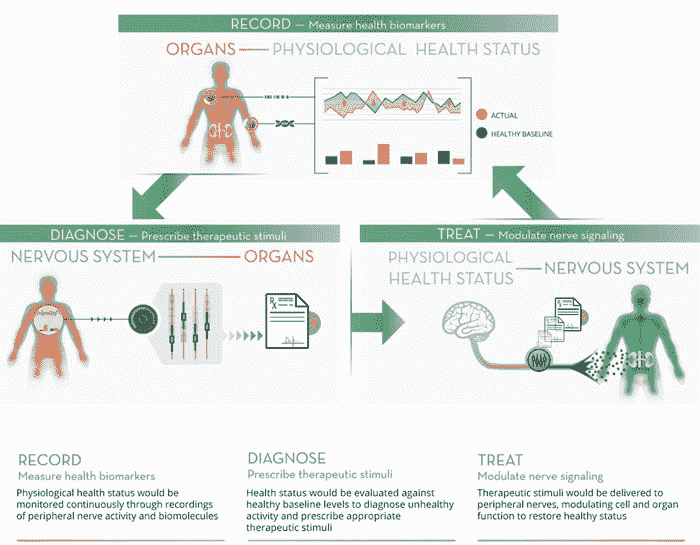

# DARPA Tech 用电、光、声和磁场来治疗疾病

> 原文：<https://thenewstack.io/darpa-tech-will-treat-disease-electricity-light-sound-magnetic-fields/>

如果我们得了重病，我们习惯于医生给我们开药方或做手术。但是任何听过药品广告的人都知道，药品可能会有一连串意想不到的副作用。下一个最好的事情——也许是医学的新前沿——是将治疗电脉冲直接应用于患者的神经。

这就是由[国防高级研究计划局](https://www.darpa.mil/) (DARPA)牵头的一个新的生物医学项目 [ElectRx](https://www.darpa.mil/news-events/2015-10-05) (读作“电子”)背后的想法。这不是昔日的[电击疗法](https://en.wikipedia.org/wiki/Electroconvulsive_therapy#History)，而是将最新的[纳米技术](https://en.wikipedia.org/wiki/Nanomedicine)与[神经调节](https://en.wikipedia.org/wiki/Neuromodulation)相结合。目标是开发超小型的生物电接口和实时生物传感器，可以直接注射到体内。这些植入物将发送电信号来调节或纠正周围神经的活动，这些神经“失灵”并导致患者疼痛或疾病，从而促进身体的先天自愈能力。

## 利用电、光、声音和磁铁来治愈身体

但是在体内使用电力只是更大图景的一部分。本月早些时候，DARPA [宣布](https://www.darpa.mil/news-events/2015-10-05)将向各种研究团队提供总额为 7890 万美元的资助，这些研究团队将研究几种神经刺激方法，包括使用光、声甚至磁场来治疗抑郁症、慢性疼痛、创伤后应激障碍(PTSD)和炎症疾病等疾病，这些疾病可能对传统疗法没有很好的反应。该计划的第一阶段旨在更好地绘制神经回路，并分析它们在疾病发展中扮演的角色。

“外周神经系统是人体的信息高速公路，传递大量的感觉和运动信号，监测我们的健康状况，并影响大脑和器官功能的变化，以保持我们的健康，”生物医学工程师兼 ElectRx 项目经理道格·韦伯说。“我们设想的技术可以检测疾病的发作，并通过刺激周围神经来调节大脑、脊髓和内脏器官的功能，从而自动做出反应以恢复健康。”

对基于光的神经刺激的研究将由 Circuit Therapeutics 领导，这是一家由[卡尔·戴瑟罗斯](http://web.stanford.edu/group/dlab/index.html)共同创立的初创公司，他是[光遗传学](http://video.mit.edu/watch/optogenetics-controlling-the-brain-with-light-7659/)领域的先驱之一，光被用来控制植入了光敏蛋白质的神经元，允许它们使用光脉冲打开或关闭。该团队将探索如何利用光遗传技术治疗神经病理性疼痛。

对于基于声音的治疗，众所周知超声波可以刺激神经元。根据 Spectrum，哥伦比亚大学的 Elisa Konofagou 和她的团队想要发现的是这一过程的机制实际上是如何工作的，以及这项技术可能对慢性病有什么作用。她认为超声波对生物组织施加压力，刺激神经元中的某些通道，使它们变得活跃或抑制。

然而，另一个团队将研究磁场如何被用来触发神经元的活动。麻省理工学院的 Polina Anikeeva 和她的团队正在研究附着在神经元上的磁性纳米材料，当暴露在磁场中时，神经元会升温，从而以无线方式刺激神经元本身，并且干预最少。

## 用于自我修复的闭环系统

DARPA 计划的最终目标是开发一个完整的“闭环系统”，其中生物传感器与植入体内的神经调质协同工作。其结果将是可以长期植入的装置，它可以监测疾病的任何生物学指征，并且可以用有针对性的治疗性神经刺激自动作出反应，具有极大的特异性和尽可能少的副作用。

鉴于 DARPA 作为五角大楼的一个研究部门的存在理由，尽管所有这些都将是医学的一大福音，但毫无疑问，这些发展有一天会找到军事应用。人们可能会想象这些生物电接口被注入机器人-人类混血儿，或超级士兵电子人，增强他们在战场上的健康和弹性，或者也许允许退伍军人治愈精神和身体创伤。目前还不清楚我们将走向什么样的伦理景观，但有一点是肯定的:任何工具都没有本质上的好坏——重要的是你如何使用它们。DARPA[ElectRx](https://www.darpa.mil/news-events/2015-10-05)的更多信息。

图片: [DARPA](https://www.darpa.mil/program/electrical-prescriptions)

<svg xmlns:xlink="http://www.w3.org/1999/xlink" viewBox="0 0 68 31" version="1.1"><title>Group</title> <desc>Created with Sketch.</desc></svg>