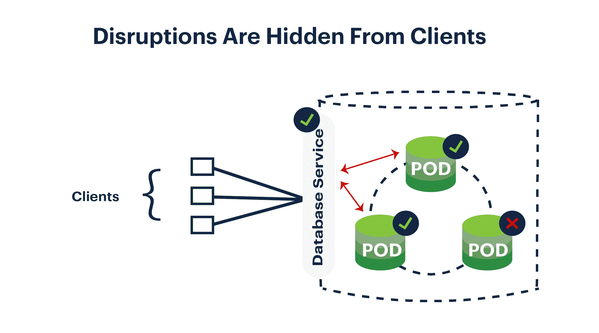
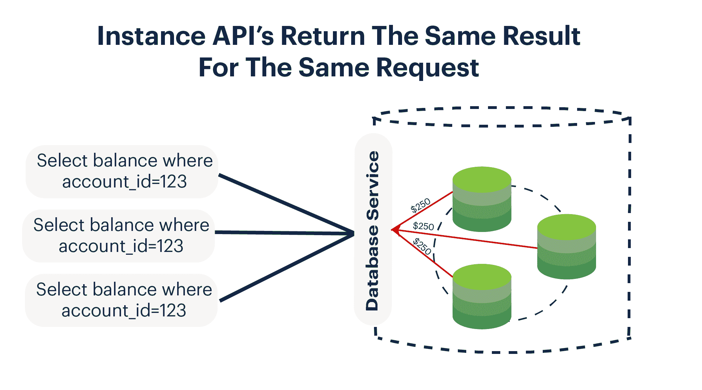
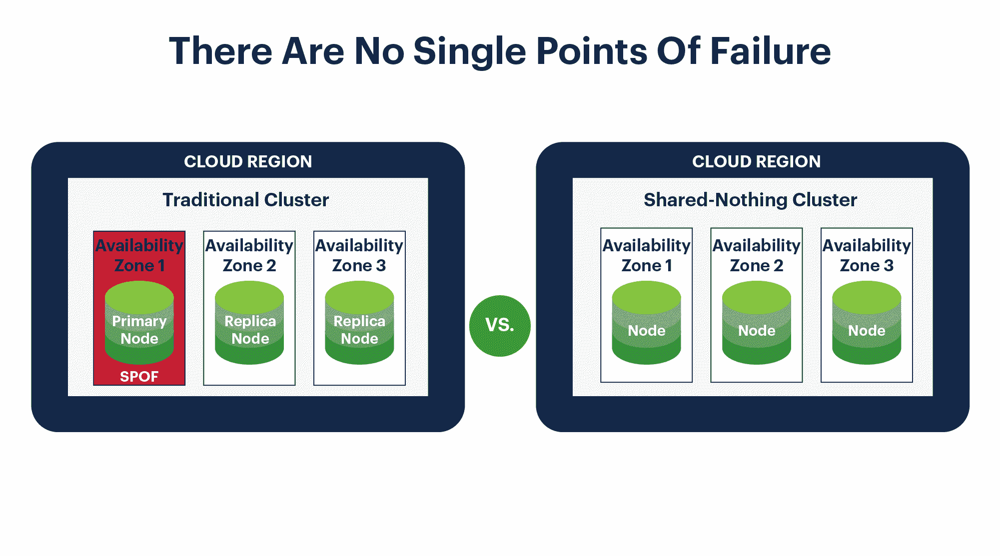
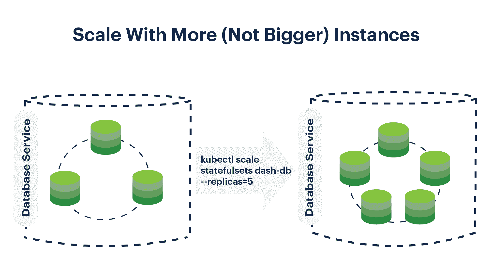

# DASH:Kubernetes 的四个特性——本地数据库

> 原文：<https://thenewstack.io/dash-four-properties-of-kubernetes-native-databases/>

 [内特·斯图尔特

内特·斯图尔特领导蟑螂实验室的产品团队，该公司开发了 CockroachDB:面向全球企业的超弹性 SQL 数据库。在蟑螂实验室之前，他为风险投资支持的 SaaS 营销公司渗滤液建立了纽约市产品管理组织。除了产品，他的经验还涉及工程和商业。Nate 是 Bloomberg L.P .的首席后端软件开发人员，并获得了麻省理工学院的 MBA 学位。](https://www.cockroachlabs.com/) 

云原生应用架构有助于开发人员向全球客户提供令人惊叹的体验。他们通过利用云提供商的数十亿美元投资来实现这一点，这些投资提供了遍布全球数百个数据中心的几乎无限的按需资源。kubernetes——Google 构建的开源容器编排系统——正迅速成为部署、运行和扩展这些应用程序的普遍工具。Kubernetes 简化并加速了应用交付，如果(这是一个很大的“如果”)这些应用被设计为利用云环境中的可用资源。

古老的 12 因素应用程序指南记录了考虑云原生架构的良好框架，但概述的设计模式实际上只涵盖了无状态的应用程序部分，这意味着它们的输出只取决于它们的输入；中间发生的任何事情都不会被存储。不幸的是，赋予任何应用程序生命(或状态)的传统关系数据库的架构并没有充分利用云中的可用资源。

在 [12 因素应用](https://thenewstack.io/12-factor-app-streamlines-application-development/)中，这些数据库被归入模糊的“后台服务”部分，它们存在于云原生指南之外。同样，虽然一些信息技术(IT)团队已经将数据库移植到容器中，并对它们进行了编排以简化部署，但他们还没有能够充分利用 Kubernetes 的强大功能来利用您期望从专门构建的云原生系统中获得的弹性和规模优势。

> 与 Kubernetes 中运行的无状态服务器相比，如果一个数据库进程停止运行，应用程序也不会知道。

如果我们设计一个更类似于 Kubernetes 构建运行的可水平伸缩的无状态应用服务器的关系数据库会怎么样？如果我们想做到这一点，同时保持 SQL 的数据完整性保证，这将意味着探索计算机科学研究的前沿，以绕过以前不可逾越的实现障碍——但结果将是值得的。其中一些下一代“NewSQL”数据库可以与 Kubernetes 一起工作，最终将端到端的云原生堆栈带入 IT 团队的视野。

在这篇文章中，我将介绍支持数据库的 Kubernetes-native 操作的四个因素:可处置性、API 对称性、无共享和水平伸缩。让我们称这些因素为破折号。为了使这些概念具体化，我将使用我最喜欢的 DASH 数据库的例子，[cocroach db](https://www.cockroachlabs.com/)，但是您应该记住，这些概念在不同程度上扩展到其他 NewSQL 数据库。

## 一次性:丢东西应该不是什么大事

可处置性是指数据库处理进程停止、启动或崩溃的能力，几乎没有任何通知。在云中，这些中断可能是由各种随机但不可避免的事件引起的，包括磁盘故障、网络分区或整个虚拟机离线。可处置性很重要，因为 Kubernetes 调度程序使用一组规则来确定哪些 pod(即，总是作为一个单元调度的容器小组)在哪些机器上运行。一旦计划了 pod，它们将保留在这些机器上，直到由于自愿(即扩展或升级)或非自愿(例如硬件故障或操作系统内核崩溃)因素而发生某种中断。

当这些中断发生时，Kubernetes 可能会将 pod 重新安排到更合适的节点；对于支持可处置性的数据库，这种重新调度应该对客户端透明。此外，在幕后，新的和现有的进程需要能够随着网络身份的改变而动态地重新配置自己。与 Kubernetes 中运行的无状态服务器相比，如果一个数据库进程停止运行，应用程序也不会知道。

像这样的中断对于遗留关系数据库来说是一个严重的问题，因为它们通常在任何给定的时间都有一台机器为它们供电。对于生产部署，这些数据库可能会将更新异步发送到第二个实例，第二个实例将在主计算机停机时起主导作用。然而，在实践中，实际故障转移的过程很难做好。Github 最近描述了在重大故障期间执行 MySQL 故障转移的危险，这会导致数据过时和不一致。如果支持遗留关系数据库的系统出现故障，用户可能会知道。

NewSQL 和 NoSQL 数据库通常都具有可处置性，因为它们被设计为在短暂的云环境中茁壮成长，在这种环境中，虚拟机可以随时重启或重新安排。具有这一因素的数据库应该能够经受住节点故障，而不会丢失数据和停机。例如，CockroachDB 能够通过在集群中的节点之间维护任何数据片段的三个一致的副本来经受机器丢失；一旦大多数副本确认了写入操作，就会向客户端确认写入。在包含给定副本的机器丢失的情况下，CockroachDB 仍然可以提供一致的读取和写入，同时在集群中的其他地方创建该数据的第三个副本，以确保它可以经受住未来的机器故障。

请记住，可处置性不仅仅是在单个机器出现故障时幸存。DASH 数据库应该能够将一次性概念扩展到整个数据中心甚至数据中心区域。这种真实世界的失败应该是无事件的；这些功能将有助于避免类似富国银行遇到的问题，即“数据中心冒烟”导致全球停机。

## API 对称性:每个服务器应该对同一个问题提供相同的答案

Kubernetes 使用服务来允许客户通过一个方便的 DNS 入口将一组相同的进程作为一个整体来处理。这样，应用程序不需要知道驱动前端的许多实例；可能有一台后备服务器，也可能有数百台。服务本质上被定义为这样的规则，即具有给定标签集合的任何 pod 都应该接收发送到该服务的请求(假设它们的健康检查和就绪性探测表明可以发送流量)。

为什么 Kubernetes 采取这种方法？通过将 pod 与它所关联的服务的地址分离，我们可以在不中断现有应用程序实例的情况下进行扩展。这是可能的，因为 API 是对称的，这意味着组中包含的 pod 都具有相同的 API 并提供一致的响应，而不管 Kubernetes 服务选择哪个实例。对于无状态服务，这很简单:每个服务中的逻辑都是相同的，因此在给定时间向任何服务发送请求都会产生相同的结果。注意，对于具有 API 对称性的数据库，**底层数据也必须是强一致的**。如果根据您被路由到哪个节点而得到不同的答案，那么 Kubernetes 提供的抽象就被破坏了，这会给应用程序开发人员带来导致错误的复杂性。

这实际上是传统关系数据库比 NoSQL 系统表现更好的一个领域。虽然这最初看起来可能违反直觉，但这是因为当数据库只有一个节点时，它的 API 是对称的(尽管是以可处置性为代价)——换句话说，当向服务发送查询时，您将总是得到相同的结果。然而，当异步复制开始起作用时(无论是为了高可用性还是为了支持性能改进，如读取副本)，API 对称性就被破坏了，因为主服务器变成了副本稍微不同步的事实的来源。

在 NewSQL 世界中，像一致性复制这样的技术允许数据库提供 API 对称性，而不牺牲可处置性。回到我们的 cocroach db 示例:任何 cocroach db 节点都可以处理任何请求。如果接收负载平衡请求的节点恰好在本地有它需要的数据，它将立即响应。如果没有，该节点将成为网关，并将请求转发到后台的适当节点，以获得正确的答案，而不是将错误发送回客户端(或提供过时的结果)。从请求者的角度来看，每个节点都是完全一样的。当您将数据库 API 对称性与 Kubernetes 服务对象相结合时，您可以创建一个有效的单一逻辑数据库，并保证单机系统的一致性，尽管实际上有几十个甚至几百个节点在幕后工作。

## 无共享:消除单点故障

云不应该有维护窗口，真正的云原生服务应该具有始终在线的能力。在可处置性一节中，我们讨论了 Kubernetes 提供的在发生计划内或计划外中断事件时立即重新安排节点的选项。无共享数据库更进了一步。这个属性表明，数据库应该能够在没有任何集中式协调器或单点故障的情况下运行。在无国籍的世界里，这与可支配性密切相关；当涉及到国家时，这一概念成为一个额外的考虑因素。

关系数据库因存在单点故障而臭名昭著。这甚至延伸到现代 RDBMS 系统，如 Amazon Aurora。甚至一些 NewSQL 数据库也依赖于专门的协调员来跟踪建立一个全球分布式系统所需的所有簿记工作。这意味着，您的体系结构可以在某些工作人员被释放后继续存在，但是如果您关闭协调器进程，如果整个系统在许多情况下没有脱机，配置状态将被冻结，某些类型的关键操作(可能是调试问题所需的操作)将失败。

云原生数据库应该能够在任何节点都可能发生故障的情况下生存，而不仅仅是“除了协调一切的特殊主节点之外的任何节点”例如，CockroachDB 没有主进程——这就是赋予它同名生存性特征的原因。尽管每个 CockroachDB 数据库服务器都是有状态的，但它只依赖于它所负责的状态(尽管它确实缓存了一些通过对等网络与其他节点通信而收集到的关于集群的信息)。CockroachDB 节点不依赖任何权威来源来说明它们在任何给定的时间点应该做什么。有状态系统的无共享架构允许超高可用性和易操作性。

*有趣的是，Kubernetes 本身并不是一个无共享的系统。它有一个单区域控制平面，如果被破坏，将危及集群。运营商可以通过跨地区甚至跨云提供商的 Kubernetes 集群来创建比 Kubernetes 的控制平面节点存活更多的 NewSQL 数据库集群。*

## 水平扩展:向外扩展而不是向上扩展

最后一个因素是水平可伸缩性。类似于这个术语在 12 因素应用程序中的用法，这意味着如果您想要更多的吞吐量，您只需添加更多的流程。Kubernetes 控制器和调度器相结合，使水平扩展成为一个简单的、声明式的过程:您只需简单地说出您想要多少个实例，Kubernetes 系统就会努力地添加 pods 来满足您的请求。当与上述服务相结合时，这就产生了一个单一数据库的印象，它神奇地获得了两倍的功能，但成本是线性增长的，而不是指数增长的。

虽然水平伸缩是许多 NoSQL 系统的一个基本优点，但传统的关系数据库在这方面做得不好。相反，他们依靠分片——有或没有 Vitess 等系统的帮助——来完成这个用例。这对于云原生环境中的传统 RDBMS 系统来说意味着，如果您需要更多的功能，您必须购买更昂贵的机器并导致停机，或者您必须通过将您的数据库分割成许多不容易相互通信的部分来大幅增加您的运营开销。对于依赖垂直扩展的团队来说，这意味着关系数据库的功能有一个自然的限制——最终，它被限制在单个服务器所能支持的范围内。

NewSQL 数据库借鉴了 NoSQL 系统，通过添加更多的机器来扩展。例如，一个单一的 Kubernetes 命令可以通过提供新资源和增加额外的 pod 来横向扩展 CockroachDB，而无需停机；Kubernetes 负载平衡器将识别新的数据库容量，并自动开始在新的实例之间路由请求。每个节点可以独立处理请求，同时也参与帮助其他节点完成任务，如通过将复杂的查询分解为可以并行完成的较小的工作来处理复杂的查询。Kubernetes 提供了一些特性来帮助扩展有状态服务，比如为 pods 提供可预测的网络身份，以促进集群实例之间的服务发现。

## 关系数据库通向云的桥梁

DASH 属性是拥有真正的云原生架构的必要前提。

*   可处置性确保当短暂的云资源不复存在时，您的有状态系统能够继续存在。
*   API 对称性允许分布式数据库总是提供最新的答案，无论哪个进程正在处理客户端请求。
*   无共享属性使您的数据库能够在没有任何集中的主数据库或协调数据库的情况下继续前进。
*   水平可伸缩性允许关系数据库利用云中无限的按需资源。

当与 Kubernetes 结合使用时，DASH 数据库为 IT 团队提供了一个自动化的关系数据库，作为一个始终在线的弹性数据层，将缺失的云原生基础添加到他们的堆栈中。

<svg xmlns:xlink="http://www.w3.org/1999/xlink" viewBox="0 0 68 31" version="1.1"><title>Group</title> <desc>Created with Sketch.</desc></svg>