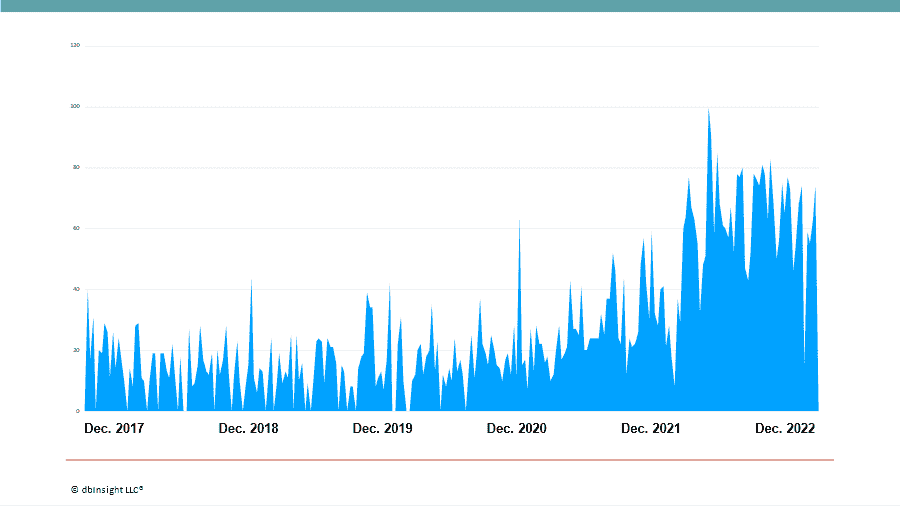
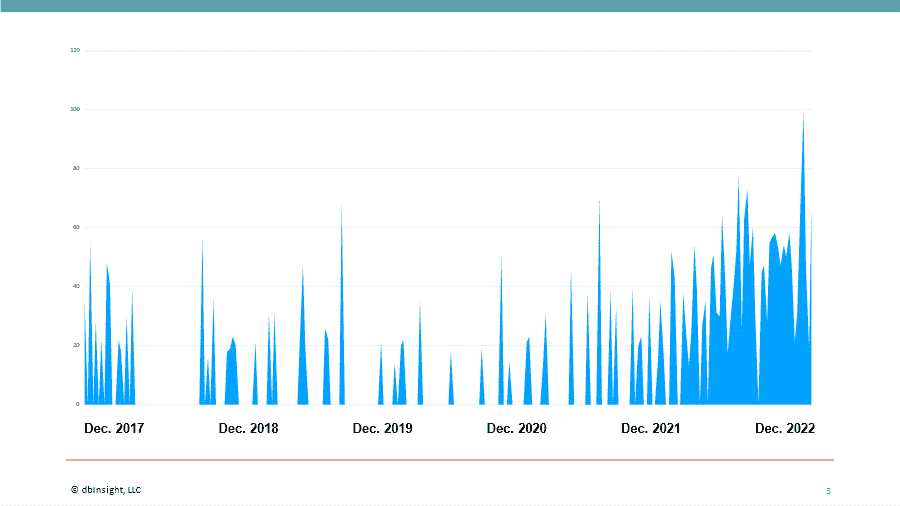

# 2023 年的数据:SQL 书呆子的复仇

> 原文：<https://thenewstack.io/data-2023-revenge-of-the-sql-nerds/>

昨天，我们[预测了](https://thenewstack.io/data-2023-outlook-rethink-the-modern-data-stack-1/)2023 年数据世界面临的最大运营挑战。今天，我们负责数据管理。

一方面，数据网格问题继续主导着数据管理的讨论。去年，围绕数据网格[的对话达到了临界点](https://thenewstack.io/data-fabric-or-data-mesh-find-the-happy-medium/)。这个话题很新，足以吸引人们的注意力，而且考虑到企业在云中积累的数据爆炸，这个话题非常及时。去年，我们预测这一概念将面临首次严格审查，并在某些方面遭到强烈反对。

如果说数据网格是一个占据前台的问题，那么数据湖库则是过去一年[在后台出现的概念](https://thenewstack.io/how-to-build-a-modern-data-infrastructure-using-a-lakehouse/)。虽然与数据网格相比，它没有引起激烈的讨论，但在 2022 年，生态系统的发展开始获得临界质量动量。对于 SQL 爱好者来说，它提供了一种证明形式:虽然 lakehouse 欢迎所有语言的查询，但它是基于使用关系表结构对数据湖进行排序。

在本帖中，我们对这些核心数据管理学科在未来一年的前景进行了预测。

数据网格谷歌搜索。来源:谷歌趋势。

### 数据网格:进展中的工作

数据网格是一个挥之不去的话题。在过去的几年里，没有任何帖子比我们在 data mesh 上的帖子引起了更多的回应。例如，[我在 LinkedIn 上写的这篇帖子](https://www.linkedin.com/posts/onstrategies_the-8-best-data-mesh-software-companies-activity-7002814978160230400-R3ZG/?utm_source=share&utm_medium=member_desktop)获得的回复比我们通常的平均水平多了大约 10 倍。显然，数据网格继续触及神经。

一年前，我预测数据网格将面临第一次真正的审查，轶事证据，无论是来自公开发表的内容还是对我 LinkedIn 帖子的评论，都表明了巨大的反弹。

我们有充分的理由继续进行数据网格的讨论。云存储和数据湖中的数据不断积累，人们担心会有什么数据进入其中。我们曾经把这个问题称为数据沼泽。

这是数据湖库背后的主要驱动力，因为组织希望获得信心，确保他们的数据湖中没有充满损坏或过时的数据。数据网格背后的流行观念是，最了解特定部分数据的人不仅应该正式拥有数据，还应该采用产品思维来管理数据的生命周期。令人担忧的是，如果治理不当，这可能会导致强化或构建新的数据孤岛。

我认为，至少团队、业务单位或寻求采用数据网格实践的主题专家“领域”[需要使用一种通用语言](https://www.zdnet.com/article/data-2022-outlook-part-ii-reality-bytes-the-data-mesh/)来描述数据和数据产品，这种通用语言就是元数据。建立某种公共元数据底板，比如通过数据结构(诚然，这是一种尚未完全定义的技术)，是重要的第一步。

虽然数据网格是关于人和过程的，但技术也参与其中，因为它是衡量人类努力的手段。然而，在那里，数据网格是一种技术的困惑依然存在。

在她[的书](https://www.amazon.com/Data-Mesh-Delivering-Data-Driven-Value/dp/1492092398)中，构想数据网格的扎马克·德格哈尼使用术语“数据网格平台”作为“自助式数据平台”的简写不幸的是，术语增加了混乱。我们希望今年围绕数据网格的技术信息会更加清晰。

具有共享上下文的团队将是采用数据网格的最佳候选人。这种背景可能来自相关业务领域或领域的工作，或者来自以前的合作经验。

最有可能采用数据网格的将是多样化的组织，它们混合了特定主题的领域，但也需要共享一些公共信息。例如，财产和意外保险公司为汽车和房主提供不同的保险项目；它将拥有针对各自业务的独立数据产品，但在共同客户的旅程中共享数据产品。

这同样适用于多样化的旅游预订业务，包括客户评论、酒店、机票、旅游和餐馆预订；或者专门研究相关药物家族的生命科学公司。

但是最大的障碍将是定义联合治理，这是为业务域提供构建和管理其数据产品生命周期的自主权所必需的，同时确保符合关于数据质量、隐私、安全等方面的公司标准、政策和法规要求。

在人员层面存在挑战——在实践中实现联合治理需要反复试验，并且在许多组织中，需要文化变革。在数据网格的拥抱中，团队是否会忘乎所以地扩散数据产品，以至于开始相互重叠和复制？你如何为此制定政策？此外还有技术限制——用于“自我注册”的自助服务技术或具有内置可观察性和可发现性的数据产品是否已准备好进入黄金时段？顺便问一下，将使用谁的数据目录—因为大多数组织可能有多个目录。

也就是说，2023 年将继续是数据网格的学习过程。这场辩论将继续直播，不，我们不能在 12 个月后宣布胜利，然后继续前进。

谷歌搜索。来源:谷歌趋势

## 数据湖屋:SQL 书呆子的复仇

在过去的一年中，我们看到围绕数据湖库构建新的商业生态系统的速度大大加快。考虑到 2022 年谷歌搜索活动的增加，这并不奇怪。

一个已经渗透了大约五年的想法，顾名思义，数据湖库是数据仓库和数据湖的混合体。它应该提供两个世界的最佳:数据湖的规模和灵活性以及数据仓库的 SLA、可重复性和成熟治理。

作为一个由 [Databricks](https://www.databricks.com/company/about-us) 在 2019 年首次推广的术语，数据湖库的触发因素是需要将[酸性交易](https://thenewstack.io/an-apache-cassandra-breakthrough-acid-transactions-at-scale/)引入数据湖。这并不是一定要将其转换成事务数据库，而是要建立信心，确保数据湖中的数据是最新的，没有损坏。它在云对象存储之上强加了软件定义的表结构。使用这种表结构，您可以获得许多其他好处，比如可以接近数据仓库的改进性能，以及更细粒度的治理，不仅可以深入到列，还可以深入到行级别。

正如开源商品化的核心基础设施一样，从操作系统到文件系统和容器编排级别，它可能对数据仓库产生相同的影响，在数据仓库中，差异化从底层表结构向上移动到分析引擎。

虽然有专有的数据湖库表结构，由 [AWS](https://aws.amazon.com/lake-formation/) 、 [Oracle](https://www.oracle.com/news/announcement/ocw-oracle-announces-mysql-heatwave-lakehouse-2022-10-18/) 和 [Teradata](https://www.teradata.com/Press-Releases/2022/Teradata-Announces-VantageCloud-Lake) 引入，但在开源方面已经出现了一群活动(双关语)，其中有三种竞争格式: [Delta Lake](https://delta.io/) ，由 Databricks 引入，以及由社区发起的 [Apache 胡迪](https://hudi.apache.org/)和 [Apache Iceberg](https://iceberg.apache.org/) 。它已经成为 Databricks 和 Snowflake 之间的最新战场，Databricks 最终[开放了 Delta Lake](https://www.infoworld.com/article/3665117/databricks-open-sources-its-delta-lake-data-lake.html) 项目的剩余部分，而 [Snowflake](https://www.snowflake.com/blog/iceberg-tables-powering-open-standards-with-snowflake-innovations/) 则全部投入到冰山上。

对 lakehouse 的支持来自超大规模公司，AWS 和 Google Cloud 宣布计划在其分析产品组合中推出对 Iceberg 的支持。最终，他们还会支持三角洲湖以及后来的胡迪[。请关注三角洲湖和冰山，因为他们在建立商业生态系统方面有领先优势。但也要留意 IBM、微软、甲骨文、SAP、SAS 和 Teradata 等知名公司的投资方向。我们期望他们今年在地里插上木桩。](https://www.infoworld.com/article/3676074/google-aims-for-biglake-data-lake-support-for-all-unstructured-data.html)

虽然 data lakehouse 面向所有人，包括 SQL 开发人员和 Python 程序员，但是大部分吸引力可能来自 SQL 社区，因为 lakehouse 在数据湖上强加了一个关系模式。2023 年，我们预计将看到 lakehouse 概念证明的普及。从长远来看，湖屋不会取代数据湖，在数据湖中，数据科学家需要自由漫游，而不受关系表结构的阻碍，以便发现模式和开发模型；它们也不会取代专门为报告而创建的专用数据仓库或数据集市。但我们预计 lakehouses 将在长期内与企业数据仓库合作，支持多语言数据、分析和数据库内机器学习。

<svg xmlns:xlink="http://www.w3.org/1999/xlink" viewBox="0 0 68 31" version="1.1"><title>Group</title> <desc>Created with Sketch.</desc></svg>