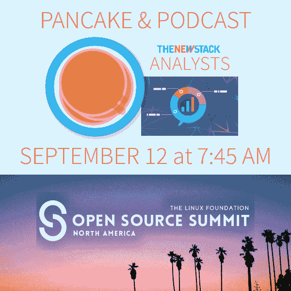
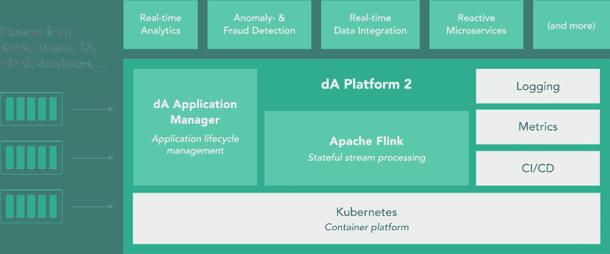

# 数据工匠部署 Kubernetes 来管理企业 Flink 流处理

> 原文：<https://thenewstack.io/data-artisans-deploys-kubernetes-manage-enterprise-flink-stream-processing/>

开源的 Apache Flink 流处理框架已经引起了人们的兴趣，自然，作为一个面向企业的软件项目，Flink 开始获得商业支持和产品。拿起 Flink 大旗，迄今为止跑得最远的公司是[数据工匠](https://data-artisans.com/)。

该公司的 dA Platform 2 平台作为早期私人测试版于本周发布，带来了管理和监控生产中 Flink 应用程序的新工具。这在以前是运营团队难以完成的任务。随着新的 dA Platform 2 的发布，这个包现在包括了 Kubernetes 容器编排工具和一个应用程序管理器。

“构建 Flink 应用程序和使用 API 很容易，但一旦你想让它全天候运行，挑战就来了。这些都是有状态的应用程序，很难在生产中维护有状态的应用程序，”Data Artisans 首席执行官兼联合创始人 Kostas Tzoumas 说。

dA 平台 2 由三个核心组件构建而成:

1)弗林克。2)应用程序经理。
3)用于日志记录和指标的参考架构和可选组件。

这也是包含 [Kubernetes](/category/kubernetes/) 的 dA 平台的第一个版本。该平台现在利用流行的容器编排平台来管理 Flink 的实例，并从整体上控制工具链。

对于未来，Tzoumas 说，他看到了很多机会来帮助企业运营和利用 Apache Flink 来满足他们的流处理需求。“我们现在真正关注的是将这项技术推向市场，并让整个企业都能使用这项技术。我们真的看到流媒体技术被用于更广泛的使用场合。我们看到了应用领域、微服务和批处理中的应用。我们在大型环境中进行了用户强化和压力测试。对我们来说，下一步是让普通企业用户的操作更加顺畅。”

该公司计划在 2018 年初全面发布 dA Platform 2 供生产使用。

<svg xmlns:xlink="http://www.w3.org/1999/xlink" viewBox="0 0 68 31" version="1.1"><title>Group</title> <desc>Created with Sketch.</desc></svg>