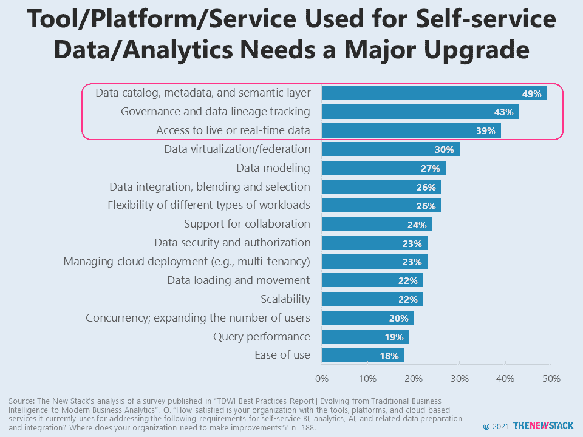

# 数据目录需要重大升级

> 原文：<https://thenewstack.io/data-catalogs-need-a-major-upgrade/>

用于数据目录、元数据和语义层的工具不能满足自助式商业智能、分析、人工智能和相关数据准备和集成的要求。根据 TDWI 的“[从传统商业智能到现代商业分析](https://tdwi.org/research/2020/09/bi-all-best-practices-report-evolving-from-traditional-bi-to-modern-business-analytics.aspx)”中包含的 2020 年调查，49%的人认为他们的工具、平台和云服务需要重大升级，以满足他们在这一领域的要求。同样，43%的人认为需要进行重大升级，以满足治理和数据沿袭跟踪要求。对实时数据的访问是一个仍然没有达到目标的领域，因为人们的期望远远高于当今数据仓库所能提供的。

总的来说，很少有回答者对需求得到满足感到非常满意，但是有些领域至少做得不太差。只有 18%的人认为“易用性”需要做很多工作，而可伸缩性、查询性能和安全性也做得相对较好。然而，尽管供应商一直在满足这些桌面赌注要求，但这并没有帮助他们快速采用广泛的自助服务功能。尽管如此，只有 50%的受访者表示，人们可以在很少或没有 IT 干预的情况下访问报告，这是最常见的自助服务活动类型。

## 

## 进一步阅读

通过 Pixabay 的特征图像。

<svg xmlns:xlink="http://www.w3.org/1999/xlink" viewBox="0 0 68 31" version="1.1"><title>Group</title> <desc>Created with Sketch.</desc></svg>