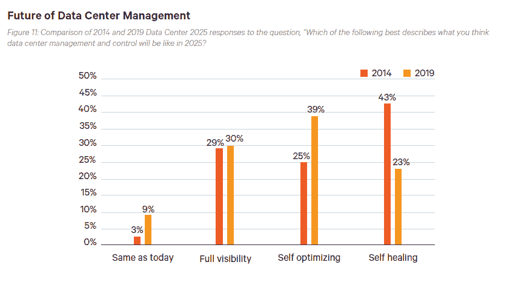
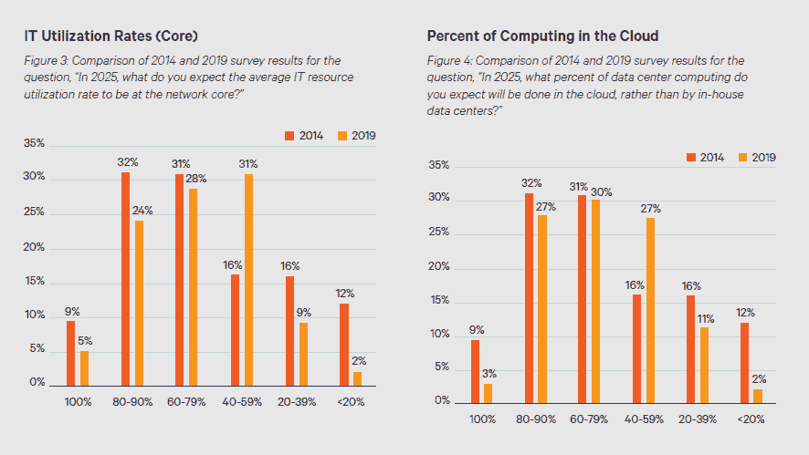
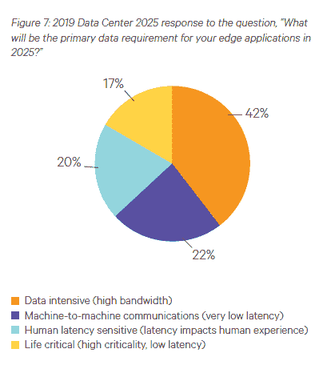

# 数据中心管理:从自我修复转向自我优化

> 原文：<https://thenewstack.io/data-center-management-self-healing-shifts-to-self-optimization/>

经验法则:不要问关于长期意图的调查问题。知道六个月后会发生什么已经够难了，更不用说六年后了。然而，规则就是用来打破的。我们不是在写 Vertiv 的“[数据中心 2025:更接近边缘](https://www.vertiv.com/en-us/about/news-and-insights/articles/pr-campaigns-reports/data-center-2025-closer-to-the-edge/)”报告，因为它准确地预测了未来。相反，来自 800 多名数据中心专业人员的回复让我们得以一窥 2025 年的情况，并审视了“自我修复”等流行语的发展情况，以及“边缘计算”等新趋势

调查受访者认为，数据中心管理和控制正朝着自我优化的未来发展。当纵向研究在 2014 年首次进行时，43%的人表示“自我修复”将是 2025 年该行业的关键。五年后，只有不到一半的人同意这一观点。虽然这两个术语都指自动化，但还是有区别的。自我修复系统可以自动检测和解决问题。相比之下，自我优化可以提高性能或降低成本，例如，将工作负载路由到不同的云提供商。也许供应商推广的自我修复技术的实践经验已经引起了怀疑。就像新兴的 AIOps 市场一样，通过使用自动化工具来逐步优化性能更为现实，这些工具可能会也可能不会利用人工智能。

来源:Vertiv 的《数据中心 2025:更接近边缘》。自愈率大幅下降:从 2014 年的 43%降至目前研究中的 23%。数据中心专业人士更有可能相信行业未来将专注于自我优化。

对 IT 利用率的预期也变得更加现实，预计网络核心平均利用率极高或极低的数据中心专业人员明显减少。五年前，服务器虚拟化推动了利用率的提高。现在，按需云计算和容器化是提高利用率的催化剂。这些进步使得资源利用的可变性不再是一个问题。事实上，在某些情况下，边缘计算和对性能的强调等对抗力量使得冗余资源成为人们的需求。此外，运营支出在 IT 预算中占据更突出的位置，这意味着人们通常不会专注于最大化其资本支出技术投资。

来源:Vertiv 的《数据中心 2025:更接近边缘》。终端用户非常不擅长预测两年后将在云中运行的工作负载的百分比。然而，从长远来看，他们可能有先见之明。

来源:Vertiv 的《数据中心 2025:更接近边缘》。

根据 Vertiv 的调查，2025 年高带宽将是边缘应用的首要数据需求。许多(但不是所有)边缘用例都有高性能需求。出于这个原因，架构师可能更愿意犯错误，过于谨慎，过度构建 IT 基础设施。对于最有可能需要边缘计算的用例的其他观点，我们建议查看 [**MobiledgeX 的导航器**](https://www.mobiledgex.com/navigator/model) 。这些交互式工具让您调整四个不同的因素将如何影响不同用例的相对吸收。

**关于方法论的最后一个旁白**

观察到的数据点、最终用户调查和专家访谈的结合是理解和分析技术趋势的最佳方式。结合对经济和市场周期性的理解，行业分析师可以有效地指导产品经理和投资者的决策。但是，谦虚可能是预测者成功的最重要的预测因素。事实上，对专家和公共政策专家的多项定量研究发现，最准确的预言家是那些经常说他们不知道未来会发生什么的人。最好的预测者会调整他们的预测，并愿意迅速改变主意。不幸的是，正如丹尼尔·德莱兹纳在《创意产业》一书中解释的那样，“有太多的激励让“思想领袖”去改变他们对下一个改变世界的想法的看法。

通过 Pixabay 的特征图像。