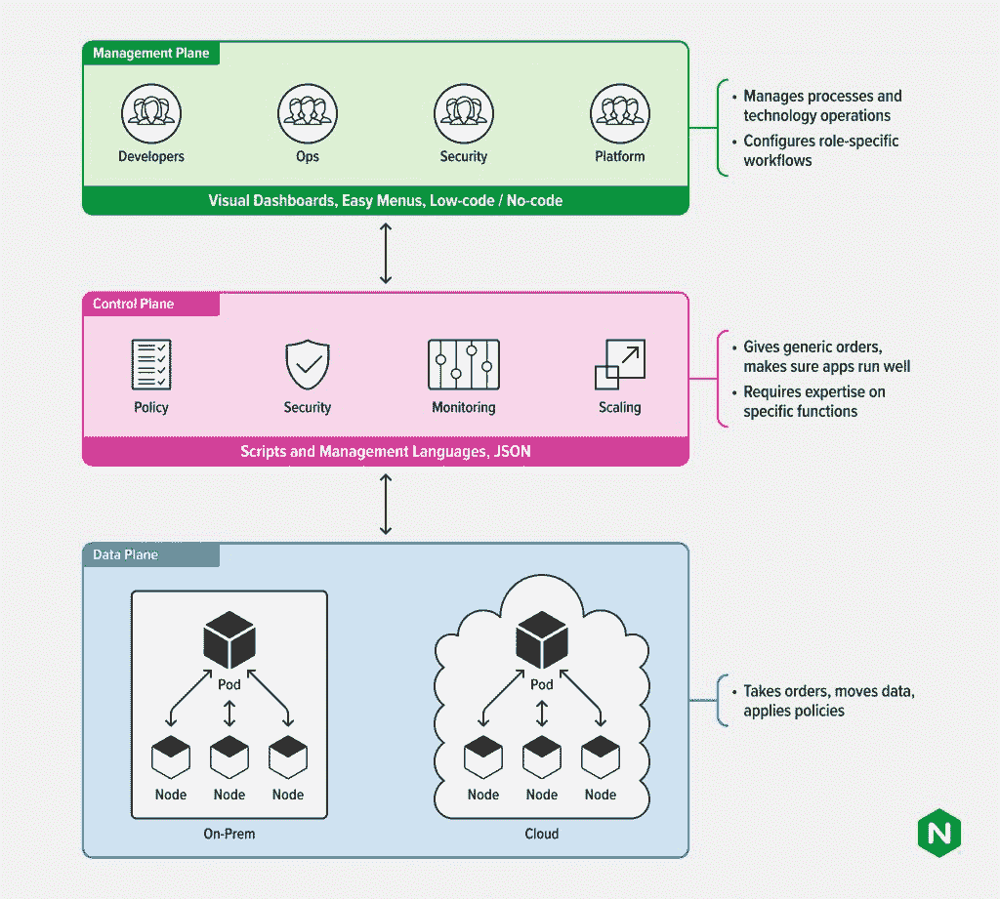

# 数据、控制、管理:三架飞机，不同的高度

> 原文：<https://thenewstack.io/data-control-management-three-planes-different-altitudes/>

这是三部分系列的第一部分。阅读[第二部分](https://thenewstack.io/why-developers-need-a-management-plane/)和[第三部分](https://thenewstack.io/why-enterprises-need-a-management-plane/)。

随着向由 [Kubernetes](https://www.nginx.com/resources/glossary/kubernetes) 和[容器](https://www.nginx.com/resources/glossary/container/)支持的云原生方法的转变，应用程序发生了根本性的变化。现代应用程序通常基于 API，在全球多个环境中更频繁地部署，并由小型微服务组成。这种范式转变带来了几个挑战，其中最主要的挑战是如何有效地管理和保护由分布式团队管理的[微服务](https://www.nginx.com/resources/glossary/microservices/)的复杂组合。

 [埃里克·布劳恩

Eric 是 F5 NGINX 产品管理和商业战略副总裁。Eric 在 SaaS、PaaS 和 IaaS 领域工作了 20 年，在公有云、私有云(系统软件)和混合云领域拥有 10 年的经验，任职于 Joyent、三星、甲骨文和德国电信的 MobiledgeX(已被 Google 收购)。Eric 是社区和生态系统的架构师，拥有开发人员体验领域的专业知识，以及云与电信和新兴 AI、ML、XR 和其他用例及互联设备的交叉。](https://www.linkedin.com/in/ebraun/) 

最近的一份报告显示[全球超过 380，000 个 Kubernetes APIs 暴露在没有适当安全策略的公共互联网上](https://www.shadowserver.org/news/over-380-000-open-kubernetes-api-servers/)。这个广泛存在的漏洞不仅仅是一个安全漏洞。这是从业者面临的日益增长的复杂性的一个征兆。分布式环境缺乏足够的可见性，会造成治理缺口，扩大威胁面，并增加因群集和服务配置错误而导致停机的可能性。

随着越来越多的企业部署[云原生应用](https://www.nginx.com/resources/glossary/cloud-native-app-delivery/)，需要一个管理平台来抽象和简化这种复杂性。简单回顾一下，云原生和容器管理领域在三个不同的层面上运行:数据、控制和管理。

*   数据平面—容纳并传输应用程序和数据流量。
*   控制平面—为数据平面配置规则。
*   管理平面—为数据平面和控制平面设置护栏。

管理平面是漂浮在控制和数据平面“上方”的元层，它在堆栈中的更高高度上运行，可以也有必要设置适用于所有应用、API 和微服务的全局策略和配置。该层还可以通过应用程序组、类型或地理位置来管理和应用策略。关键是要区分控制平面和管理平面，并了解它们如何重叠。

在本文中，我们定义了每个平面，并从高度、业务案例和技术要求的角度强调了控制平面和管理平面之间的关键区别。

## 数据平面概述

数据层是橡胶接触路面的地方。用户体验、延迟和所有其他决定应用性能的关键指标都依赖于响应迅速、可靠且高度可扩展的数据平台。这就是为什么[你的数据平面不是商品](https://thenewstack.io/your-data-plane-is-not-a-commodity/)并且对大规模构建高性能现代应用至关重要。从根本上说，数据层是实现应用程序应该做什么以及应该如何运行的层。所有策略、服务级别协议(SLA)和扩展或行为触发器(如重试、保持活动和水平扩展)都在数据平面内执行。

Kubernetes 中的数据平面看起来与旧架构中的略有不同。它由 worker 节点组成，它们的 pod 和容器通过它们的 [kubelet](https://kubernetes.io/docs/reference/command-line-tools-reference/kubelet/) 代理进行通信，这些代理与容器引擎和维护状态信息的数据库(例如，像 [etcd](https://etcd.io) 这样的键值存储)共享状态和条件。每个节点都有一个 kubelet，它从 API 服务器(控制平面)接收配置指令。虽然在构造和设计上与传统三层 web 应用程序中使用的数据平面有些不同，但 Kubernetes 数据平面的功能大致相同，即确保应用程序运行良好。

## 控制平面和管理平面

控制平面作为独立的实体位于数据平面之上。最初它是第四层网络的策略引擎，在 Kubernetes 中，它对第七层流量也有一定的影响。数据平面直接控制通过应用程序的数据流以及应用程序在 pod 级别的行为方式。控制平面制定并向数据平面分发指导，监督容器、节点、pod 和[集群](https://www.nginx.com/resources/glossary/clustering/)的编排和协调。控制平面的组件对集群做出全局决策(例如，调度)，以及检测和响应集群事件(例如，在现有 pod 出现故障或无响应时启动新的 pod)。

控制平面组件可以在集群中的任何实例上运行。但是，配置脚本通常将所有控制平面组件放在同一台机器上，并通过不在该机器上运行用户容器来隔离该机器。简而言之，控制平面就像交通警察，为数据平面中呼啸而过的数据强制执行道路规则。

在这里，我想介绍一下管理平面，我们看到[平台运营团队](https://thenewstack.io/platform-ops-the-next-frontier-for-operations-teams/)创建这个平面来实现更加敏捷和以开发人员为中心的应用程序开发。虽然其功能相似，但管理平面位于控制平面之上。这一更高层旨在简化控制平面的配置，以实现更轻松的扩展、可观察性和弹性。

## 为什么我们需要管理平面

在[现代应用](https://www.nginx.com/blog/defining-a-modern-app/)的时代，要求构建微服务的团队学习如何管理数据和控制平面是不现实的。学习曲线不仅会增加额外的负担，还会导致失败。与此同时，[在左移时代](https://www.nginx.com/blog/shifting-security-tools-left-for-safer-apps/)，组织需要向更广泛的利益相关者展示控制层面的力量，以便他们能够更有效地开展工作。管理平面更像是一个 SaaS 式的界面，即使是半技术团队成员也可以在应用程序策略、治理和行为上做出决策。

虽然一个[服务网](https://www.nginx.com/blog/what-is-a-service-mesh/)可以覆盖这里的一些领域，但有许多方面可以从一个独立而强大的管理平面中受益。这些团队可能包括网络运营团队和业务线(营销团队、安全团队、合规团队等)。管理平面也是[平台运营团队](https://www.nginx.com/blog/why-every-company-needs-platform-ops/)放置透明护栏的地方，以确保用户不会伤害自己或他人。这些护栏允许团队和组织更快地移动，更快地发布代码，并以相当低的风险运行。

随着组织继续将服务和功能分解为更离散的元素，每个元素都需要控制和治理，对管理平面的需求变得越来越迫切。用于运行应用程序的核心系统变得越来越复杂；这正是 Kubernetes 用于管理各种不同形状和大小的分布式容器化应用程序的原因。这种复杂性不会很快逆转。

## 更高的复杂性要求对面向未来的适应性应用进行智能抽象

随着我们转向从边缘到云运行的日益分布式的应用，以及随着应用部署环境变得更加多样化，我们需要给应用团队更多的选择，以帮助他们向左转变。左移扩展到应用程序团队之外的其他团队，这些团队技术含量较低(市场营销、法规遵从性)或技术含量高但负担过重(网络运营)，为他们提供了更好地完成工作的新能力。

在这种混合和快速发展的现实中，需要一个管理平台来有效地连接、运营和保护复杂的微服务和应用组合。在 NGINX，我们正在[构建一套工具](https://www.nginx.com/solutions/)，以确保所有三个层面的可观察性、可靠性、治理和安全性。蓬勃发展的组织必须在所有三个层面都做得很好，并为部署、管理、保护和迭代现代应用程序的大局而设计。

<svg xmlns:xlink="http://www.w3.org/1999/xlink" viewBox="0 0 68 31" version="1.1"><title>Group</title> <desc>Created with Sketch.</desc></svg>