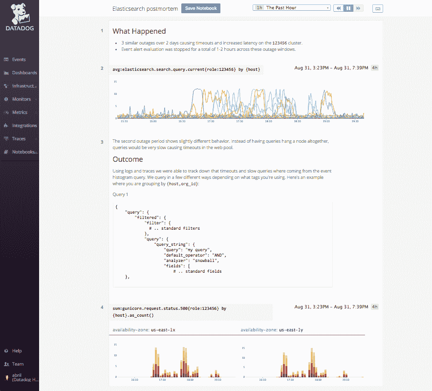
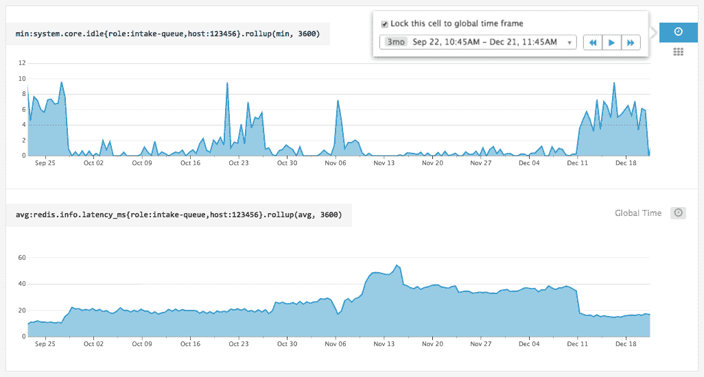
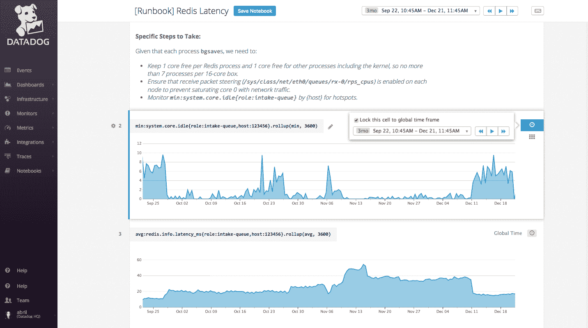
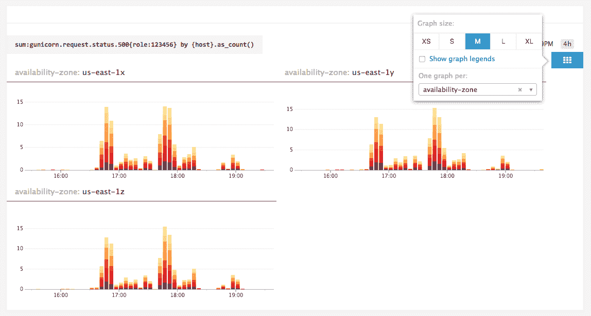

# 借助 Datadog 的全新公制笔记本，实现数据驱动的故事讲述

> 原文：<https://thenewstack.io/data-driven-storytelling-metric-notebooks/>

 [阿布里尔·洛亚·麦克劳德

阿布里尔·洛亚·麦克劳德是 Datadog 的技术作家。你可以通过推特@abrilaloya 联系到她。](https://www.datadoghq.com/lpg/?utm_source=Content&utm_medium=Blog&utm_campaign=Blog-TheNewStackNotebooks2016) 

当性能问题开始影响您的客户或用户时，您希望能够进行调查，查明问题的根源，并快速纠正它。为了防止将来出现类似问题，您还需要识别警告信号，设置自动警报，并在事后全面记录您的事件响应，以及应该采取的任何进一步措施。

[基础设施和应用监控服务 Datadog](https://www.datadoghq.com/lpg/?utm_source=Content&utm_medium=Blog&utm_campaign=Blog-TheNewStackNotebooks2016) ，通过其新的笔记本功能，使创建丰富、可共享的事后分析变得更加容易。与已经成为科学领域数据探索标准工具的基于网络的笔记本非常相似，Datadog 笔记本允许您将来自您的应用和基础架构的实时数据与详细的解释和分析联系起来。

笔记本中的每个单元格都可以包含一个数据狗度量图或丰富的减价格式文本。除了创建详细的事后分析，您还可以使用笔记本来创建操作手册，帮助工程师解决反复出现的问题，或者简单地将它们用作开放式探索您的指标的便笺本。

## 更好的尸检

使用 Datadog 笔记本，您可以使用事故的历史度量图创建详细的事后分析，并与整个团队分享。添加到任何笔记本的上下文文本都采用 Markdown 格式，允许您添加标题、副标题、链接、列表和代码块:

## 比较时间范围

笔记本中的每个图表都可以设置为可调整的“全球时间”，或者锁定在自己特定的时间范围内。因此，您可以显示描述事件发生时系统行为的图表，以及您发现的任何警告信号或上游问题。查明导致事件发生的系统行为提供了创建警报所需的信息，有助于您下次提前解决问题:

## 构建运行手册

当一个警报被触发时，有一个可用的操作手册可以在响应时间上产生很大的不同。笔记本可让您轻松创建、分发和更新操作手册，因此您可以确保随时待命的任何人都能获得处理已知问题的逐步说明。在警报中包含操作手册的链接会使警报更具可操作性。

## 开放式探索

借助笔记本电脑，您可以快速将任何基础架构或应用指标可视化为时间序列、热图或分布。例如，您可以将全局聚合指标的图表分解为每个可用性分区的单独图表:

默认情况下，新笔记本是私有的且短暂的，因此您可以将它们视为用于探索或调查的便笺本。但是，如果您发现了值得保存或分享的内容，您可以使用“保存笔记本”按钮来保存您的工作。

## 向前去探索吧！

丰富、最新、可访问的内部文档为工程团队提供了急需的背景。Datadog 的笔记本功能可以轻松创建和维护事后分析和运行手册，同时还允许您自由探索您的基础设施指标。

如果您已经是 Datadog 的客户，您可以通过点击侧边栏中的“笔记本”按钮来访问笔记本。否则，Datadog [有一个 14 天的免费试用期](https://www.datadoghq.com/lpg/?utm_source=Content&utm_medium=Blog&utm_campaign=Blog-TheNewStackNotebooks2016)，所以你可以给笔记本一个旋转。

[Datadog](https://www.datadoghq.com/lpg/?utm_source=Content&utm_medium=Blog&utm_campaign=Blog-TheNewStackNotebooks2016) 赞助了这个故事。

<svg xmlns:xlink="http://www.w3.org/1999/xlink" viewBox="0 0 68 31" version="1.1"><title>Group</title> <desc>Created with Sketch.</desc></svg>