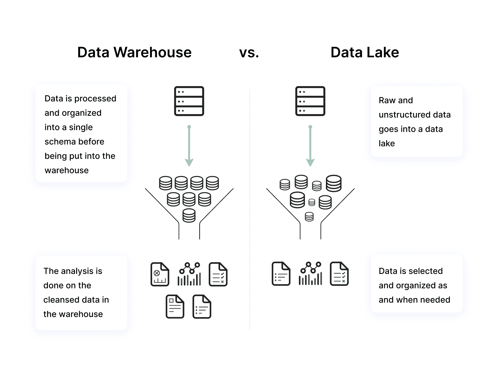

# 数据湖安全:深入了解最佳实践

> 原文：<https://thenewstack.io/data-lake-security-dive-into-the-best-practices/>

数据是地球上最有价值的资源，企业的成功取决于他们从数据中实现最大价值的能力。这就是为什么许多企业都在转向数据湖，以改进分析、实现更有效的协作并支持大规模的数据驱动型决策。

与传统关系数据库不同，数据湖能够从多个来源摄取原始形式的数据。

虽然数据湖有望提供卓越的业务成果，但快速采用数据湖会造成一些团队缺乏资源和领域专业知识来确保法规遵从性和安全控制到位的情况。让情况变得更为复杂的是，一系列广泛的内部角色(有时还有外部角色)都可以利用这个湖，从而放大了业务的潜在风险。

为了实现数据湖的好处而不损害安全性，企业需要遵循几种最佳做法，以降低不合规、数据管理不当、数据泄漏或其他安全事件的风险。

## **从数据库到数据湖**

数据库技术是在 20 世纪 60 年代引入的，当时计算机变得更容易访问，企业也在寻求一种高效存储和管理数据的解决方案。几十年来，在线事务处理(OLTP)工作负载和关系数据库一直是主力—提供快速、准确的数据处理。

然而到了 20 世纪 80 年代，数据仓库将数据处理从事务或操作系统转变为决策支持系统。这一转变使公司能够跨多个环境聚合数据，以收集业务智能(BI)并支持战略决策。

如今，几乎每个组织都使用数据库、数据仓库和 BI 来为创新提供信息并指导战略决策。但是，随着云计算和现代编码语言的兴起，数据库的使用方式也在不断变化，原因如下:

*   企业意识到，如果不应用预定义的模式或限制跨事务或分析系统使用模式的方式，他们可以从数据中获得更多价值。
*   数据用于开发和培训用于分析的机器学习(ML)模型，或用于实现在任何类型的数据库上运行的现有工作负载的现代化。
*   云计算允许以几年前不可能实现的速度和规模快速调配工作负载并实现现代化。

虽然一些企业仍然专注于关系数据库或数据仓库，主要是结构化数据，但精通数据的客户越来越会对这种过度关注表示不满。

数据仓库在处理和分析结构化数据方面表现异常出色，但它们无法捕获原始和非结构化数据，这是数字业务的一个严重限制。因此，数据湖等非关系数据库正变得越来越受欢迎，一些数据架构师现在默认为新工作负载使用数据湖，并对现有工作负载进行现代化。

## **为什么您应该考虑数据湖**

越来越多的组织开始在数据湖中开始他们的数据生命周期，因为他们可以立即获得价值，并可以使用它来构建 ML 模型，执行即席分析查询，为无数的分析系统提供数据等等。

传统上，数据仓库用于定期分析大量结构化数据或生成定期报告。但是，它们要求企业在处理和存储数据之前对数据应用预定义的模式，这限制了数据在事务或分析系统中的使用。

或者，数据湖不需要同样的前期工作。当数据从多个来源(包括非结构化日志数据、物联网(IoT)传感器和社交媒体或多媒体内容)被吸收到数据湖中时，这允许集成和存储未经转换或经过最少处理的数据。

这提供了三个好处。用户可以:

*   使用 Apache Kafka 等流处理工具，在数据流入数据湖时近乎实时地处理数据。
*   使用高性能查询引擎，如 Google BigQuery 或 Amazon Athena，直接从数据湖中获得特定的见解。
*   使用 Elasticsearch 等工具对大量结构化和非结构化数据进行按需分析，从日志和运营数据中搜索、过滤和可视化数据。

## **数据湖安全吗？**

与存储在关系数据库中的数据相比，进入数据湖的数据需要得到同等级别的保护，甚至更高级别的保护，因为关系数据库是公司数据的唯一存储库。

数据湖面临的三个主要安全风险是:

*   **访问控制:**由于没有数据库表和更灵活的权限，访问控制在数据湖中更具挑战性。此外，权限很难设置，必须基于特定的对象或元数据定义。通常，整个公司的员工也可以访问该湖，其中包含个人数据或符合法规的数据。根据委托 Forrester Consulting [进行的一项研究](https://www.imperva.com/resources/resource-library/infographics/get-ahead-of-insider-threats/)，58%的安全事件是由内部威胁引起的，如果不加控制，员工对敏感数据的访问将是一场安全噩梦。
*   **数据保护:**数据湖通常充当组织信息的单一存储库，使其成为有价值的攻击目标。如果没有适当的访问控制，不良行为者可以访问并获取整个公司的敏感数据。
*   **治理、隐私和合规:**由于整个公司的员工可以将数据输入数据湖而无需检查，因此一些数据可能包含其他数据不包含的隐私和法规要求。此外，在数据湖存储体系结构中定位和监控个人数据也极具挑战性。

不保护这些缺口可能会导致组织在限制存储在数据湖中的数据和将自己置于不合规风险之间做出选择。或者在最坏的情况下，它可能导致数据泄漏或安全事故。

## **如何保护数据湖**

数据是现代企业的命脉，有效的安全策略需要从保护数据开始。

为了获得对数据湖的可见性和控制，企业应该采取四个步骤:

*   **概述标准化的数据访问流程:**由人类用户和集成系统使用，该流程应能够跟踪数据的访问和使用。
*   **创建数据分类方案和目录:**湖中的数据应该按照内容、使用场景、类型和可能的用户群进行分类，并有一个目录来支持数据的搜索和检索。还应该有一种方便的方法来将您想要保留的数据与您想要删除的数据分开。
*   **启用数据保护:**安全控制、数据加密和自动监控必须到位，并且当未授权方访问数据或授权用户执行可疑活动时，应发出警报。
*   **实施数据治理、隐私和合规:**应制定明确的政策，并传达给所有相关员工，说明如何浏览和利用数据湖，如何提高数据质量以及敏感数据的道德使用。数据湖通常存储历史数据，这些数据的存储应该符合数据隐私标准。

## **最大化数据价值，同时防止安全和隐私风险**

历史上，关系数据库是企业的默认存储系统，但数据存储、捕获和分析方面的新进展提供了从原始数据中提取价值的能力，这在几年前还是不可思议的。

越来越多的组织正在采用非关系数据库，如数据湖，因为它们能够提供实时分析和捕获更多的数据类型。然而，数据湖提出了一个复杂的挑战:在遵守隐私法规的同时管理安全性。

为了解决与数据湖相关的安全性和法规遵从性风险，组织应该首先创建一种有效且高效的方法来分类和发现其环境中的数据。其次，组织必须能够识别谁在访问数据，何时被入侵用户访问敏感数据，并防止数据被恶意内部人员窃取。

虽然这些安全最佳实践是创建更安全的数据湖环境的基础步骤，但组织应该投资于以数据为中心的整体安全解决方案，该解决方案旨在保护数据，无论数据位于何处，也无论数据以何种形式存在。

<svg xmlns:xlink="http://www.w3.org/1999/xlink" viewBox="0 0 68 31" version="1.1"><title>Group</title> <desc>Created with Sketch.</desc></svg>