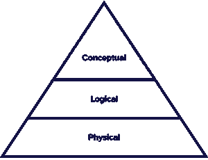

# 数据建模:第 1 部分—目标和方法

> 原文：<https://thenewstack.io/data-modeling-part-1-goals-and-methodology/>

数据建模是定义和表示系统中的数据元素的过程，以便在数据点和结构之间传递连接。Martin Kleppmann 在他有影响力的书《设计数据密集型应用程序》中描述了数据建模是开发任何信息系统的最关键的一步。

了解哪些数据与业务相关以及以何种形式相关，需要职能人员和技术人员之间的沟通。此外，允许信息系统内的组件之间共享数据对于系统的良好运行至关重要。引用 Kleppmann 的话，“数据模型不仅对如何编写软件有着深远的影响，而且对我们如何思考我们正在解决的问题也有着深远的影响。”

但是到底什么是数据模型呢？

> 数据模型是描述存储在系统中的数据结构的规范。

此外，它可以定义保证数据完整性的约束，并标准化如何表示(规则)、存储(格式)或共享(协议)数据。在文献中，我们通常区分三个不同级别的数据建模(参见金字塔图)

图 1

*   **概念层**定义*系统包含什么*。业务涉众通常会创建一个概念模型。目的是组织、界定和定义业务概念和规则。定义在这个层面上是最重要的，比如一个产品。
*   **逻辑层**定义了*如何*实现数据库管理系统(DBMS)。逻辑模型在技术上是有偏见的，并且是为了开发规则和数据结构的技术地图而创建的。关系和属性变得可见，例如，产品名称和价格。
*   **物理层**描述*如何*使用特定技术实现信息系统。创建物理模型的目的是实现数据库。物理层探索数据结构和算法方面的折衷。

在 InfluxDB 大学的[初学者 Flux](https://university.influxdata.com/courses/beginner-flux-tutorial/?utm_source=vendor&utm_medium=referral&utm_campaign=2023-02_spnsr-ctn_data-modeling_tns) 培训中，我们使用相同的级别来理解时间序列数据如何映射到 Flux 数据结构和 InfluxDB 的线路协议数据模型。在这里，我们进一步对 InfluxDB 和 Flux 进行数据建模。因此，值得回顾的是:

*   从概念上讲，[时间序列](https://www.influxdata.com/what-is-time-series-data/?utm_source=vendor&utm_medium=referral&utm_campaign=2023-02_spnsr-ctn_data-modeling_tns)是一组有序的带时间戳的数据点，由一个(且仅一个)测量值和一组标签描述。
*   逻辑上，Flux 同时表示多个序列，通过一组名为*字段*的键值对来表示不同的值。此外，标记是帮助进一步划分数据以便处理的键值对。
*   在物理上，InfluxDB 将数据存储到时间结构的合并树中；还值得一提的是，标签既有键索引又有值索引。

## **数据建模方法简史**

既然我们已经阐明了什么是数据模型以及数据建模的目标，那么我们就可以讨论如何实现它了。在实践中，文献中存在几种方法。下面列出了最突出的几个，它们在目标信息系统和工作负载方面有所不同，如在线事务处理(OLTP)和 DBMS 联机分析处理(OLAP)和数据仓库；大数据和数据湖。

*   **关系建模(RM)** 专注于为包含整个企业业务的模型移除冗余信息。RM 使用关系(表)来描述域实体及其关系。
*   **维度建模** ( **DM** )侧重于支持完整的需求分析，同时在处理大型复杂(分析)查询时保持高性能。数据挖掘旨在优化数据访问；因此，它是为 OLAP 量身定做的。星形和雪花形模型是维度建模的显著成果。

值得注意的是，考虑到上述的逻辑和物理抽象层次，RM 和 DM 会产生明显不同的结果。尽管如此，当在概念层次上操作时，它们都共享相似的概念化和工具。事实上，实体关系(ER)建模技术和图表支撑了上面提到的所有模型和图形数据库或语义存储。因此，有必要重申一下 ER 的含义:

*   一个实体是一个存在的物体，它与其他物体是有区别的。实体具有类型和描述性属性；实体集对相同类型的实体进行分组。称为主键的属性唯一地标识集合中的每个实体。
*   关系是几个实体之间的关联。关系的基数描述了另一个实体可以与之相关联的实体的数量；我们考虑一对一，一对多，多对一。

图 2

在不同的技术中，实体和关系仍然是中心。然而，他们的性质和角色根据业务目标被重新解释。例如，RM 强调识别尽可能多的实体以避免数据冗余。事实上，随着时间的推移，冗余会产生维护问题，这与用户对一致性的需求背道而驰。

相反，数据挖掘建立在利用多对多关系从其他实体借用身份的事实基础上。这些实体被解释为维度，例如，为事实提供上下文的描述性信息。数据仓库用户对数据挖掘最感兴趣，他们最关心的是分析。上面提到的两种建模技术在某种程度上都可以表示时间。

*   在关系建模中，时间只是一个属性。可以更新实体和关系，但是概念模式不携带这一级别的信息。已经提出了关系建模方法的时间扩展。然而，它们是为时态数据库量身定制的，时态数据库专注于其实体的时态有效性(作为一种一致性形式)，而不是[时序数据库](https://www.influxdata.com/time-series-database/?utm_source=vendor&utm_medium=referral&utm_campaign=2023-02_spnsr-ctn_data-modeling_tns)(tsdb)及其时变属性的历史。
*   在维度建模中，时间被认为是一个分析维度——它代表了一个可能的切片主题，从而产生重要的聚合。维度模型中的维度表不考虑概念级别的更改。然而，在较低的级别，可能会发生变化。人们提出了不同的方法来处理这种“缓慢变化的维度”，包括跟踪它们的历史，这接近于 TSDB 会做的事情。

<svg xmlns:xlink="http://www.w3.org/1999/xlink" viewBox="0 0 68 31" version="1.1"><title>Group</title> <desc>Created with Sketch.</desc></svg>