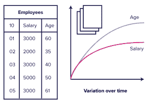
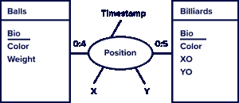
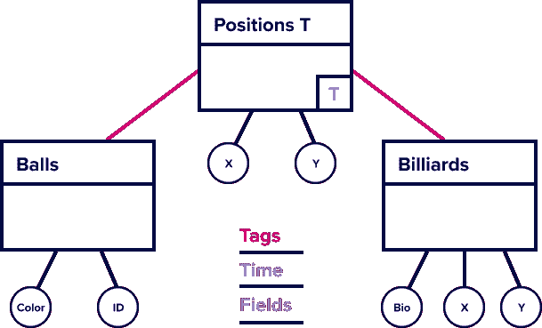

# 数据建模:第 2 部分—时间序列数据库方法

> 原文：<https://thenewstack.io/data-modeling-part-2-method-for-time-series-databases/>

阅读[第 1 部分—目标和方法](https://thenewstack.io/data-modeling-part-1-goals-and-methodology/)

在建模任务中，时间是出了名的。事实上，时间方面加剧了建模任务的复杂性，使得简单的图看起来相当复杂。当时间维度参与识别实体时，它变得特别令人讨厌。



图 1

右图显示了典型的数据库示例:雇员是我们在给定时间观察的传统实体，当属性更新时，我们删除该实体的先前版本。

然而，时间序列数据库(TSDBs)是分析性的，因此对这个问题提供了一个更方便的视角。事实上，时间序列没有时间实体复杂，但也有其自身的细微差别。

为了理解一个时间序列描述的是什么样的实体，让我们考虑一下*的信息需求*像 [Flux](https://www.influxdata.com/products/flux/?utm_source=vendor&utm_medium=referral&utm_campaign=2023-02_spnsr-ctn_data-modeling_tns) 这样的查询语言旨在满足什么。通常，当查询时间序列数据库时，我们希望从整体上观察一个时间范围内的现象。尽管每个 series 元素都包含单独的时间戳，但我们关注的是大图——趋势。

> 我们试图代表什么样的实体？
> |时变实体，属性随时间变化的实体。

答案直接来自有关时态数据库的文献:时变实体是以时变属性为特征的实体，与属性相关联的值的可变性是属性定义的一个组成部分。从形式上讲，时变属性是从时间域到与属性类型相关的域的函数。

时变实体不同于传统实体，传统实体模拟瞬时视图。实际上，时变实体描述了其所有时变属性随时间的变化。上图还显示了 employee 实体的时变解释，从中我们可以观察到他的年龄和工资随时间的变化。

为了更好地理解这个概念，让我们考虑下面的场景:国家台球协会(NBA)想要跟踪年度锦标赛的台球比赛。传统的数据库设计将运动员和比赛表示为锦标赛的实体。然而，NBA 希望跟踪完整的比赛历史。直观地说，至少有两个随时间变化的属性来表征一场比赛:每个球员在任何给定时间的总得分。

由于静态实体通常会转化为一个表(考虑到上面提到的建模技术)，当涉及到时变实体时，我们可以认为关联`Measurement ⇐⇒ Entity`是有效的。由于时变实体可能包含多个时变和静态属性，我们需要理解如何将这些概念映射到 TSBDs，特别是 InfluxDB。此外，实体的主键可以是复合的；在这种情况下，TSDB 对应方应该保留属性的标识性质。

下表显示了我们提出的朴素映射。

值得注意的是， [InfluxDB](https://www.influxdata.com/?utm_source=vendor&utm_medium=referral&utm_campaign=2023-02_spnsr-ctn_data-modeling_tns) 通过键和值来索引标签。因此，它们的基数可能会影响性能。我们可以将不参与主键但与几个查询相关的属性视为标签，以加速查询执行。

此外，由几个静态属性描述的时变实体提出了一个令人兴奋的建模挑战，这与关系数据库设计中弱实体的概念有关。

弱实体是指没有唯一标识它的主键的实体。因此，它必须依赖于强实体集进行唯一标识。

只要有可能区分实体的时变方面和静态方面，我们就可以考虑将它们分开，并将静态方面表示为时变的弱实体，外包给外部数据库。在实践中，InfluxDB 允许使用各种关系数据库丰富时间序列。这种方法通过保持系列简洁来帮助避免冗余。

最后，尽管`Measurement ⇐⇒ Entity`关联看起来很实用，但是这种关联并没有提供关于 InfluxDB 抽象的完整视角，我们将在下面看到。

> 关系呢？
> |歧视性的一面是时变属性是否表征了关系。

像传统的数据库设计一样，TSDB 关系在建模上比实体稍微复杂一些。直觉上，我们希望观察一段时间内关系及其属性的演变。然而，一个关系涉及多方(通常是两方，但也可能是多方)。因此，我们必须区分情况。

*   静态实体之间的关系
*   时变实体和静态实体之间的关系
*   两个时变实体之间的关系

值得注意的是，这种特征与关系基数正交——一对一、一对多和多对多，这将变得更加清楚。然而，歧视性的方面是随时间变化的属性是否表征该关系。


图片 1

让我们通过扩展我们的 NBA 例子来深入了解每一个细节。假设台球协会想要扩展爱尔兰共和军分析。特别是，它希望监控每个球在桌子上以及在碰撞和撞击中的相对位置。台球有一个独特的纹理，允许识别使用特殊的相机指向每个台球桌，并在比赛时校准到一张桌子。从数据库建模的角度来看，我们考虑两个实体，球和台球桌，以及多对多关系“位置”,它跟踪球在每个桌上的分配和时间位置。

球和台球桌是使用唯一 id 在实体集内可识别的静态实体。通常，实体有额外的非识别属性，例如，球有颜色。球和台球桌之间的关系描述了球相对于球台中心的位置。

鉴于游戏的动态性质，时间注释表征了这种关系:我们在案例 1 中——连接两个静态实体的时变关系。特别地，该关系具有两个随时间变化的属性，x 和 y，它们是球随时间变化的相对坐标。

在我们的 TSDB 设计中，我们可以像在时变实体的情况下一样表示这种关系。关系名称成为度量，而时变属性的名称和值分别构成字段键和值。



图 2

假设不同桌上的多个比赛可以使用同一个球，并且一个台球桌主持许多比赛(每个比赛有几个球)，那么这种关系具有多对多的基数。

在传统的数据库设计中，我们将多对多关系转化为所谓的“复合实体”，通过从参与关系的实体中借用元素来构建它们的主键。因此，组合键会产生几个标记键和值。

这种方法扩展到情况 2，当关系连接时变实体和静态实体时。在这种情况下，我们有两个选择:

*   如果关系具有时变属性，则构建一个全新的序列。
*   相反，如果关系本身没有随时间变化的属性，我们将使用表示静态侧键的附加标记和表示静态实体名称的附加标记来扩展建模随时间变化侧的系列的标记集。

当推理基数时，类似的方法也适用。在关系建模中，我们将外键附加到一对一和多对一关系的任一侧。另一方面，在 [TSBD 设计](https://youtu.be/1Iw_0J5UkYs)中，我们的推理基于关系中时变属性的存在。

在某些情况下，通过将静态实体之间的时变关系转换成具有与静态实体的关系的时变实体，可以方便地扩展我们的概念建模。例如，我们可以使用一个系列来表示位置时变实体，该系列捕获这种关系随时间的状态。



如前所述，我们可以使用 InfluxDB 的标记来表示系列中的这些关系，如右图所示。在概念层面上，这个系列并不完全代表这两个静态实体。例如，它省略了像球颜色这样的属性。这个问题类似于我们讨论的时变实体的静态属性。

让我们继续我们的 NBA 场景，通过表示我们的最后一个案例，两个时变实体之间的关系。在这种情况下，我们在自己创建的扩展模式上进行构建。现在，我们想表示球与球之间的碰撞。在这个意义上，我们考虑位置实体之间的自我关系。

虽然在概念层面上，将碰撞表示为空间和时间中的物体之间的关系是容易理解的，但是这种关系的表示不太直观。事实上，碰撞和位置之间的区别是时间的作用，前者有助于识别单个碰撞。继续台球的例子，但是在不考虑球的体积的简化版本中，我们可以将碰撞定义为在给定时刻“t”在相同位置发生的两个球，在 t，ball1(x1，y1)和 ball2(x2，y2)使得 x1==x2 或 y1==y2。这种比较意味着基于时间的连接，比较每个单独时刻的球的位置。这种操作不仅算法上昂贵，而且由于流的无限性质而不可行。事实上，即使考虑到时态数据的顺序性质，比较范围仍然是无限的。

正如我们在“[流数据介绍](https://www.influxdata.com/resources/stream-processing-with-influxdb/?utm_source=vendor&utm_medium=referral&utm_campaign=2023-02_spnsr-ctn_data-modeling_tns)中所讨论的，实现无界的常用方法是使用窗口操作符。因此，通过使用像 Flux 这样的连续查询语言，可以表示跨时变实体的时变关系。

如下面的查询所示，简化的台球示例的 Flux 查询仍然相当复杂。它需要对每个要比较的维度(x，y)进行自连接。

然而，最重要的方面是在第 7 行使用了窗口操作符，这减少了以后比较的基数。修改窗口的值(60 秒是一个回合的平均持续时间)，我们将识别不同的碰撞次数，因为比较范围将会改变。

另一种实现方式可以使用`aggregateWindow`对流元素进行下采样，但是以检测精度为代价。在这种情况下，准确选择聚合函数至关重要。例如，“平均值”与“最后值”的近似结果不同

在查询中，我们使用旋转通过比较维度来对齐连接条件。这种方法允许我们避免对每个组合进行成对比较。另一方面，它需要过滤掉那些代表“自我碰撞”的条目，包括从两个球的角度来看的碰撞。

最后，我们通过量纲比较和使用最近的实验联合，对序列进行反投影，并将两个序列重新合并在一起。

总之，对时变实体之间的时变关系进行建模是一项高级任务，具体取决于窗口大小参数。像 Flux 这样的连续查询语言使这成为可能，但这项任务仍然相当复杂。最后，下表总结了我们对数据建模的分析。

一览表

```
import  "experimental"
import  "influxdata/influxdb"

all  =  from(bucket:  "training")
|>  range(start:  v.timeRangeStart,  stop:  v.timeRangeStop)
|>  filter(fn:  (r)  =>  r["_measurement"]  ==  "position")
|>  group(columns:  ["ball",  "_field"],  mode:  "by")
|>  window(every:  60s)
|>  pivot(rowKey:  ["_start",  "_time",  "_stop"],  
 columnKey:  ["_field"],  valueColumn:  "_value")

//ball cannot be key otherwise i have only self collisions
all1  =  all  |>  group(columns:  ["_measurement"],  mode:  "by")
all2  =  all  |>  group(columns:  ["_measurement"],  mode:  "by")

//ball cannot be key otherwise i have only self collisions
collisionx  =  join(tables:  {b1:  all1,  b2:  all2},  on:  ["_time",  "x"])
|>  filter(fn:  (r)  =>  r.ball_b1  !=  r.ball_b2)
|>  map(fn:  (r)  =>  ({r  with _measurement:  "collision"}))
|>  keep(columns:  ["_measurement","_field","_value","_time","ball_b1",  "ball_b2","x"])
|>  group(columns:  ["_measurement",  "ball_b1",  "ball_b2"])
|>  experimental.unpivot()

collisiony  =  join(tables:  {b1:  all1,  b2:  all2},  on:  ["_time",  "y"])
|>  filter(fn:  (r)  =>  r.ball_b1  !=  r.ball_b2)
|>  map(fn:  (r)  =>  ({r  with _measurement:  "collision"}))
|>  keep(columns:  ["_measurement",  "_field",  "_value",  "_time",  "ball_b1",  "ball_b2",  "y"])
|>  group(columns:  ["_measurement",  "ball_b1",  "ball_b2"])
|>  experimental.unpivot()
//remerge the two series and write
union(tables:  [collisionx,  collisiony])  |>  influxdb.wideTo()

```

<svg xmlns:xlink="http://www.w3.org/1999/xlink" viewBox="0 0 68 31" version="1.1"><title>Group</title> <desc>Created with Sketch.</desc></svg>