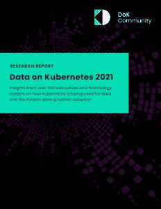

# Kubernetes 上的数据:操作员、工具需要标准化

> 原文：<https://thenewstack.io/data-on-kubernetes-operators-tools-need-standardization/>

当 Kubernetes 推出时，它展示了其轻松处理无状态工作负载的能力，这些工作负载不需要与某种形式的永久存储数据进行交互。然而，随着时间的推移，开源容器编排引擎提供了处理数据库和其他持久数据源的钩子。

但是，根据最近成立的 Kubernetes 社区 (DoKC)上的[数据今天发布的一份报告，尽管今天有太多的“解决方案”可以在](https://dok.community/) [Kubernetes](https://thenewstack.io/category/kubernetes/) 上运行有状态工作负载，但用户需要更多跨工具的标准化，以促进大规模的生产使用。

今天最先进的 K8s 用户“看到这些真正巨大的生产力提升，所以他们想标准化，”[梅丽莎·洛根](https://www.linkedin.com/in/mklogan/)、 [DoKC 主任](https://www.linkedin.com/in/mklogan/)在接受新堆栈采访时说。“他们试图弄清楚如何让所有这些东西协同工作。”

该组织将于周二[在今年的](https://dok.community/dok-day/) [KubeCon+CloudNativeCon](https://www.cncf.io/kubecon-cloudnativecon-events/?utm_content=inline-mention) 上举行一次聚会，从太平洋海岸时间早上 8:45 开始，这是[正在直播的](https://www.youtube.com/watch?v=EFvJ9ln8aFw)。在那里，他们将更详细地讨论这些发现。

## Kubernetes 上的有状态工作负载

这份名为[关于 Kubernetes 2021 的数据](https://dok.community/dokc-2021-report/)的报告是对 500 名 Kubernetes 用户进行的一项调查的结果，调查内容是关于在 Kubernetes 中部署的数据密集型工作负载的类型和数量。

总的来说，它发现大多数人都在运行有状态的工作负载，并且他们希望运行更多。但是他们首先需要掌握管理所有资源的方法。

它们将需要与当前工具集更好的集成和互操作性。报告发现，他们还需要熟练的员工、更好的 Kubernetes 运营商和更值得信赖的供应商。

该报告是结合 ClearPath 战略完成的。这项研究采访了各行各业的 502 名高管和技术从业者。他们代表的组织从 100 名员工到 1，000 多名员工不等。

在调查中，一半的受访者报告在 Kubernetes 上运行 50%或更多的生产工作负载，高级用户报告有 2 倍或更多的收益。大约 90%的人认为它已经为有状态工作负载做好了准备，并且大多数人(70%)正在生产环境中运行它们，其中数据库名列前茅。公司报告称，标准化、一致性和管理作为关键驱动因素带来了显著的好处。

对于 K8s 用户来说，数据库操作员是一个特殊的挑战。[操作符](https://kubernetes.io/docs/concepts/extend-kubernetes/operator/)是用户定义的扩展，可以使用定制资源来管理应用程序。它们被广泛用于帮助管理 K8s 下的数据库。大多数组织都部署了不止一个数据库，所以它们应该有多个操作符。

“他们特别指出了与其他运营商保持互操作性的困难，”洛根说。

Kubernetes 还必须应对行业中的其他行业趋势。数据库是用户的主要问题，尽管也确定了其他数据源，如对象存储、流消息、备份和归档、分析和机器学习。调查发现，用户还呼吁在数据管理方面建立更多的标准，尤其是在声明式编程方面。

## 关于 Kubernetes 的数据:一个新的群体

Kubernetes 社区数据成立于 6 月，旨在帮助 Kubernetes 从业者使用数据源，识别和帮助开发工作工具。该组织有 4000 多名成员，在世界各地举行了 100 多次聚会。 [MayaData](https://mayadata.io/?utm_content=inline-mention) ，然后 [Datastax](https://www.datastax.com/?utm_content=inline-mention) 赞助了这个团体。

洛根说:“我们的目的总是让更多的人一起解决这些挑战。”。“我们试图把所有人带到谈判桌前，把一些事情写在纸上。所以我们对我们在这里做的事情有共同的理解。”

<svg xmlns:xlink="http://www.w3.org/1999/xlink" viewBox="0 0 68 31" version="1.1"><title>Group</title> <desc>Created with Sketch.</desc></svg>