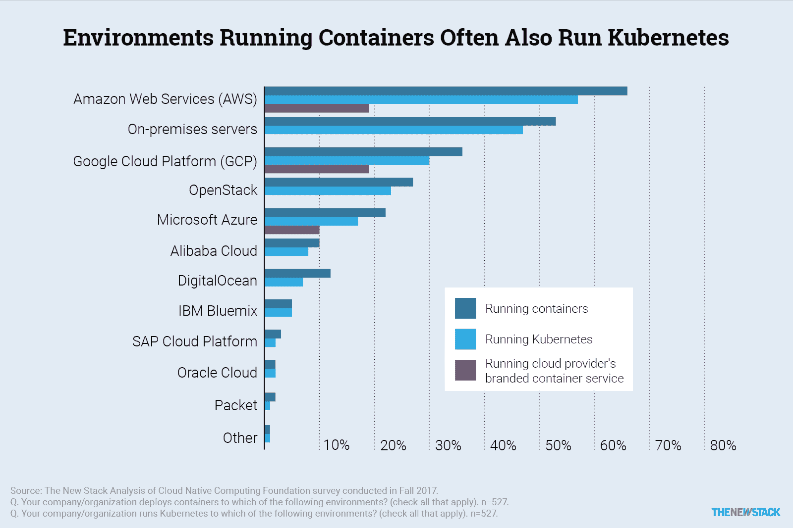

# 关于 Kubernetes 部署模式的数据是什么

> 原文：<https://thenewstack.io/data-says-kubernetes-deployment-patterns/>

Kubernetes 市场的显著增长是有据可查的。它是目前使用最广泛的编排平台，但不是唯一的，这阻止了它获得完全默认的状态。Kubernetes 的接受迫使它很快成熟，并让技术社区快速创新。随着新的和更成熟的供应商现在在云原生空间中竞争，这有助于迫使市场发生颠覆。

容器技术促进了 Kubernetes 编排平台的兴起和发展。如今，容器的最大用户是拥有 1000 多名员工的公司，这些公司运营着自己的数据中心。这些公司也是 Kubernetes 在生产中的最大用户——这有力地提醒了推动该项目的开发和采用的市场力量。但这些趋势只是故事的一部分。

故事的其余部分有点复杂。向面向应用的架构的转变才刚刚开始，市场中的许多力量将影响我们如何看待这一转变。它们包括组织部署的各种类型的工作负载、组织的规模以及用户和供应商如何开发云原生架构以满足更大市场需求的细分。

开发人员发现容器正在发生变化，以如此大的规模采用它们，以至于理解使用如何影响整个市场成为一个复杂的过程。来自我们自己的研究和[云本地计算基金会](https://www.cncf.io/) (CNCF)最近的一项调查的数据提供了一些 Kubernetes 用户遇到的成功和挑战的迹象，这反过来可以说明我们今天看到的更广泛的生态系统转变。

## 两次 Kubernetes 调查的数据分析

在 CNCF 2017 年秋季的调查中，764 名受访者直接通过 CNCF 参与者、他们的社交网络和更大的云原生学习公司社区招募。调查的早期结果有 577 名受访者，发表在 2017 年 12 月的一篇博文中。从那以后，CNCF 又收到了 187 份翻译成中文的问卷调查。

几乎所有(97%)的受访者都以某种方式使用容器，而 61%的受访者在生产中使用容器。总体而言，69%的受访者表示他们正在使用 Kubernetes 管理集装箱。

除了 CNCF 的调查，我们还引用了新堆栈自己的研究，最初包括在“库伯内特生态系统的状态”根据 2017 年 5 月从使用容器的组织的 470 名个人收集的答复，调查结果集中在生产中使用 Kubernetes 的 62%的受访者身上。

新堆栈对 CNCF 调查数据的独立审查在我们最近的电子书中进行了更深入的探讨[，显示了一些关键的 Kubernetes 部署数据点:](https://thenewstack.io/ebooks/kubernetes/kubernetes-deployment-and-security-patterns/)

*   CNCF 调查的 69%的组织使用 Kubernetes 来管理容器。然而，Kubernetes 并不是唯一的编排方法。将近三分之二的 Kubernetes 用户仍然使用另一种方法来管理容器。
*   大多数用户将 Kubernetes 部署到公共云。83%使用 Kubernetes 的组织将其部署到至少一个公共云上。
*   尽管供应商提供的 Kubernetes 越来越普遍，但 91%的部署是在内部处理的。
*   在使用 Kubernetes 的组织中，安全性是与容器相关的最大挑战。然而，对于只将 Kubernetes 部署到本地服务器的组织来说，存储是最大的挑战。对于那些只将 Kubernetes 部署到公共云的公司来说，监控是最大的挑战。
*   一个组织使用的容器越多，他们使用 Kubernetes 的可能性就越大。正在运行的容器数量改变了对容器编排的需求。虽然只有 12%的受访者表示他们工作的组织运行超过 20 个 Kubernetes 集群，但对于组织运行超过 1，000 个容器的受访者来说，这一数字跃升至 35%。
*   NGINX 是领先的 Kubernetes 入口提供商，HAProxy 在拥有六个或更多集群的组织中与之竞争。

## 分析是理解部署选项的起点

在过去的两年中，调查显示 Kubernetes 在竞争产品中遥遥领先。在一个高层次上，Kubernetes 赢得了容器编排战的第一场战斗。拥有竞争产品的公司，如 Docker 和 Mesosphere，现在宣传他们的产品如何与 Kubernetes 互操作。主要的云提供商纷纷效仿，阿里云、亚马逊网络服务(AWS)、谷歌云平台、华为云和微软 Azure 都提供管理 Kubernetes 环境的服务。

今天，Kubernetes 是大规模管理容器的主要选择，但这并不意味着它将继续如此。Kubernetes 部署在过去几年中取得了很大进展，从实验转向管理生产工作负载。然而，大多数 Kubernetes 部署仍然年轻，规模相对较小。Kubernetes 在 IT 生态系统中的中心地位并不确定。Kubernetes 是否会成为一种利基技术，专门用于协调资源以大规模部署基础设施？开发者会转向运行在容器上的平台吗？除了 Kubernetes 是否在里面之外，这些平台在其他因素上也是不同的。

我们的数据分析不能预测未来。它也没有假装报告全球范围内采用 Kubernetes 的企业的百分比。相反，它描述了最近的过去，重点是使用容器并开始采用 Kubernetes 的组织。根据对主要为使用容器的组织工作的受访者的两项调查，本系列文章将帮助读者了解他们自己的 Kubernetes 部署。

<svg xmlns:xlink="http://www.w3.org/1999/xlink" viewBox="0 0 68 31" version="1.1"><title>Group</title> <desc>Created with Sketch.</desc></svg>