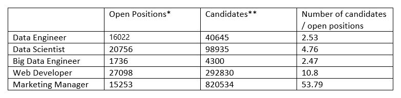
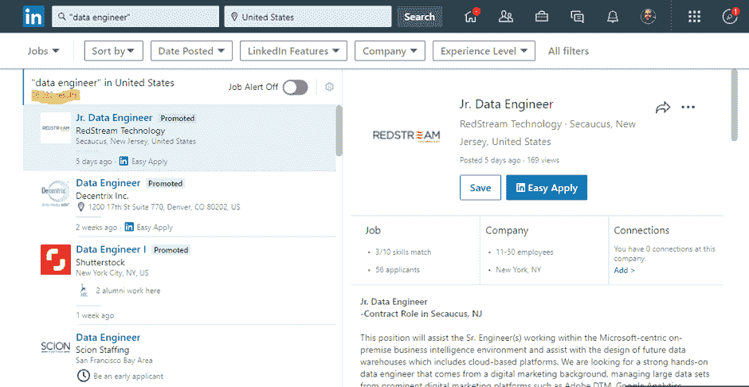
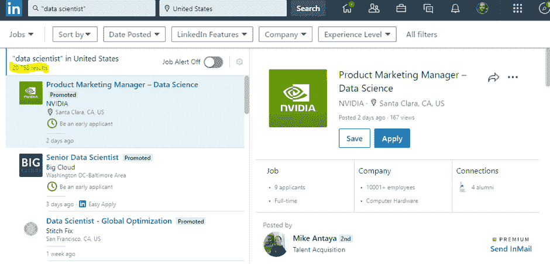

# 数据科学家拥有所有的魅力，但是，哇，还需要数据工程师吗

> 原文：<https://thenewstack.io/data-scientists-get-the-glamour-but-there-is-also-a-need-for-data-engineers/>

[Ori Rafael](https://www.upsolver.com/)

[Ori Rafael 是 Upsolver 的首席执行官，该公司提供自助式数据湖 ETL 平台，在数据湖和数据消费者之间架起一座桥梁，帮助组织释放云数据湖的价值。](https://www.upsolver.com/)

在过去几年中，数据科学家严重短缺的新闻标题一直占据显著位置。在一个痴迷于寻找下一个大数据创新的世界，似乎没有足够的数据科学家来满足组织对高级分析和见解的渴望。

人们提出了各种解决方案，但许多似乎都忽略了问题的关键部分:熟练人员的短缺贯穿于整个数据分析生命周期。不仅仅是数据科学家在行动中失踪或极其难以雇用:数据工程师也存在类似的问题，而且更加尖锐、令人担忧和紧迫。

## 数据科学家和数据工程师是同一数据科学价值链的一部分

我们先来区分一下这两个角色。根据 Airbnb 数据科学主管 Elena Grewal 撰写的一篇关于[数据科学](https://www.linkedin.com/pulse/one-data-science-job-doesnt-fit-all-elena-grewal/)技能的文章，数据科学家提供分析(致力于度量、数据故事和工具构建)、算法(解释实现数据产品的算法)和推理(提供与统计数据的因果联系)方面的专业知识。简而言之，数据科学家清理、揉捏和组织大数据。

数据工程师的工作可能包括数据治理和质量控制、复杂的分布式架构实施(内部或云中)、数据管道构建和维护、存储或计算集群中的资源利用优化，以及批处理作业管理，以便能够访问最新、准确的数据。换句话说，她开发、构建、测试和维护数据库、处理系统和其他架构。

现在，数据科学家获得了所有的魅力和关注，部分原因是数据科学是旅程中最后也是更明显的一步。在数据科学家开始工作之前需要进行的所有其他步骤(这可能是几十个围绕摄取、转换和结构化数据以进行分析的过程)都属于数据工程师，通常比“收集见解”部分更加耗费人力。

### 数据怎么说？

既然问的是关于数据科学的问题，用数据来回答是有意义的。如果在某个领域出现了短缺，我们希望看到它表现在(1)更多的空缺职位比可用的候选人和(2)雇主提供非常高的工资来吸引少量的可用候选人。

LinkedIn 确实能给我们很好的洞察这两个问题。以下是我们从美国的数据中得到的信息(通过 LinkedIn 统计):

* LinkedIn 精确匹配以下关键字的工作搜索结果:“数据工程师”、“大数据工程师”、“数据科学家”地理位置:美国。2020 年 2 月 20 日进行的所有搜索。
** LinkedIn Sales Navigator 精确匹配以下关键词的搜索结果:“数据工程师”、“大数据工程师”、“数据科学家”地理位置:美国。2020 年 2 月 20 日进行的所有搜索。

这里有一些有趣的发现:对于每个开放的数据工程师职位，有 2.53 个合适的候选人。对于每个开放数据科学家职位，有 4.76 个合适的候选人。而每一个开放的大数据工程师岗位，就有 2.47 个合适人选。与其他开发人员的对比非常明显，表明与大量的网络开发人员(每个职位 10.8 人)和营销经理(每个空缺职位 53.79 人)相比，数据专业人员实际上是如何短缺的。

## 数据科学家负责数据操作的关键部分，但不是整个过程

想要成功利用大数据的组织必须对“数据研磨”有一个长远的看法，即从旅程的开始到结束需要什么，以及什么类型的人才可以提供所需的技能。在数据科学家施展魔法之前，数据工程师必须构建大量基础设施。您需要同等程度的这两种才能来优化您的数据科学价值链的结果。

### 所以，让我们开始工作吧！

显然，这不是数据科学家和数据工程师之间关于哪个部门实际上遭受人才短缺的“竞争”。为了让您的数据工作取得成功，您将需要数据工程师的专业知识来构建基础架构和准备数据，以及使用这些数据来开发分析、算法和研究的数据科学家的技能。这两个领域的人才短缺只会增加人力成本，毁灭整个数据科学项目。

由于媒体一直关注数据科学人才缺口，现在有太多的建议来解决这一问题。对于解决数据工程师的技能差距，没有太多的存在。

让我提出几个例子:

*   **了解公司内部:**通过对现有员工进行数据工程框架、编程语言和系统方面的培训，您可以在不依赖外部候选人的情况下提高您的数据工程专业知识。
*   **投资技术:**如果您投资自动化数据工程流程和工作流的解决方案，您将需要更少的数据工程师。
*   **想象未来:**随着数据工程师工资的攀升，准备好应对研发、开发和 IT 预算的激增。对您的数据操作采取全局观点。

如果您了解数据科学的实际工作方式以及您的数据科学家和数据工程师的实际工作，您的数据工作可以转化为有意义的商业价值。

你可能已经有了合适的人，现在你只需要用合适的技术把他们安排在合适的位置上——这样你就完全不用参与这场战斗了。

<svg xmlns:xlink="http://www.w3.org/1999/xlink" viewBox="0 0 68 31" version="1.1"><title>Group</title> <desc>Created with Sketch.</desc></svg>