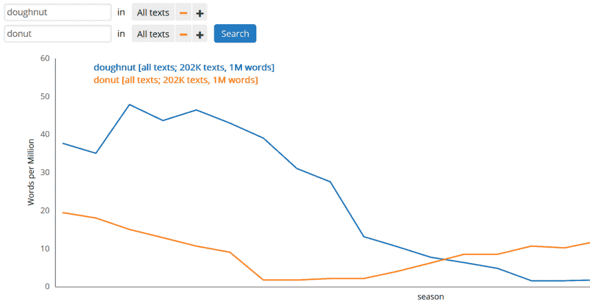
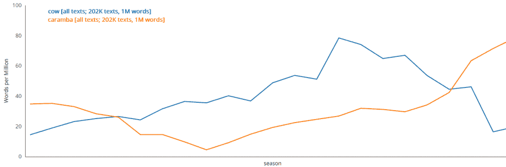
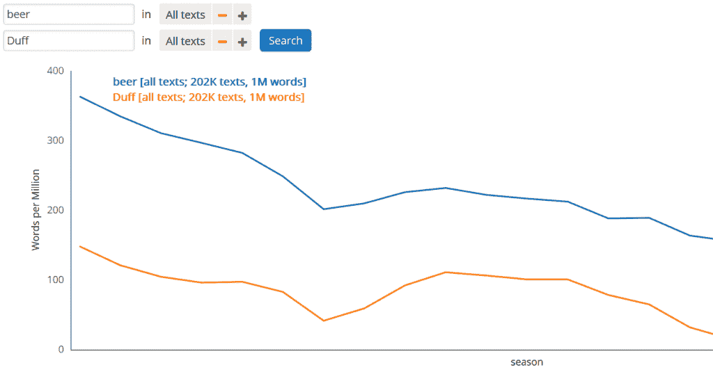
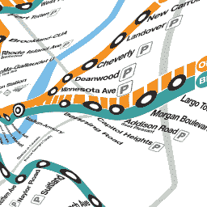

# 大数据辛普森一家

> 原文：<https://thenewstack.io/data-set-simpsons/>

多亏了东北大学历史学助理教授本杰明·m·施密特(Benjamin M. Schmidt)的工作，从[到*长达 25 年的对话，《辛普森一家》*](https://www.imdb.com/title/tt0096697/) 已经被粉碎成一个巨大的数据集，[连接到一个用户友好的搜索窗口](http://benschmidt.org/Simpsons)。

结果以图表的形式显示了这些词在该剧每一季中的使用频率。这个名为 [*书虫:辛普森一家*](http://benschmidt.org/Simpsons) 的网页甚至允许用户点击结果图中的任何一点，弹出包含他们搜索单词的实际对话行列表。

那么我们学到了什么？首先，随着节目的进展,“甜甜圈”这个词出现的频率越来越低。虽然这似乎可以部分解释为有人开始拼写它“甜甜圈”

虽然巴特·辛普森给短语“不要有一头奶牛”带来了新的流行，但该节目对“奶牛”一词的实际使用在 2005 年达到高峰，而它对巴特的流行语“caramba”的使用仍在继续攀升。

虽然令人惊讶，但“啤酒”一词的使用在整个系列中一直在稳步下降——几乎与该剧使用“达夫”一词同步，这是荷马·辛普森喜欢的虚构啤酒品牌。

所有这些背后都有一些严肃的科学。施密特是东北大学文本、地图和网络实验室(一个“数字人文和计算社会科学”中心)的核心教师之一)他还教授美国历史、数字历史和大数据历史(针对本科生和研究生)。

施密特将自己描述为一名数字人文主义者，并补充说:“我的大部分工作都是探索历史学家(以及任何想讲述故事的人)如何通过数据分析、可视化和算法转换，使用大规模数字档案以新老方式进行交流。”

## 将交互式数据集与众包相结合

分析辛普森一家的词频只是他最近的副业。

Schmidt 还研究了美国总统的“国情咨文”演讲，制作了各种互动图表，向 T2 展示每位总统使用关键词的频率。130 年来,“威严”这个词出现在除了托马斯·杰弗逊、扎卡里·泰勒和本杰明·哈里森之外的每一位总统的讲话中——直到 1921 年沃伦·g·哈丁的讲话，在那之后的 44 年里它消失了。威廉·塔夫脱 1909 年的地址是最后一个包含“印第安人”一词的地址

施密特还创作了“[校正过的](http://benschmidt.org/dcmetro/)”[地铁](http://benschmidt.org/mbta) [地图](http://benschmidt.org/mta)，将他们彩色的路线图叠加到实际地图上。

他什么都学过，从大学专业到棒球统计。但更重要的是，他也是一个名为 Bookworm 的工具的联合创作者(和联合导演)之一，该工具通过由[开放科学数据云](https://www.opensciencedatacloud.org/)支持的托管，从数字文本(例如，书籍、报纸或科学出版物)的存储库中创建数据可视化。书虫还可以访问电影和电视节目对话的可搜索数据库(使用热门网站[OpenSubtitles.org](https://www.opensubtitles.org)的字幕)——这最终驱动了*书虫:辛普森一家*页面。

施密特将其描述为“一个书虫浏览器如何打开你的文本的特别琐碎的例子。”从更大的意义上来说，这是“文化组学”的一个显著例子，它被[描述为](https://arxiv.org/abs/1202.5299)“高通量数据收集和分析在人类文化研究中的应用。”

例如，哈佛大学的[文化观察站](http://www.culturomics.org/cultural-observatory-at-harvard)表示，它正致力于通过三管齐下的方法“实现跨社会、跨世纪的人类文化定量研究”:

*   创建与人类文化相关的大规模数据集。
*   使用这些数据集来推动全新类型的分析。
*   开发工具，使研究人员和公众能够查询数据。

因此，在未来几年，我们可能会看到更多类似的分析。

在黑客新闻上看到非学术界人士[对 Schmidt 最新项目的反应很有趣。一位评论者写道:“我觉得有趣的是，随着时间的推移,‘荷马’的使用量一直在稳步下降。”这促使另一位评论者做了一个更详细的实验。这是一个有趣的例子，展示了互动数据集与众包实验相结合的结果。](https://news.ycombinator.com/item?id=14652421)

* * *

# WebReduce

专题图片:巴特曼雕塑，由南茜·卡特莱特，谁是巴特·辛普森的声音。纽约。

<svg xmlns:xlink="http://www.w3.org/1999/xlink" viewBox="0 0 68 31" version="1.1"><title>Group</title> <desc>Created with Sketch.</desc></svg>