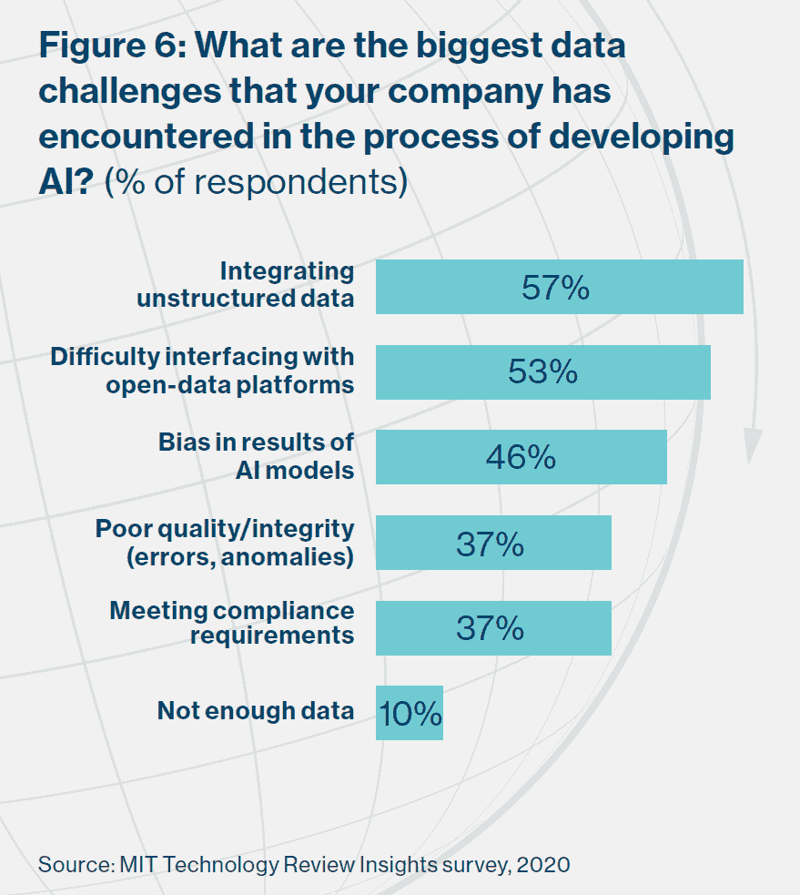
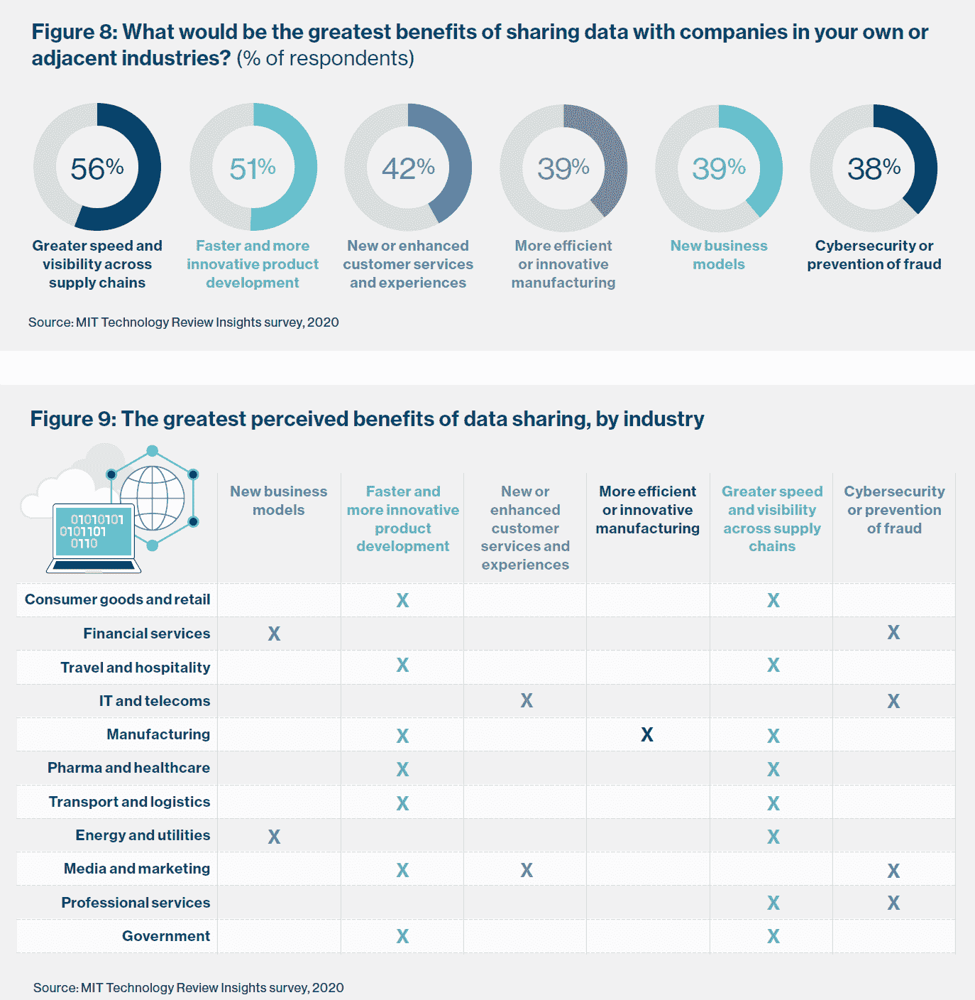
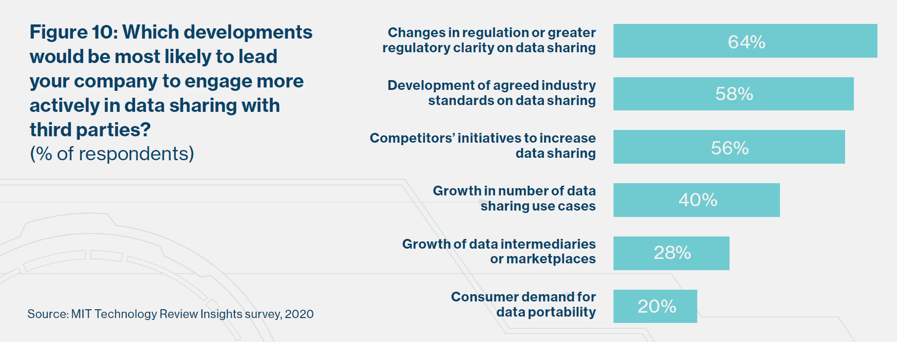

# 数据共享是新冠肺炎数据模型成功的关键

> 原文：<https://thenewstack.io/data-sharing-key-to-success-for-covid-19-data-models/>

预测数据模型的用处取决于它们所包含的数据。

流行病学家、记者、公民数据科学家和其他任何使用新冠肺炎数据集的人都意识到了这一真理。虽然使用深度学习的人工智能令人兴奋，但似乎克服数据集成和数据共享障碍是最大限度地利用大多数新冠肺炎相关分析工作的最佳方式。事实上，“数据数量、质量和可用性”与“业务和流程挑战”一样，是人工智能使用的最大制约因素，根据麻省理工学院技术评论洞察(MIT Technology Review Insights)[全球人工智能议程](https://www.technologyreview.com/s/615407/the-global-ai-agenda-promise-reality-and-a-future-of-data-sharing/)的 1000 多项调查。

根据 57%的调查，集成非结构化数据是开发人工智能时遇到的最大数据挑战，53%的麻省理工学院研究提到了与开放数据平台的接口。只有 10%的人认为数据不够；相反，问题是如何处理已经存在的数据。

新堆栈的读者知道，共享[数据](https://thenewstack.io/category/data/)会带来无数的技术挑战和商业风险。尽管存在这些障碍，三分之二接受调查的高管表示，他们的公司至少在某种程度上愿意与第三方分享内部数据，以建立新的价值链、产品或服务。跨供应链的速度和可见性以及改进的产品开发被视为与同行共享数据的最大好处。

当然，并非所有行业都像其他行业一样热衷于这个想法，政府和金融服务最不可能开放数据共享。此外，从消费者的角度来看，人们非常担心用于新冠肺炎计划的数据将如何影响隐私和人权。

在政府、学术界甚至私营部门，使数据更加开放和可访问是一个长期趋势。然而，尽管有“分享即关怀”的格言，自下而上和自上而下的努力都面临着让数据更加开放和可访问的挑战。如果你想了解更多关于新冠肺炎的数据协作响应，请查看由数据管家网络维护的 70 页知识库。

除了数据共享的重要性，我们对新闻报道和"[冠状病毒技术手册](https://coronavirustechhandbook.com/)"的回顾也让我们想到了一些关于数据模型和新冠肺炎的额外收获:

*   **R，而不是 Python 是新冠肺炎相关数据分析的首选工具。**根据 DataCamp 的说法，R 编程语言在涉及生命科学的人群中尤其强大，并且有更广泛的模型类型可供选择。数据科学培训公司表示，大部分深度学习是在 Python 中完成的，像 [Keras](https://keras.io/) 和 [PyTorch](https://pytorch.org/) 这样的领先工具具有“Python 优先”的开发。[**R****E**pidemics**Con**sortium(RECON)](https://www.repidemicsconsortium.org/)是一个资源，可以查看它以获得更多信息。
*   **深度学习和高性能计算有它们的位置。**正在利用处理 x 射线和其他图像的训练数据集。高性能计算可以加速药物测试和基因组测序，因此来自[新冠肺炎 HPC 联盟](https://covid19-hpc-consortium.org/)的免费计算资源可以推进一些计划。六个项目已经获得批准，其中大部分与药物测试有关。
*   Skeptism 对许多计划的价值大加赞赏。正如 Shay Palachy 在 [InfoQ](https://www.infoq.com/news/2020/03/data-science-covid-19/) 中解释的那样，专门预测疾病爆发的公司并不比人类专家做出的结论好多少。此外，虽然大查询是许多公民科学家活动的中心，但至少有一位谷歌的开发者拥护者认为“[业余新冠肺炎预测毫无价值](https://medium.com/@hoffa/covid-19-arima-predictions-are-worthless-f34e52139769)”
*   这篇文章只是冰山一角。这里还有两个组织值得你关注:
    *   [COVID Act Now](https://covidactnow.org/) :一个由志愿者组成的分布式团队，与美国一些杰出的流行病学家和公共卫生专家合作开发美国干预模型，这是一个预测美国各地 Covid 感染、住院和死亡情况的数据平台，并模拟公共卫生干预措施如何遏制 Covid 的传播。
    *   [新冠肺炎医院流行病影响模型(CHIME)](https://penn-chime.phl.io/) 。使用一种标准的流行病学建模技术，即 [SIR(易感、感染、康复)](https://mathworld.wolfram.com/SIRModel.html)模型来生成估计值。

## **来自全球人工智能议程的更多图表**

与其他公司相比，金融服务更有可能将网络安全、欺诈防范和新的商业模式视为共享数据的主要好处。也就是说，只有 37%的人非常愿意对外共享数据，而整体调查中有 49%的人有这种感觉。

数据中介和消费者对数据可移植性的需求得到了大量的新闻报道，但这是公司开始与第三方共享数据的最不可能的原因。

<svg xmlns:xlink="http://www.w3.org/1999/xlink" viewBox="0 0 68 31" version="1.1"><title>Group</title> <desc>Created with Sketch.</desc></svg>