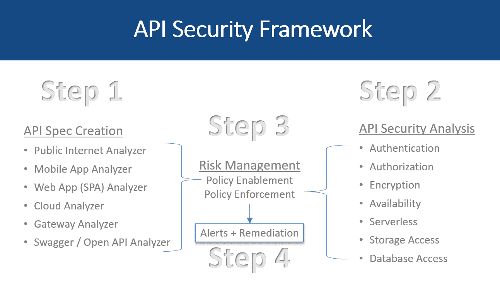
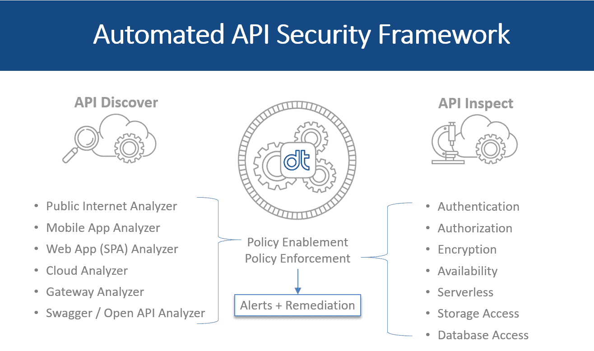

# 数据定理:从移动到无服务器的 API 安全性

> 原文：<https://thenewstack.io/data-theorem-api-security-from-mobile-to-serverless/>

现代企业中的安全性最近一直是一个不断变化的目标，重点是云原生世界中的[差异](/why-security-is-really-different-in-todays-cloud-native-world/)、[开源面临的挑战](/the-new-stack-context-two-views-of-open-source-security/)以及[共享责任模式](/problems-with-sharing-responsibility-for-security/)。

与此同时，Gartner 报告了对 API 安全性日益增长的担忧，指出客户对该主题的询问同比增长了 30%。[据预测](https://www.gartner.com/en/documents/3834704/how-to-build-an-effective-api-security-strategy)到 2022 年，API 滥用将成为企业 web 应用最常见的攻击媒介。

总部位于加州帕洛阿尔托的[数据定理](https://www.datatheorem.com/)正在采用 DevOps 方法解决 API 安全性问题。该公司最初专注于移动应用的 API 安全，但在过去的一年里，一直在建设保护无服务器 API 的能力。

Data Theorem 首席运营官道格·杜利(Doug Dooley)表示:“我们的业务是在应用程序层面防止数据泄露。

“我们的任务是帮助安全团队在 DevOps 团队中占有一席之地，而不是对允许 DevOps 快速运行的伟大想法和功能泼冷水，而是提供保护和护栏，以构建更快的速度。…增加安全自动化，而不会增加系统负担和减缓进度。”

[受](https://www.datatheorem.com/resources/reports/esg-security-for-devops/)[企业战略小组](https://www.esg-global.com/)委托的公司进行的研究发现，随着自动化成为标准方法，组织开始将安全实施到[开发运维实践](/category/devops/)中。然而，在一项针对 371 名 IT 和网络安全专业人员的调查中，只有 8%的受访者表示他们的组织通过 DevSecOps 实践保护了 75%或更多的云原生应用程序，只有 39%的受访者表示他们的网络安全团队成员参与了目前一半以上的云原生应用程序项目。

“如果您有一个敏捷的环境，我们认为您需要一个持续的监控和安全分析系统，该系统与您的 DevOps 流程挂钩，不仅可以快速发现安全问题，还可以提供清晰的指导，甚至是自动补救功能来纠正这些问题，”杜利说。

### 自动分析器引擎

[Himanshu Dwivedi](https://www.linkedin.com/in/himanshudwivedi1/) ，连续创业者和安全[作者](https://www.amazon.com/Himanshu-Dwivedi/e/B001IXO8N8)，于 2013 年推出数据定理。

该公司拥有一项核心技术，即专有的分析器引擎，其产品基于不同的用例。这是纯粹的 SaaS 产品。

*   **App Secure** :持续扫描和监控 iOS 和 Android 应用中的漏洞和数据隐私问题。
*   **应用搜索**:自动应用追踪服务。
*   **API Inspect** :自动持续安全服务，在面向互联网的 API 中发现认证和加密漏洞。
*   **API Discover** :自动持续发现服务，在公共云环境中发现新的 API、已知 API 的变化以及相关的云服务。
*   **Brand Protect** :一个自动爬虫，寻找发布到第三方应用商店的未经授权的克隆移动应用。

去年九月，它发布了一个自动发现和持续动态运行时漏洞[检测工具](https://www.businesswire.com/news/home/20190917005407/en/Data-Theorem-Launches-Automated-Discovery-Continuous-Dynamic)专门为 web 单页面应用程序(SPAs)构建。它支持 GraphQL 和 REST API 服务作为 API Discover 和 API Inspect 的一个组件。

它还开发了 [TrustKit](https://github.com/datatheorem) ，这是一个用于在移动应用程序中部署 SSL 公钥锁定和报告的开源框架。

### 阻止数据提取

杜利说，通过移动设备，分析器引擎可以查看各种应用商店中应用的生产版本——授权版本和未授权版本，然后通过二进制分析、运行时分析、动态分析和静态分析来寻找漏洞。

“我们正在寻找攻击者追踪你的应用程序的所有途径，”他说。

一旦它通过所有的应用程序，“我们整合结果，并尝试以人类可读的方式展示这些结果。当你登录到门户网站时，这些都是你的应用程序，所有可能出错的东西，然后我们自动筛选最重要的东西，”他说。

他说，这与计算风险无关，那是商业决定。它只是专注于防止从应用程序中提取数据。

“有时客户说数据无论如何都是公开的，所以即使数据被破坏了，数据也不是敏感的，他们可以接受，”他说。

这和云很相似。

“我们寻找您的所有域，寻找与您的域相关联的所有 API，我们经常查看您的移动应用程序、web 应用程序，以找到企业通常没有意识到的嵌入式 API 或影子 API，即在应用程序中移动数据。

“我们向他们展示了他们拥有的所有 API，以及可能被用来提取数据的潜在攻击。在某些情况下，当我们发现泄漏的 API 时，我们可以提取数据并进行我们自己的分析，以确定是否有任何 PII(个人身份信息)可能代表合规违规。然后我们把它展示给顾客，”他说。

杜利说，分析客户的数据需要一定程度的信任，这种信任是通过首先分析其生产应用程序来建立的，然后客户通常会决定将数据定理集成到预生产中，作为 Jenkins 或其他 CI/CD 管道的一部分。

### 无服务器

他说，该公司已经体验到了内部无服务器基础设施的好处，开发人员使用一些机器学习技术，用大约 1/10 的代码更快地构建功能。

但是在没有服务器的情况下，许多底层技术都变得短暂。虚拟机在哪里？操作系统在哪里？集装箱在哪里？作为开发人员，这些对您来说都是隐藏的，但是，您并不真正关心这些。

但对安全团队来说，不利的一面是，如果你希望挂钩容器或在操作系统上安装代理，或强制实施代理网关让流量通过，云供应商现在已经隐藏了所有这些，使其在幕后自动缩放，所以你甚至看不到它或挂钩它。

“当我们两年前开始构建我们的 API 技术时，我们知道我们必须致力于无代理和网关无代理的架构。因此，我们开始寻找新的技术来保护 API 和数据流，或者至少分析数据流，而不强制执行代理挂钩或操作系统挂钩或网络代理，”他说。

它决定采用云提供商提供的技术:审计角色。使用基于角色的访问控制，it 可以查看云提供商和客户提供的 API，以持续监控它们，确保它们符合其功能规格。

Gartner 注意到越来越多的 API 安全供应商采用各种方法，包括[42 crunch](https://42crunch.com/)；槟榔湾，改名[云媒](https://www.cloudvector.com/)；[视觉](https://www.imvisiontech.com/)；[盐保](https://salt.security/)；以及[弹性梁](https://thenewstack.io/ai-engine-api-security-scale/)，通过 Ping 身份获取，现在叫做[Ping intelligence for API](https://www.pingidentity.com/en/software/pingintelligence.html)。

数据定理吹捧已经检测到超过 3 亿个应用程序窃听事件，同时为包括网飞、Evernote、威瑞森和 Etsy 在内的客户保护了超过 4000 个应用程序。

最近，该公司一直在警告新的攻击，如拒绝钱包(DoW)，其中提交了如此多的请求，以至于底层基础设施不断扩大，直到成本失控。

[https://www.youtube.com/embed/uLYUpDz2Svw?feature=oembed](https://www.youtube.com/embed/uLYUpDz2Svw?feature=oembed)

视频

专题图片:[奇兰嘎水泥](https://www.flickr.com/photos/drbillydude/)的[莫洛克斯](https://www.flickr.com/photos/drbillydude/37337740262/in/photolist-YTpFms-r179kU-Ejeqyf-2eJuhFa-PNb2Uo-fcodhg-RFM6jz-26xiNy7-PP6oUA-z2qxu-4mmzgG-25XVVJM-dVxbBR-SNuuKo-bhAC6V-StZshy-69YLzC-ykGRQu-DYoqNr-7VQmHe-4GriTj-dqkJ5n-NHqWZi-N8uozy-Azp8dW-zTcjLP-tqhybY-25J6mYY-ov51qX-JoLTVT-B56KfZ-kDM3G2-8NQ3Yd-oi5z5Y-26nrfLh-2fkL7Dp-TxgL1K-abxBej-q6Mz7r-9hSLaZ-htpimc-nKtnb6-raJcLq-T7Fhux-riqAzE-21eb2U5-28YwqJz-VNng7U-SNuGPJ-AD7c58)。根据 [CC BY-SA 2.0](https://creativecommons.org/licenses/by/2.0/) 授权。

<svg xmlns:xlink="http://www.w3.org/1999/xlink" viewBox="0 0 68 31" version="1.1"><title>Group</title> <desc>Created with Sketch.</desc></svg>