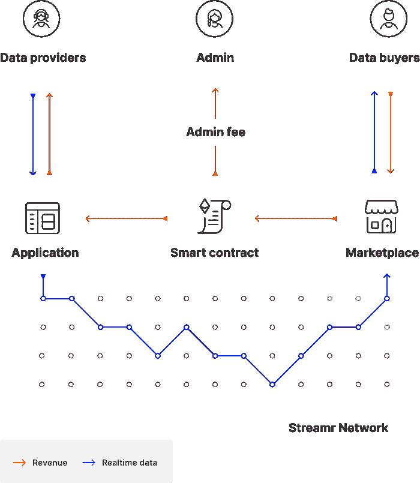

# 数据联合为用户数据提供了一种新的模型

> 原文：<https://thenewstack.io/data-unions-offer-a-new-model-for-user-data/>

如果你浏览 ETHDenver 的[推文，你可能会觉得这是一个 HODL 加密货币的大派对，同时通过穿着印有他们昂贵的个人资料照片 NFTs 的帽衫来展示他们的早期采用者街头信誉，同时追逐](https://twitter.com/search?q=%23ETHDenver)[维塔利克·布特林](https://twitter.com/VitalikButerin)的[自拍 opps](https://twitter.com/search?q=ethdenver%20photos%20%40VitalikButerin&src=typed_query&f=image) 。所有这些当然都发生在周末，尽管 ETHDenver 也有一系列会议，有机会了解更多关于以太坊生态系统的信息。

我发现题为“通过数据联合从 Web2 到 Web3”的会议特别有趣，无论是作为一个将我的数据货币化的用户，还是作为一个认识到可能对打包或访问用户数据感兴趣的开发人员的潜力的人。座谈会由[数据联盟 DAO](https://dataunions.org/) 的联合创始人 [Marlene Ronstedt](https://twitter.com/ronstedt) 主持。本次会议的小组成员包括:

Ronstedt 在关于数据联盟的会议上开始说，“我们认为每个人都有数据，但不是每个人都有加密，我们认为这是我们如何让下一个 10 亿用户进入这个领域的。”你可以在下面的 YouTube 视频中观看完整的面板。我对演讲内容的想法如下。

[https://www.youtube.com/embed/9nf8Qqyk_9c?feature=oembed](https://www.youtube.com/embed/9nf8Qqyk_9c?feature=oembed)

视频

## 什么是数据联合？

去中心化 Web3 的承诺之一是，作为用户，我们都可以拥有自己的数据。这与 Web 2.0 形成了鲜明的对比，在 Web 2.0 中，主流观点认为，我们用户和我们的数据是被大型集中式组织利用来获取经济利益的产品。数据联合是一种可伸缩的方式，可以从个人那里收集实时数据，并以数据源和打包应用程序都同意的方式将数据打包出售。就像现实生活中的工人加入工会以围绕一组共同的目标，数据工会允许个人加入这些工会以可控的方式聚合数据，并能够通过 DAO(分散自治组织)治理对数据的使用方式和位置进行投票。

对于用户来说，控制数据的一个挑战是找到一个感兴趣的买家。很少有数据消费者愿意经历一次从一个人那里获取数据的麻烦。数据联盟通过聚集一组选择加入的用户的数据来解决这个问题。对于开发人员来说，数据联盟有一个冷启动问题，他们需要足够数量的用户来使数据包变得有趣——既是销售的东西，也是消费的数据集。

这些联盟中的数据是一个分散的应用程序(dApp ),用户通过智能合约同意将他们的数据包含在应用程序的市场中。数据购买者从市场上获取数据，在政府收取费用后，付款流回数据提供者。关系的端到端由智能契约控制。基本结构如下图所示。

## 数据联合的用例

Streamr 网络是一个分散的发布/订阅网络，用于通过 WebRTC 网状网络传输实时数据。数据联盟是 Streamr 的核心产品之一。它简化了开发过程，使开发人员可以轻松地在以太坊侧链 xDai 上部署智能合约。作为开发人员，您将 [Streamr 客户端](https://github.com/streamr-dev/network-monorepo/tree/main/packages/client)集成到您的 dApp 中，这允许用户加入您的数据联盟。示例部署都是为了在 Node.js 等 JavaScript 框架中使用而提供的。

数据联合的第一个例子是浏览器扩展 [Swash](https://swashapp.io/) 。安装了扩展后，用户就可以聚集浏览数据并出售给感兴趣的人。

面板包含几个额外的有趣的数据联合。DIMO 网络出售一种硬件设备，可以连接到汽车的 ODB2 端口，将护理数据共享回网络。Re-public 是另一个允许用户通过 iOS 或 Android 应用程序参与数据联合的例子。根据 Keith Axline 的说法，Re-public DAO 有一个乌托邦式的观点，即“你可以收集所有人从中赚钱的数据，你可以首先看到这些数据，你可以控制这些数据，你可以决定是否以及如何共享这些数据。”

查看完整的面板记录(见上)，了解数据联盟如何为分散的数据共享和消费奠定基础的额外背景。

<svg xmlns:xlink="http://www.w3.org/1999/xlink" viewBox="0 0 68 31" version="1.1"><title>Group</title> <desc>Created with Sketch.</desc></svg>