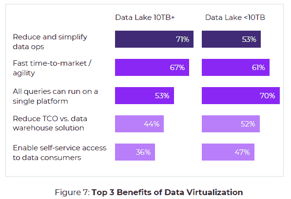

# 数据网格环境中的数据虚拟化

> 原文：<https://thenewstack.io/data-virtualization-in-the-context-of-the-data-mesh/>

作为一种面向领域的团队拥有“数据产品”并拥有自助式数据基础设施平台的方法，[数据网格](https://thenewstack.io/data-mesh-liberate-business-value-from-data-lakes-data-warehouses/)概念继续获得发展势头，该平台既向消费者交付数据产品，又允许对数据进行分析/消费。

在新创建的[数据网格学习](https://launchpass.com/data-mesh-learning)社区呆了一周之后，我可以报告专家们的共识是[数据结构和数据网格](https://open.spotify.com/episode/2h1BummL8RA96wujsPsUnt)都提供了一个跨多种技术和平台访问数据的架构；数据结构是以技术为中心的，而数据网格侧重于组织变革。

关于[数据虚拟化和](https://www.cloudera.com/campaign/forrester-data-virtualization-or-data-fabric-which-is-right-for-you.html)数据结构的观点不太一致，但前者通常只关注跨多个位置的存储抽象。所有这些方法都解决了相同的痛点，并且过多地使用了“平台”这个词，以至于它变得毫无意义，因此对于定义的混乱也就不足为奇了。

以色列数据管理公司 [Varada](https://varada.io/) 利用 [Presto SQL/Trino](https://trino.io/) 进行的一项新的[调查](https://varada.io/blog/data-virtualization/data-virtualization-survey-q12021/)提供了一点语义清晰度。当 130 名数据虚拟化用户被问及他们如何定义数据虚拟化时，64%的人说它是无缝连接到任何数据源或平台的能力，19%的人将其定义为运行任何查询而无需对数据建模的能力，17%的人认为它是数据湖查询引擎。如果这个问题提供了更多的选择或者是开放式的，结果可能会有很大的不同。

当描述数据虚拟化的好处时，用户展示了他们对数据虚拟化的真实看法。数据湖或数据仓库容量超过 10TB 的组织表示，减少和简化数据操作是最大的优势，但容量不足 10TB 的组织更有可能关注在单一平台上运行所有查询的能力，以及支持数据消费者自助访问的能力。这项研究的大部分由数据足迹较小的组织组成。

来源:Varada 的[《数据虚拟化的现状》。](https://varada.io/blog/data-virtualization/data-virtualization-survey-q12021/)研究中的另一个问题还发现，60%的数据虚拟化用户认为它是数据仓库的强大替代方案。然而，这可能是一个错误的选择，因为在现实中，分布式查询引擎等技术的采用者可能已经在使用数据仓库、数据湖或另一个基于 SaaS 的数据平台，如雪花。

根据[Varada 产品副总裁 Ori Reshef](https://www.linkedin.com/in/ori-reshef-84440a6/) 的说法，他认为数据虚拟化通过允许组织中的任何人在适当的治理政策下访问数据网格中的任何数据集来促进数据民主化。最终结果是，更多的业务部门可以将海量数据货币化。这是一个乐观的观点，但也有一些障碍，最明显的是对数据平台的查询，需要为每个特定领域的用例重新编写。

数据网格要求围绕用例组织跨职能团队。如果每个用例都需要自己重写查询，这是否会使跨职能团队开发自己的数据管道的组织中的数据虚拟化不切实际？这是否仅仅意味着需要重新分配用于构建和维护分散数据基础设施平台的资源？所有这些问题如何发展将影响您如何评估[现代数据基础设施的新兴架构](https://a16z.com/2020/10/15/the-emerging-architectures-for-modern-data-infrastructure/)以及[自动化数据管道](https://www.eckerson.com/register?content=architecting-and-automating-data-pipelines-a-guide-to-efficient-data-engineering-for-bi-and-data-science)时的组件选择。

## 更多分析

*   **数据网格悖论:**解决数据激增的某些方面的能力可能会导致其他问题。 [Zhamak Dehghanit](https://twitter.com/zhamakd) 认为数据网格解决了“数据来源的激增、数据使用案例和用户的多样性以及对变化的响应速度。”然而，如果没有一个强有力的首席数据官，它实际上可能会加速数据管道、数据平台或数据工程师的数量增加。
*   **多样化的数据管道挑战:**在由[Enterprise Management Associates](http://www.enterprisemanagement.com/)开展并由 [Starburst Data](https://www.starburst.io/) 赞助的[调查](https://www.starburst.io/resources/the-state-of-data-whats-next/)中，400 名受访者表示，在 32%的情况下，将动态数据与静态数据相结合是构建和部署[数据管道](https://thenewstack.io/part-1-the-evolution-of-data-pipeline-architecture/)的最大挑战。由于大多数受访者试图将数据仓库中的静态数据与动态变化的数据相集成，这并不奇怪。然而，至少五分之一的受访者也提到了其他七个选项。
*   **实际时间基准看起来没有那么糟糕:**处理中断修复问题和手动编码所花费的时间被认为是挑战，但创建和部署数据管道所需的时间比创建和改进机器学习模型所需的时间少得多。超过半数(54%)的 EMA 研究对象平均在不到一天的时间内创建了数据管道，48%的人表示，在生产中实现管道运营只需不到一天的时间。随着数据管道越来越容易创建，数据用例的数量也越来越多，人们担心缺乏数据工程资源来处理它们。
*   **存储、平台和管道之间的细微差别:**上述 EMA 报告中有一半在其数据生态系统中也有至少五个数据存储平台。在这种情况下，数据仓库和数据湖都被认为是数据存储平台，但它们也是数据架构。O'Reilly Media 的[《现代数据平台:数据湖的崛起》(The Modern Data Platform:Rise of The Data Lake)是 Databricks 赞助的电子书，调查了 3，000 名数据专业人士，并认为架构是描述通常作为数据平台营销的产品的最佳方式。这项研究发现，当使用一种以上的数据架构时，至少三分之二的受访者认为运营复杂性、数据质量和数据治理都是挑战。从业务的角度来看，受访者认为业务敏捷性和团队生产力受到架构的制约，但这在多大程度上是数据专业人员在过去 20 年中给出的标准答案呢？](https://databricks.com/p/ebook/oreilly-survey-nine-out-of-ten-enterprises-want-a-simpler-data-platform-architecture)

通过 Pixabay 的特征图像。

<svg xmlns:xlink="http://www.w3.org/1999/xlink" viewBox="0 0 68 31" version="1.1"><title>Group</title> <desc>Created with Sketch.</desc></svg>