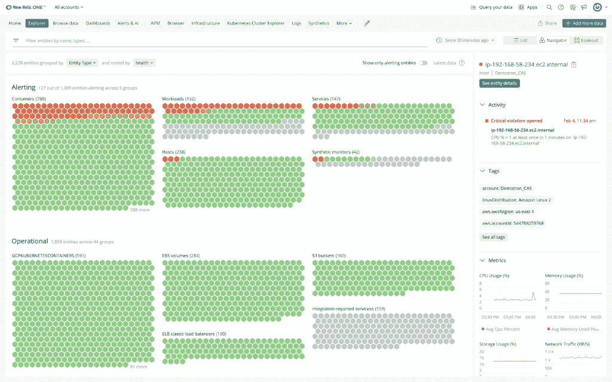
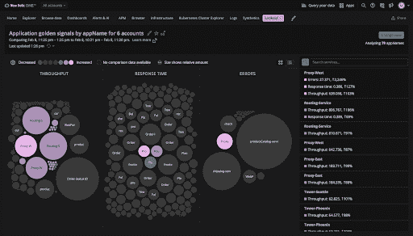

# 数据可视化和可观察性:采取行动的关键桥梁

> 原文：<https://thenewstack.io/data-visualization-and-observability-the-critical-bridge-to-taking-action/>

 [杰森·英格利西

Jason 是 Intellyx 的首席分析师和 CMO，他为领先的技术解决方案提供商和软件初创公司提供数字化转型方面的建议。他的企业软件背景包括供应链、交互设计、软件开发和测试、虚拟化、云计算和区块链。](https://twitter.com/bluefug?lang=en) 

作为早期网络互动机构的年轻信息架构师，我贪婪地吸收了我能找到的任何数据可视化的好例子，从咖啡桌大小的爱德华·塔夫特系列书籍，到经典视频游戏中数量和事件的新颖表示，如 T2 铁路大亨和 T4 文明。

当显示器分辨率低、连接带宽低时，为用户提供一个良好的概要视图，展现底层数据最相关的方面是一项极具挑战性的工作。但是，我们今天要应对的数据流量和数量在当时是无法估量的——不仅仅是在吞吐量和系统容量方面，而且是从人为因素的角度来看。我怎么能指望最终用户理解所有这些数据呢？

***数据可视化*** 涉及设计和工程人机界面，或指标仪表板，以允许人类更好地认知和分析实时数据流和存档数据上的数据。

虽然数据可视化的概念目前在商业和科学分析界已经相当成熟，但不断膨胀的数据量的直观显示仍然为软件可观测性领域的创新提供了大量空间。

良好的数据可视化是使可观察性解决方案所消耗的几乎无限的操作和应用数据变得可理解和可操作，并最终改善客户体验的关键桥梁。

## 超越 IT 运营控制中心

IT 运营团队长期以来一直使用“任务控制”风格的仪表板来监控活动的系统事件、指标和网络流量，以发现潜在的异常。这些数据可视化可以保存在 IT 团队房间的墙上显示器上，或者在工程师桌面的窗口中运行。

从预期服务水平目标(SLO)开始，运营团队为性能问题(如标记响应时间)或威胁事件(如 DDoS 攻击)设置阈值。希望度量仪表板设计得足够好，能够让随叫随到的工程师识别事件，这样他们就可以开出故障单。

系统事件和度量的数据可视化对于 SecOps 团队来说是一件很棒的事情，但是经常会将开发和业务涉众排除在问题补救和持续改进循环之外。

此外，当谈到现代应用程序的预期客户体验时，运营指标本身有一个越来越大的盲点。

## 复杂应用程序的透明度要求

没有任何严肃的应用程序是孤立存在的。今天的高度分布式系统正在将工作负载从单片和集中式应用服务器中移出，以利用可能包含数百或数千个不同位置的微服务和 API 调用的混合架构。

此外，DevOps automation 允许组织驱动更多代码更改，并更快地将配置部署到弹性云架构中。随着交付管道以极快的速度满足客户需求，以可操作的形式保持可观察性比以往任何时候都更加困难。

一个亮点？Grafana 和 Prometheus 等工具的开源指标和 [OpenTelemetry](https://opentelemetry.io/) 等标准计划提供了更好地使用和整理来自这种异构服务器和服务的传入应用程序数据(事件、警报、指标、跟踪)的能力。

在全球开发商和供应商的合作下，任何值得收集的遥测数据源都将适用于可观测性。但是如何理解这些数据呢？

所有利益相关者都需要了解整个环境的最新情况，不仅是为了对系统级问题发出关键警报，也是为了了解整个应用领域发生的变化和趋势。所有这些都有足够清晰的视觉效果来实时传达业务和运营现实，因为任何不足都会影响反应时间。

## 跨应用程序资产的可视化能力

最常见的 IT 数据可视化是以运营为中心的精细化视图，显示数据存储或网络带宽的消耗情况，或数据中心中运行的服务器或虚拟机集的利用率，或公司云帐户中运行的实例或容器的状态。

[New Relic](http://newrelic.com/?utm_content=inline-mention) 最近向我展示了他们的 [New Relic Explorer](https://discuss.newrelic.com/) 平台，该平台可以缩小以提供跨多个应用程序和服务的更全球化的数据可视化。

图一。新遗迹浏览器中的全局实体浏览器视图。(来源:新遗迹)

这是大局吗？这种高密度视图发现并包含与业务涉众的扩展应用程序套件相关的任何和所有实体。这里显示的每个小“六边形”可能是一个内部部署的应用程序、一个外部服务，甚至是运行在无服务器架构上的工作负载。

用户可以很快看到绿色六边形是如何报告正常状态的，而红色六边形代表某种类型的警报。单击任意十六进制开始深入研究详细的指标和根本原因。

一些显示为灰色六边形的已发现实体可能是休眠系统，或者只是尚未主动报告，在这种情况下，可以要求该服务的所有者释放容量分配或更好地将其作为遥测数据源。

虽然该界面提供了强大的全球状态视图，但它可能无法提供我们的人类思维在考虑使用趋势和发现新出现的风险时寻求解决的感官反馈。

图二。在 New Relic Lookout 中跟踪关键指标的变化，这里显示的是最近很流行的黑暗模式。

通过在 New Relic Explorer 中使用这个有趣的新 Relic“气泡”视图，应用程序利益相关者可以通过可视化利用率的相对变化或任何其他重要指标在一段时间内的增量，从字面上“连接点”以实现可观察性。

这些气泡之间的相对变化率(包括此相邻视图中的所有相关服务和系统实体)为用户提供了更好的视觉环境，让用户了解可能影响客户体验的最重要趋势。

可观察性的自然好处包括更少的故障和更快的问题解决时间。但是，当数据可视化超越典型的图表和图形时，IT 和业务利益相关者可以发现他们甚至没有发现的新的服务改进机会。

## 智能带

数据可视化形成了可观察性和人类行为之间的重要桥梁。可观察性的价值最终取决于 IT 和业务利益相关者感知、解释大量数据并采取适当措施的能力，以尽早预测潜在问题并修复整个应用程序资产中的故障。

幸运的是，跟上当今快速变化的高度分布式混合应用程序所产生的数据海啸的复杂性可以转化为净优势。在整个应用范围内采样的遥测数据越多，数据可视化的保真度越高，就越有助于澄清异常情况或发现突发模式。

直观的可观察性界面不仅能最大限度地提高您所拥有系统的应用正常运行时间和 IT 运营效率，还能对扩展的应用资产产生更广泛的影响，从而促进开发成功和业务绩效。

通过 Pixabay 的特征图像。

<svg xmlns:xlink="http://www.w3.org/1999/xlink" viewBox="0 0 68 31" version="1.1"><title>Group</title> <desc>Created with Sketch.</desc></svg>