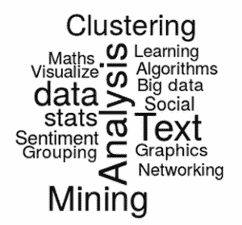
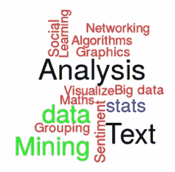
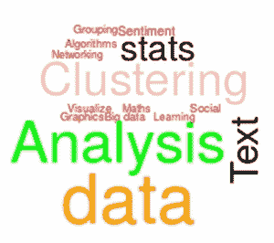

# R 编程语言的数据可视化基础

> 原文：<https://thenewstack.io/data-visualization-basics-r-programming-language/>

这是关于 R 编程语言系列的第一篇文章。在第二篇博文中，文殊菩萨探讨了如何从 R 中提取数据用于[智能分析](https://thenewstack.io/pulling-data-r-smart-analysis/)。本系列的第三篇文章讲述了如何用 R 编程语言[图形化地理解数据](https://thenewstack.io/understanding-data-graphically-through-r/)。在第四篇文章中，她解释了如何使用 ggplot2 为[绘制快速图](https://thenewstack.io/r-package-drawing-quick-plots-with-ggplot2/)。

蓬勃发展的公共图书馆可能会因其海量的知识而令人苦恼。如果有一种更简单的方法来组织所有的知识，并以不同的方式来看待它，会怎么样？

[](https://thenewstack.io/wp-content/uploads/2015/01/image1.png)

实现这一点的一种方法是使用 [R 编程](http://www.cran.r-project.org)。

## **什么是 R 编程？**

R 编程语言是一个免费的开源软件，由于其数据处理能力，它正迅速流行起来，可以描述如下:

*   它是一种可以快速处理大量数据的脚本语言。
*   它可以连接和兼容几乎所有类型的数据库和编程语言。
*   它有强大的内置图形功能。
*   它是用于数据挖掘、信息检索和数据分析的最强大的语言之一。
*   它支持机器学习算法等等。
*   它有能力像科学计算器一样工作。
*   它处理向量、矩阵和列表。
*   r 编程是许多内置统计和数学函数的集合。

## **R 中的矢量化**

在传统编程中，操作是按元素来执行的。矢量化是指操作直接应用于整个矢量，而不是单个元素。

让我们看一个平方和的例子:

```
&gt;  s=0
&gt;  for  (i  in  1:10000)
{s=s+i^2}
&gt;  s
[1]  333383335000

```

在数据处理的情况下，您不需要逐个元素地运行操作。r 可以一次处理一个完整的向量，你可以直接在向量上应用运算。

```
&gt;  sum((1:10000)^2)
[1]  333383335000

```

## **数据对象**

数据可以是字符串、数字、逻辑数据、数字集合等。为了以多种格式存储数据，r 中有不同类型的数据对象。

## **矢**

数据可以存储如下:

```
m&lt;-c(100,-23,3.4,56/34)
&gt;  m
[1]  100.000000  -23.000000    3.400000    1.647059

```

c 代表收藏。数据被分配给 m。

## 快速数据访问

可以使用索引值访问数据:

```
&gt;  m[2:4]
[1]  -23.000000    3.400000    1.647059

```

逻辑表达式可以通过索引值传递。

```
&gt;  n&lt;-c(23,34,-34,0,-12,10)
&gt;  n[n&lt;0]
[1]  -34  -12
<strong><strong> </strong></strong>

```

## **矩阵**

矩阵是表格格式的数字数据的集合。实时数据可以通过巨大的矩阵来处理。许多数学函数都与矩阵相关联，允许同时处理大量数据的能力。

矩阵是矩阵类型数据对象的声明。

```
A&lt;-matrix(n,byrow=TRUE,2)
&gt;  A
[,1]        [,2]
[1,]  100.0  -23.000000
[2,]    3.4    1.647059
<strong><strong> </strong></strong>

```

## 矩阵相关函数

*的逆 A* 可由:
求出

```
&gt;  A^-1
[,1]         [,2]
[1,]  0.0100000  -0.04347826
[2,]  0.2941176   0.60714286
<strong><strong> </strong></strong>

```

## **列表**

列表允许收集长度不均匀的混合数据类型。可以在列表数据中组合字符数据、数字数据、向量。

list 将数据对象声明为类型列表。

```
<strong><strong> </strong></strong>
&gt;  v&lt;-list(A,"Try This",pi)
&gt;  v
[[1]]
[,1]        [,2]
[1,]  100.0  -23.000000
[2,]    3.4    1.647059
<strong><strong> </strong></strong>

[[2]]
[1]  "Try This"
<strong><strong> </strong></strong>

[[3]]
[1]  3.141593

<strong><strong> </strong></strong>

```

## **流行数据对象:data.frame**

数据框是不同类型数据的集合。它可以保存数字、逻辑或字符数据。唯一的要求是每个数据列必须有相同数量的条目(长度)。

```
d&lt;-data.frame(  Word=word,  Freq=f)
&gt;  d
word frequency
1        Data        123
2      mining         34
3  Algorithms         89
4  Prediction        120
5    Analysis         32
6       Logic         56
7     Twitter         45
8       Model        111
9     Cluster         22

```

可以从各种来源读取数据并存储为 data.frame。

## **添加库**

用户可以根据需要添加任意数量的库。这些是用于特殊任务的。你可以用命令
在[http://cran.r-project.org/](http://cran.r-project.org/)下载这个库

```
install.packages(“wordcloud”,dependencies=TRUE)

```

从 R 控制台。对于工作会话，需要加载库。

## **世界云:挖掘信息**

wordcloud 库将提供一个可以传递参数的函数。

设 *x* 为单词集合， *f* 为这些单词对应频率的集合。

为了理解哪个单词出现得最频繁，让我们画出单词 cloud。

单词的大小和单词出现的频率成正比。

```
x&lt;-c("data","stats","Sentiment","Analysis","Social","Networking","Visualize",
"Big data","Graphics","Maths","Algorithms","Machine",  "Learning","Classification",
"Clustering","Grouping","Mining","Text")

f&lt;-c(  78,   40,  172  ,147,  213,  101,  217,   29,  149,  174,  213,  166,  265  ,215,,   56  109,   80,    260)

&gt;  wordcloud(x,f,scale=c(4,1),Inf,random.order=FALSE)

```

[](https://thenewstack.io/wp-content/uploads/2015/01/image2.png)

[](https://thenewstack.io/wp-content/uploads/2015/01/image3.png)

## **关于 R 的更多信息**

*   r 有许多漂亮的图形用户界面。最著名的 GUI 是 R-studio。
*   r 带有支持性的帮助和良好的内置图形命令。
*   它内置了来自真实数据的数据集。
*   如果信息对于任何集合或矩阵的特定条目不可用，R 将 NA-不可用理解为一个值。
*   像 NaN-不是一个数，Inf -infinity (∞)这样的特殊值也和 r 一起存在。
*   由于 R 是一个免费的开源软件，互联网支持许多关于 R 的库、帮助和文档。

练习的代码可以在这里找到:[https://github . com/manjushajoshi/R-code/tree/master/DiggingdatawithR-v2](https://github.com/manjushajoshi/R-code/tree/master/DiggingdatawithR-v2)

Manjusha Joshi 是科学计算的自由开源软件的自由职业者。她是一名数学家，也是 Pune Linux 用户组的成员。

特色图片[通过](https://www.flickr.com/photos/romanboed/13356494013/in/photolist-mmgwkx-r3zodL-cZhQH-cmYE8b-o2bHvm-5HXBcF-8MuvLc-eaGPCC-ab91CJ-nZ77yj-6Lep5z-KVuTv-ghnoDc-dCcXMW-4pXcz4-6VVkds-61MTbm-zTFfW-fyuGD8-9dUbHm-9dUby3-aAWrcF-9aWdz4-pnZWnh-8F6K2M-787Wt9-hRZZnn-7q9Brq-zTFg5-6UA9E9-6Qxog-BAwZy-pTt34v-7vWy6u-8ZZqFJ-boDT4g-9u2j95-eojDBM-f1T5Vc-aMQyEK-e3h7sV-7Wq4G9-4RjZxv-9AiLeq-4Rk6XF-gLsch-6N5Csx-b3YZxM-fW5zRj-4JX9) Flickr 知识共享。

<svg xmlns:xlink="http://www.w3.org/1999/xlink" viewBox="0 0 68 31" version="1.1"><title>Group</title> <desc>Created with Sketch.</desc></svg>