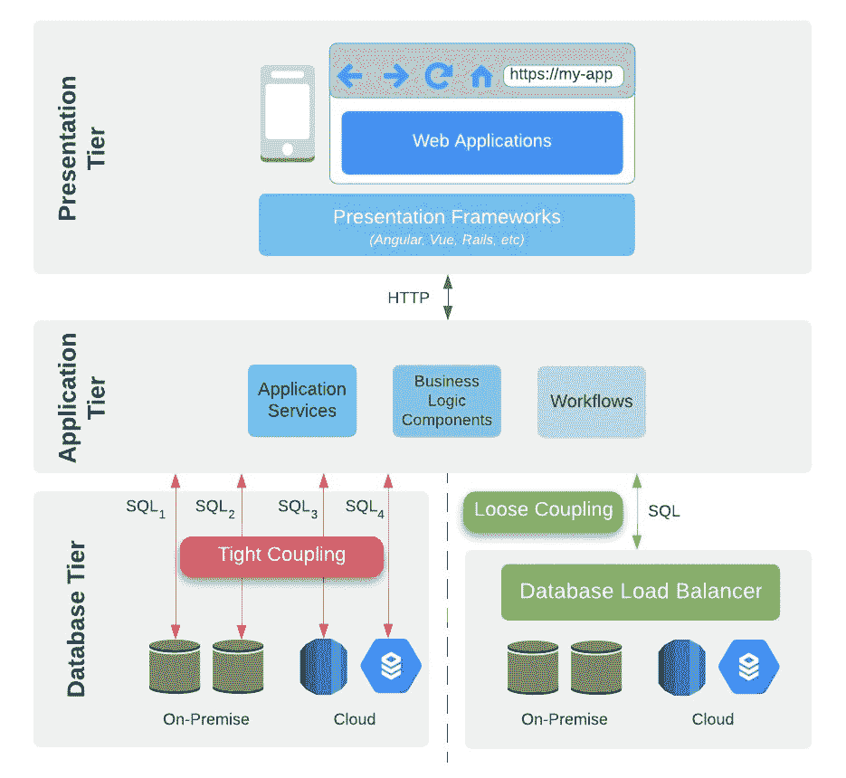

# 数据库负载平衡如何完善三层架构

> 原文：<https://thenewstack.io/database-load-balancing-and-the-delusion-of-3-tiered-architecture/>

 [拉胡尔·苏布拉马年

拉胡尔·苏布拉马年是 EngineYard、DevFactory 和 FogBugz 的首席执行官。他也是 ESW 资本公司的创新主管。他在计算机软件行业工作了很长时间，拥有算法、python、敏捷软件开发和软件项目管理的背景。](https://www.engineyard.com) 

三层架构是一个神话。你只是认为你拥有它。事实上，你有一个双层架构和一个梦想。

三层体系结构的“传统”定义认为它包括:

*   表示层
*   应用层
*   数据库层。

真正的三层架构允许您扩展或迁移任何单独的层，而不会对其他两层产生任何影响—您可以在任何一层中进行更改，而无需更改任何其他层中的任何一行代码。

这是一个很棒的想法——它建立了一个您可以干净流畅地即插即用任何组件的环境。

对于 web 应用层来说，这是完全正确的。HTTP 协议的发展确实创造了完整的 web 应用层。它与应用程序和数据库层完全分离。web 和应用服务器层的 HTTP 分离更加成功，因为它指定了协议。

然而，如果您现实地考虑一下，您会发现您的应用程序层和数据库层根本不是独立的实体。它们是如此紧密地结合在一起，你不可能对一个基础设施做任何改变而不影响另一个。

## 应用程序与数据库关系的简史

应用程序和数据库从一开始就紧密地交织在一起。与“干净的”HTTP 不同，数据库供应商引入了 SQL 语言的专有扩展和实现。因此，SQL 语言创造了统一性，要求与持久性相关的应用程序更改需要反映在数据库中，反之亦然。

一层上发生的一切都需要在另一层上反映出来。当两个系统在同一台服务器上运行时，这加快了处理速度，因为信息不必传输很远。

## 分手很难做到

云的出现彻底改变了这种动态——按需可伸缩性的承诺可以实现——只是它并没有真正发生。

将应用服务器从数据库中分离出来几乎是不可能的。对一个层的单一更改可能会对两个层的通信方式产生负面影响。例如，数据库中的更改可能会“中断”与应用程序中某些内容的连接。 [SQL](https://citeseerx.ist.psu.edu/viewdoc/download?doi=10.1.1.218.507&rep=rep1&type=pdf) 可以设置为在应用程序调用“采购订单编号”时提供特定的数据，但是对会计数据库的更新会将采购订单编号更改为工作订单编号，使应用程序无法再访问它。分析代码到数据库的连接需要大量的静态分析，以便在做出任何改变之前找到所有的耦合。

## 达不到第三等级

公司没有直接解决耦合问题，而是在向云过渡的过程中尝试变通方法。它们重复工作，在逐渐过渡功能时并行运行内部和云数据库。他们将旧数据迁移到云数据库，并写入两个数据库。如果没有出现问题，并且两个数据库同步，它们稍后会切换读取查询。

这很好，除了:

*   如果组织不能有效地将读写流量路由到特定数据库，那么部分转移数据功能就很复杂。
*   当出现问题时，DBA 可能无法快速回滚。由于数据和应用程序逻辑通常紧密耦合，在故障转移期间切换到另一个数据库而不更改代码可能会导致应用程序错误。这使得无法实时修改其数据基础架构的组织面临迁移风险。
*   成功的数据库迁移需要可靠的监控和集中登录功能。在数据库迁移过程中缺乏透明度的 IT 团队——没有对性能的洞察或明确的责任审计跟踪——无法成功过渡。
*   数据库和应用程序之间源自 SQL 的紧密耦合要求每次对底层数据存储进行更改时都要对应用程序进行大量的代码更改，这增加了采用云迁移的谨慎性。

## 您可以实现真正的三层架构

秘诀是负载平衡，它在解耦过程中起着重要的作用。它充当一个“自动”转换器，一个中间层，保持数据库和应用程序之间的通信通道开放，但完全绕过紧密耦合，允许每个组件根据需要进行伸缩或迁移。这简化了管理数据库-应用程序耦合的能力，而不会对两者造成损害。有了真正的三层体系结构，您的数据库可以轻松快速地与多个应用程序“对话”，而您的应用程序可以与多个数据库对话。

借助数据库负载平衡，每个挑战都可以得到解决，从而真正从云规模中受益。数据库负载平衡增强了多台服务器之间的工作负载分布。使用中间控制平面可以简化迁移，中间控制平面可以将 SQL 命令转换为云活动操作，而无需更改一行代码。数据库负载平衡将应用程序与其存储分离，简化操作，并大幅降低总拥有成本。最终结果是能够随时将读取切换到云服务器并切换写入，从而实现零宕机的安全迁移。

一旦发生迁移，保持数据库负载平衡器就位可提供长期的可伸缩性和稳定性，确保维护期间零停机，并降低计划外停机的风险。

数据库负载平衡基础设施:

*   使开发人员能够将应用程序指向单个连接并与数据交互，而无需担心数据库基础结构。
*   理解多种 SQL 方言，允许动态流量路由而不影响事务，减少或消除停机时间，降低成本。
*   分析流量峰值，以相应地分配资源并最大限度地减少对最终用户的影响，通过确保数据可用且可访问，保持任务关键型业务应用程序高效运行。
*   允许在特定数据库出现任何问题时安全快速地回滚迁移。DBA 可以配置故障转移标准，以自动重新路由来自故障数据库节点的流量，而不会导致应用程序错误。

从长远来看，数据库负载平衡使管理操作变得更加容易，从而实现:

*   在单个云数据库集群上整合数千个模式，简化了操作并降低了成本，以十分之一的价格提供了 10 倍的性能。
*   扩展到每秒数十万个事务—平稳地迁移到更大的实例规模或无缝地大规模使用读取副本。
*   实时可见性，快速识别并即时响应问题查询。
*   通过避免停机、提高网站性能和减少开发时间，加快应用部署，并带来大量增量收入和成本节约。
*   有效平衡读写流量，显著提高整体数据库吞吐量。
*   在单一平台中整合数据库分析，实现更智能、更高效、省时省钱的决策。
*   转变您的两层架构，真正采用三层架构——负载平衡将帮助您实现这一目标。

<svg xmlns:xlink="http://www.w3.org/1999/xlink" viewBox="0 0 68 31" version="1.1"><title>Group</title> <desc>Created with Sketch.</desc></svg>