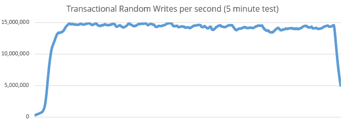
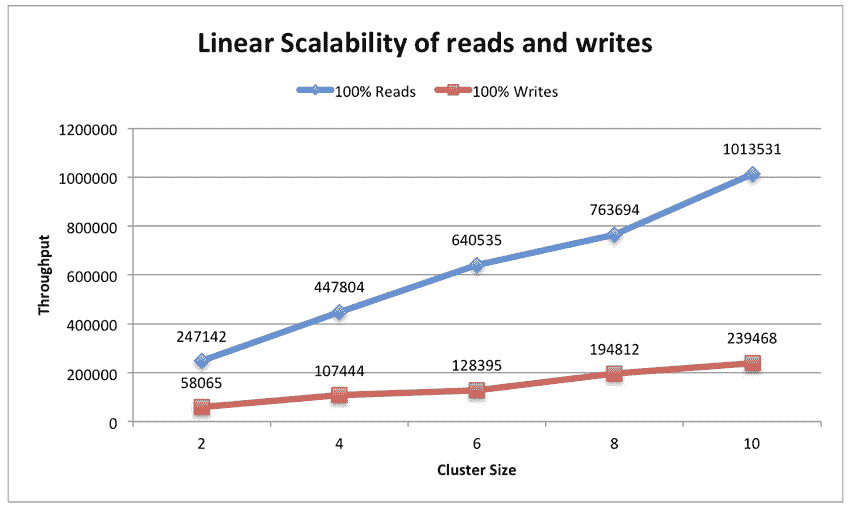
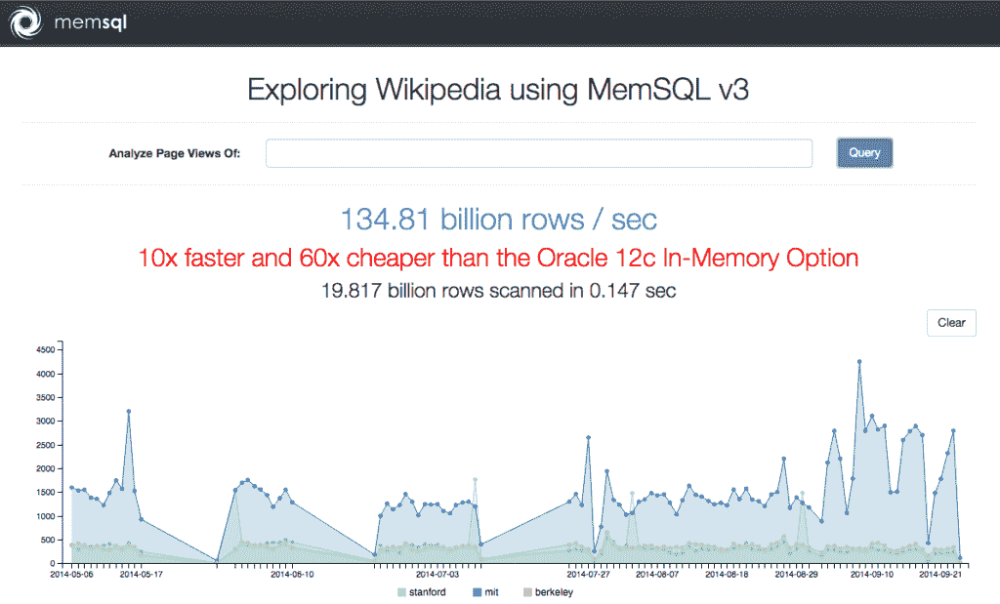

# 大规模数据库第二部分:基准测试游戏

> 原文：<https://thenewstack.io/databases-high-volume-transactions-scale-part-two/>

这是我们的三部分系列的第二部分，着眼于实时事务的数据库可伸缩性的最新进展，重点关注新兴参与者如何分享性能基准测试，作为吸引新客户购买其产品的一种方式。虽然 100 万笔交易是 2014 年年中的最高点，但到了年底，FoundationDB 已经超过基准一个数量级。现在，Aerospike 正在发布基准测试，显示其写事务速度的成本节约。

[Part One](https://thenewstack.io/databases-high-volume-transactions-scale/)

关注新一代数据库服务，这些服务正在大规模提供实时事务处理。

[Part Three](https://thenewstack.io/databases-high-volume-transactions-scale-part-three/)

将重点关注企业可以采取哪些步骤来管理早期可扩展性，同时构建可以管理增长轨迹的未来基础架构。

随着分布式数据库市场的不断扩大，竞争对手急于满足对能够以低延迟执行大规模高容量事务的数据库的不断增长的业务需求，基准测试正在成为一种关键的推广和概念验证工具，帮助新的提供商论证他们的业务案例。

虽然 Basho 和 Redis 等老牌公司在企业级市场上拥有相当稳定且不断增长的市场份额，但 Aerospike、FoundationDB 和 MemSQL 等新公司希望通过发布交易处理能力的基准测试，吸引新客户购买他们的产品。

## FoundationDB:每秒 1440 万次写事务

FoundationDB 发布了一个新版本的数据库产品，旨在构建新一代物联网和设备驱动的交互式应用，保持大规模分布式数据库的单一视图，同时允许对数据进行持续的读写。

“最难扩展的事情之一是写事务，”FoundationDB 的首席执行官和创始人戴夫·罗森塔尔(Dave Rosenthal)说，他在过去的一年中一直致力于数据库的第三版。“在大量写入同时发生的情况下扩展事务非常困难:过去，我们每秒钟能够管理 300-400，000 次对数据库的随机写入。这是一个相当不错的数字，但也有一些企业推出了更大的数字。”

罗森塔尔引用了最近的一份《网飞邮报》,该报去年被评为行业最佳实践。在记录的测试中，网飞能够在一千个核心集群上大规模运行 Cassandra，保持每秒 110 万次写入。

“这是一个非常酷的基准，让很多人站了起来，”罗森塔尔说。“它比我们的 2.0 产品快了大约三倍。”

根据 Rosenthal 的说法，许多人怀疑 FoundationDB 是否有能力承担这种级别的事务处理能力，特别是考虑到 FoundationDB 的架构是建立在单个节点上的。

随着版本 3 的发布，FoundationDB 推出了他们新的事务处理引擎:“这对我们来说是一个巨大的项目。它基于全新的可扩展设计。我们展示的基准测试每秒运行 1440 万个事务，比网飞测试快一个数量级。”

为了支持这种事务处理，FoundationDB 还发布了自己语言的更新——Flow 2——混合了 C++和 Erlang。流 2 提供了一些新的批处理和缩放算法，它们与事务处理引擎一起工作，以减少延迟并提高可伸缩性。

例如，在 FoundationDB 2 中，启动具有最高保证级别的事务将是一个 3 毫秒的操作。也许你可以把时间缩短到 2 毫秒。现在，Foundation 3.0 将需要 3-400 微秒，当您建立大量事务时，不会有延迟损失，”Rosenthal 说。

罗森塔尔认为，这比其他竞争对手共享的测试要快得多。写事务会降低处理速度，因为需要做更多的工作来实时维护单个数据集，尤其是当它分布在一个机器集群上时。

对于一些早期采用者来说，运行 FoundationDB 所需的 4 GB 内存一直是一个障碍。FoundationDB 社区论坛中的用户指出，4GB ECC RAM 的最低要求“似乎高得不合理”。一名用户指出，他们习惯于其他数据库选项，例如 [Neo4j](https://thenewstack.io/neo4j-funding-shows-graph-databases-gained-acceptance/ "Neo4j on The New Stack") ，如果内存使用预计较低，最大内存限制也可以设置得较低。

该用户正在寻找一种解决方案，其 web 前端即使在高压力负载下也能容纳不到 1GB 的 RAM，因此剩余的 RAM 将留给 FDB。我们一次性读取并缓存不可变对象，因此 FDB 将仅用于读取/写入可变对象(低负载)这就是为什么我们认为在同一台服务器上为前端和后端共享 CPU/RAM/SSD 资源将足够好。”

因此，对于他们来说，运行 FoundationDB 进程所需的 4GB 官方最低内存量在目前来说是一个过高的价格。FoundationDB 目前正在进行进一步的测试，看看有什么可能。

与此同时，Rosenthal 认为新的 FoundationDB 版本有可能支持一系列全新的物联网产品，但迄今为止，实际用例仅限于游戏和电子邮件营销分析。

[customer . io](http://customer.io/)——一家专注于电子邮件的营销自动化提供商——目前正在使用该数据库提供商的免费多达六个节点的生产集群计划对 FoundationDB 的容量进行测试。Customer.io 一直使用 MySQL 关系数据库来管理客户的帐户订阅和电子邮件活动，Redis 用于队列和缓存，MongoDB 用于点击流数据。但是，随着他们开始从 5 个客户扩展到 400 多个客户，他们当前的数据体系结构无法根据每个目标的在线行为快速确定应该向每个客户发送哪封电子邮件:对于 Customer.io 的所有客户来说，这已经成为需要实时分析和处理的 1 TB 以上的数据集。在 FoundationDB 的一篇案例研究论文中，他们表示，他们已经帮助“根据被监控的网络应用程序中的动作，对要发送的电子邮件和发送给谁的电子邮件进行分类。FoundationDB 能够进行简单的范围扫描，以便快速检索 ID 信息。

虽然营销和游戏可能是受欢迎的用例，但它们很难改变世界。这就是像 [Basho](http://basho.com/) 这样的数据库平台真正的优势所在，不管基准测试如何。Basho 的首席执行官 Adam Wray 将财富 50 强企业中的三分之一作为客户，并指出 Basho 的 [Riak](http://basho.com/riak/) 产品在英国和丹麦医疗服务中的使用，作为分布式数据库提供商如果要在市场中竞争就必须施加影响的例子。

最近几周，巴黎提出了在城市核心区消除私家车的想法，以应对日益严重的交通拥堵问题，这些问题造成了向城市中心分配商品和服务的拥堵，更不用说由于城市劳动力被困在汽车中而对劳动力经济产生的影响了。利用对家庭和行业能源消耗的大数据分析，提高能源使用效率；活动和旅行的实时需求驱动的票价；识别品牌或音乐艺术家何时成为流行趋势的全球营销活动；金融交易；在线和移动选举活动都可能使用 FoundationDB 声称提供的那种事务处理能力。目前，FoundationDB 尚未在利用其基准向这些企业和政府市场展示其数据库平台的能力方面取得进展。

## 气塞式:关注规模化的速度

与此同时，Redis 的竞争对手 [Aerospike](http://www.aerospike.com/ "Aerospike") 于 2010 年开始，将自己定位为“第一个闪存优化的内存 NoSQL 数据库”去年，他们开源了他们的数据库软件，“我们现在在意想不到的角落看到了更广泛的应用和采用，”Aerospike 的首席营销官 Monica Pal 确认道。

Pal 和技术负责人 Sunil Sayyaparaju 表示，Aerospike 的目标是提供 Redis 的速度，Cassandra 的规模，但具有闪存的经济性。Sayyaparaju 说:“我们已经建立了一个数据库，其中的索引在 RAM 中，数据可以在 RAM、闪存或两者的组合中，因此规模速度快:这就是我们正在谈论的内容。”。“我们从简单的键值存储开始，然后添加了额外的索引和用户定义的函数，但我们希望确保在添加功能时不会损失性能。事实上，我们最新的测试显示，情况有所改善。”

Sayyaparaju 说:“Aerospike 传统上被用作前端操作数据库，后面是 Hadoop 集群。“我们正在加速 MySQL 等传统数据库的发展。第二种使用情形是，热数据在 Aerospike 中，历史数据在 Hadoop 中，并结合两者做出决策。”

Sayyaparaju 和 Pal 说，由于速度效率，他们看到客户从自动分片数据库解决方案转向 Aerospike。

例如，广告欺诈检测服务 [Forensiq](http://forensiq.com/ "Forensiq") 从 Redis 转向 Aerospike。他们的服务需要立即确定在线广告是由真人还是机器人观看，以确定互联网广告机会的真正价值。这涉及到对 5000 多万用户、移动设备和 IP 地址的持续评分。

Forensiq 的首席技术官 Matt Vella 解释说，他们每天要处理 50 万笔交易，而解决方案却停滞不前。

“我们的交易数量一直在以 100 或 1000 倍的速度增长，我们需要再扩大 1000 倍，以处理我们每天需要扫描的大量流量，”他说。

Vella 表示，Forensiq 的两个主要产品——旨在确定客户何时应该购买广告的高级解决方案和位于客户网站上并从访问者那里收集数据点的 Javascript 标记解决方案——现在每天都处理超过 10 亿次的请求。

“现在许多可用的数据库都已准备好用于生产，这与 10 年前不一样了，当时只有少数几家大公司。因此，这实际上取决于您正在设计的架构以及您对特定应用程序的需求。没有多少公司在做任何事情时都只使用一个数据库。我们对这些应用程序中的每一个都使用了数据库组合。例如，我们使用 Aerospike 进行实时分析，并聚合数据。我们正在实时收集特征，观察它们如何变化，比如在 90 天内，然后我们运行算法来确定分数。

“我们确信 Redis 是适合我们的解决方案。然而，它没有内置的分片，尽管有公司拼凑了解决方案来提供这些功能，但我们认为它在生产中不适合我们。这就是我们找到气塞公司的原因。它仍然很新，但它有一个很好的功能集，不是最强大的，但对我们来说已经足够了，它确实有可以帮助我们实现低延迟和大规模性能的分片，并且成本非常值得。

“我们还使用 MongoDB 来存储原始数据集。这种方式效果很好，它的每秒更新需求较低，因此对于长期数据来说，它基本上可以满足我们的需求。”

Vella 描述了一种情况，这种情况反映了内存数据库服务需要不断发展的方式:“我们正在开发一些东西，使我们能够为大规模客户端存储完整的数据，特别是那些每天有数千亿次印象的客户端。我们需要存储所有这些数据——或者至少是这些数据的样本——以便进行分析，因此我们一直在使用 MongoDB 来实现这一目的，但是数据量变得如此之大，以至于我们正在构建一个内存数据库来处理它。由于每个广告印象都有多个在不同时间出现的数据点，我们需要一个能够在数据点出现时收集这些数据点的数据库，当我们有了这些数据后，我们就可以对其进行分析。”

12 月，Aerospike [在谷歌计算引擎博客网站](http://googlecloudplatform.blogspot.com.es/2014/12/aerospike-hits-one-million-writes-Per-Second-with-just-50-Nodes-on-Google-Compute-Engine.html "Aerospike benchmark using Google Compute Engine")上发表文章，展示他们在 50 个节点上每秒处理一百万次写事务的能力。由于 Aerospike 的基准测试使用了与 FoundationDB 不同的变量，因此进行直接比较有点棘手，但从表面上看，FoundationDB 声称处理 5400 万次写入事务每小时需要 150 美元，而 Aerospike 计算出处理 100 万次写入事务的成本为 41.20 美元。

## MemSQL:作为客户概念证明的基准

[MemSQL](http://www.memsql.com/ "MemSQL") 的技术营销工程师 Conor Doherty 认为交易处理基准测试是获得新客户的重要工具:“基准测试和评估是我们为客户提供的概念证明和评估的重要组成部分。他们经常让当前的数据库达到(甚至超过)它所能处理的程度，并在寻找能够保持可扩展性和/或减少延迟的东西。对于客户来说，将他们的事务性和分析性工作负载合并到一个 MemSQL 集群上并从几分钟缩短到几秒或几毫秒是很常见的。

Doherty 说:“我们的客户一直有扩展交易处理的需求。”他指出，媒体公司 Ziff Davis 和加拿大电信公司 Novus 等客户的交易处理速度比 MongoDB 和其他以前使用的解决方案快了几个数量级。

MemSQL [使用 Oracle 演示作为基准](http://blog.memsql.com/memsql-does-oracles-own-demo-ten-times-as-fast-sixty-times-cheaper/ "MemSQL Oracle benchmark results")来展示他们如何超越传统企业提供商，计算出他们的速度快了十倍，但 Doherty 证实，在该基准测试中，只执行了读取事务。

然而，Doherty 指出 MemSQL 运行的其他基准测试“可以在集群中每个 CPU 每秒处理 10-20，000 次写入。”

虽然性能指标评测的想法似乎很有用，但结果仍然令人困惑，因为每个数据库提供商都使用不同的体系结构和服务器集群大小，通常无法明确区分什么是读或写事务处理，甚至以不同的指标显示成本节约结果，从而让客户不得不自己进行比较。

“大多数行业标准基准旨在测试纯事务性或纯分析性工作负载。这些是重要的指标，我们将继续使用它们进行内部回归测试和概念验证，但它们不是现代实时分析工作负载的有用复制品，这些工作负载需要融合事务处理(插入、更新、删除、简单选择查询)和分析处理(具有聚合、连接等的复杂选择查询)。).Doherty 说:“在 MemSQL，我们相信我们需要一个现代基准来测试数据库分析实时变化的数据集的能力。

进行比较的另一个困难是，MemSQL 本身不是分布式数据库架构，所以他们的基准测试都在与 MemSQL 集群相同的服务器上运行。MemSQL 由前脸书员工构建，他们看到了大规模实时数据库事务处理的需求，MemSQL 可能在多台机器上或跨虚拟网络运行，但被设计为充当单个数据库，而不是分布式架构平台。Doherty 认为这是 MemSQL 构建方式的一个优点:

“MemSQL 专为适应混合读/写和在线事务/分析处理工作负载而设计，因此不再需要维护和同步许多数据副本。MemSQL 为灾难恢复提供了跨数据中心复制，允许用户创建任意多个数据库副本。辅助(副本)群集可用于分析和读取密集型工作负载。使用 MemSQL 方法有几个优点:(a)不太担心最佳/最差情况下的延迟，因为所有事务处理都发生在具有可预测延迟的单个 MemSQL 集群中，以及(b)它受单向网络延迟(而不是往返网络延迟)的限制，因为事务处理不需要地理分布的数据库实例之间的通信。无论如何，数据至少需要通过网络传输一次。但是，发送一次数据总比发送后必须等待回复(并在此期间阻止读写)要好。”

目前，潜在的最终用户仍然需要根据自己的需求和潜在的扩展轨迹来决定可用的数据库服务。MemSQL 的 Gary Orenstein 认为，这种情况需要改变，迫切需要新的行业基准来显示各种数据库提供商如何真正能够处理大规模的大容量事务，支持具有全球分布客户群的应用程序。

“我不认为基准已经赶上了，”奥伦斯坦说。“大多数人都专注于事务性和分析性处理。但是终端客户需要能够同时进行交易和分析。他们需要能够对这些交易进行分析。他们需要能够查询直到最后一次点击的数据…这在以前是不可能的。”

在大容量事务数据库系列的第三部分中，我们将探讨应用程序开发人员如何在实现高性能数据库架构的过程中管理增长并保持可伸缩性。

<svg xmlns:xlink="http://www.w3.org/1999/xlink" viewBox="0 0 68 31" version="1.1"><title>Group</title> <desc>Created with Sketch.</desc></svg>