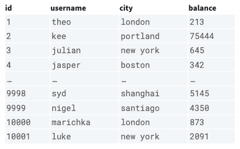
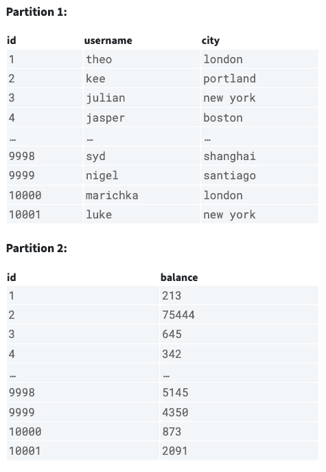
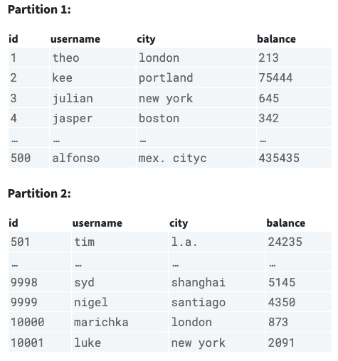
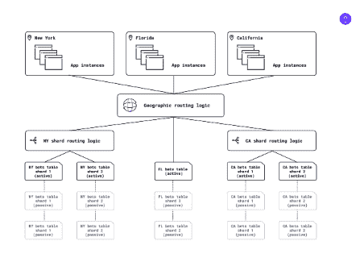

# 数据库:关于分区应该知道什么

> 原文：<https://thenewstack.io/databases-what-to-know-about-partitioning/>

数据就是一切，一切都是数据，在大多数情况下，数据库中的数据会不断增长，但用户体验必须保持不受影响。这怎么可能呢？一个策略是[所有其他策略](https://thenewstack.io/techniques-for-scaling-applications-with-a-database/)都是[建立在](https://thenewstack.io/how-to-choose-the-right-database-in-2023/)之上的，那就是分而治之，也就是分割。

分布式数据库提供商[蟑螂实验室](https://www.cockroachlabs.com/)最近发表了一篇有用的[博客文章](https://www.cockroachlabs.com/blog/what-is-data-partitioning-and-how-to-do-it-right/)——由高级技术内容营销人员 [Charles Custer](https://www.linkedin.com/search/results/all/?keywords=charlie%20custer%20cockroach&origin=GLOBAL_SEARCH_HEADER&sid=YHX&utm_source=thenewstack&utm_medium=website&utm_content=inline-mention&utm_campaign=platform) 撰写——涵盖了分区的基础知识。

有两种类型的分区。垂直分区根据机器能力分割一个表。水平扩展按行划分，带来了添加更多服务器的能力，这被称为分片。

分片可以极大地提高应用程序的性能，但它需要相当多的工程工作来执行操作，而使用单个数据库本来可以更简单地完成这些操作。

## **基础知识**

*什么是数据库分区？*

概念上非常简单，这意味着将数据库分成单独的部分，也就是分区。独立的分区允许对每个进行单独的访问、存储和管理。好处是它是一个可伸缩性更强、性能更高的应用程序，但挑战是它可能是一个艰难的工程，既昂贵又耗时。

*分区类型*

虽然有两种以上，水平和垂直是最常见的。这个例子包括一个表，但是真实世界的例子没有这么简单。

以下是之前的表格:

**垂直分区**是按列拆分的表，不同的列存储在不同的分区上。

垂直分区的一个用例是不同的列被不同地使用。如果这个例子来自一个真实的银行，那么分区 1(用户名，城市)将是相对静态的，需要较少的高性能机器，但是分区 2(余额)将需要高吞吐量、高性能的机器，因为余额更新得更有规律。

**水平分区**是由不同分区上不同范围的行分割的表

水平分区的一个用例示例是对表进行分区表，以提高针对该数据的特定的、频繁使用的查询的性能。

**分片**是在多台服务器上分布水平分区。

分片在拥有关系数据库的公司中是一种常见的做法。如果没有分片，数据库仅限于垂直扩展，这是有益的，但也是有限的。为了引入水平伸缩，数据库被分割成水平分区，现在称为碎片，这些碎片被分割到多个服务器上。

存在许多分片策略和架构。亚马逊网络服务有一个很棒的[介绍资源](https://aws.amazon.com/what-is/database-sharding/)给分片。

**分区的优势**

**可扩展性** **:** 垂直扩展很大程度上，但最终一台服务器只能做这么多。分区引入了添加服务器的能力，并消除了对扩展的限制。

**能力** **:** 一台服务器意味着存在单点故障，但是分区解决了这个问题。

**性能**

## **听起来不错，你所说的挑战是什么？**

以一个链接到其生产应用程序的单实例 Postgres 数据库为例(如果生产数据库出现故障，一些备份可以作为安全措施)。工程团队预见到当前配置的性能限制，并制定了一个计划，将数据库分成三个主动碎片，每个碎片有两个被动副本碎片用于备份。唷。

但是等等，还有更多…这不仅仅是一个简单的情况，因为现在以前可能很简单的流程需要更多的工作和考虑。以下是一些任务:

*   在碎片之间平均分配数据和工作负载；否则，可能会有不成比例的大量查询使一个 shard 过载。
*   确保来自应用程序的应用程序代码路由查询到正确的碎片。
*   一旦创建了碎片，与数据库交互的其他系统的支持代码(例如，向分析数据库发送更新的数据管道或变更提要)将可能发生变化。
*   曾经简单的过程现在可能会变得复杂，涉及多个碎片(例如，更新跨越多个碎片的数据)。

这是一个分片架构的示例:

关于分片的事情是，当添加新的分片时，上面列出的所有项目符号都需要再次更新。这可能会带来更好的用户体验，但可能不会带来更好的工程体验，这取决于您如何定义更好的工程体验。成本会上升，但是存储数据很贵。

## **结论**

分片和分区都是将一个较大的数据库分解成本质上较小的数据库，以根据特定需求提高性能。影响数据的因素也会影响整个应用程序。卡斯特说，分布式数据库是伟大的，但它不能代替理解在引擎盖下发生了什么。

<svg xmlns:xlink="http://www.w3.org/1999/xlink" viewBox="0 0 68 31" version="1.1"><title>Group</title> <desc>Created with Sketch.</desc></svg>