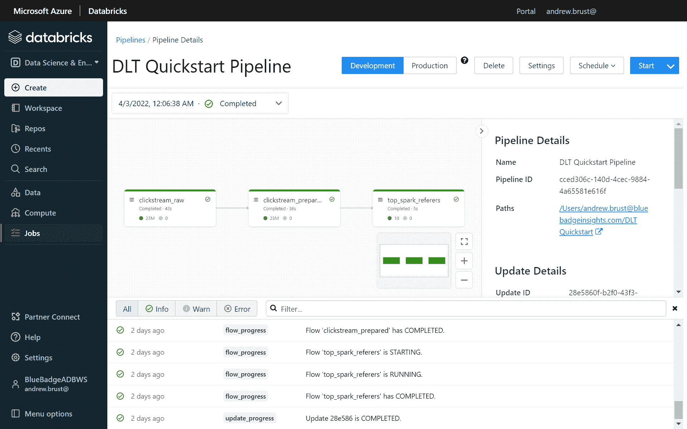

# Databricks 为 GA 带来数据管道服务

> 原文：<https://thenewstack.io/databricks-brings-data-pipeline-service-to-ga/>

Databricks 是云数据平台公司，它创造了“数据湖屋”这个词，并由 [Apache Spark](https://spark.apache.org/) 的创建者创建，今天宣布 [Delta Live Tables](https://databricks.com/product/delta-live-tables) (DLT)的全面上市(GA)。DLT 是 Databricks 在 2021 年 5 月以预览形式推出的数据转换和数据管道服务。

新的堆栈有幸听取了 Databricks 杰出软件工程师 [Michael Armbust](https://www.linkedin.com/in/michaelarmbrust/) (他创建了 Delta Live Tables)和 Databricks 首席执行官 [Ali Ghodsi](https://www.linkedin.com/in/alighodsi/) 对 DLT GA 的介绍。在简报中，两人解释了 DLT 的一些优点，这些优点有助于它避免成为市场上“另一个”ETL(提取-转换-加载)解决方案。

## 热混乱，冷清理

让我们从解决 Delta Live Tables 试图解决的问题开始。正如 Ghodsi 所描述的那样:“……人们……把这么多不同的东西缝合在一起。他们拥有数据，他们使用这些工具来获取数据，但随后他们必须使用 [Airflow](https://airflow.apache.org/) ，或者他们可能正在使用 [Oozie](https://oozie.apache.org/) ，他们正在编写一系列定制的 ETL 脚本，他们正在将数据转移到数据仓库，他们正在将数据转移到数据湖……他们必须进行自己的监控，以确保这些数据不会中断……只有幕后的地狱，每个人都必须这样做。”

现在将这与 Databricks 对事情*应该*如何的观点进行对比:数据工程师应该只需要提供他们希望在数据管道中执行的数据转换的声明性规范，并且用他们已经知道的语言来做。此外，数据工程师不应该关心背后的逻辑，或执行管道时的特殊性能考虑。相反，他们应该只需要定义一个规范；然后，系统应该接管，按需、连续或按计划管理执行。

简而言之，这就是 Delta Live Tables 的目标。

## 甜蜜的句法糖

由于 Databricks 认为数据工程师应该能够利用他们已经拥有的技能来做数据管道，DLT 的面包和黄油是笔记本中的 SQL 和 Python 代码片段。

在 SQL 端，管道的输出由一个查询定义，该查询的结果集指示输出表的模式和内容。SQL 语法的扩展允许指定“[期望](https://docs.databricks.com/data-engineering/delta-live-tables/delta-live-tables-expectations.html)”—数据质量规则和当数据行不符合时要采取的行动。

在 Python 方面，开发人员利用对 [DataFrame API](https://spark.apache.org/docs/latest/sql-programming-guide.html) 的扩展，而不是编写命令性代码，利用声明性语法来指定计算、目标表列名、过滤条件以及对指定 SQL 中支持的相同数据质量“期望”的属性的支持。

用阿姆布鲁斯特的话来说:“在这两种情况下……你都是在给出一个声明性的描述，说明你的湖边小屋应该有什么样的表，然后系统会计算出如何创建这些表并使之保持最新。”

## 天真地执行

Delta 实时表作业的数据块用户界面。注意底部是上次运行的状态消息列表，中间是可视化的执行图。

具有 DLT 代码的笔记本电脑可以在 Databricks 中被安排为一种特殊的作业，这将触发对笔记本电脑代码的分析并生成智能执行图。该分析允许并行执行被确定为不具有相互依赖性的子任务以及具有相互依赖性的子任务的适当排序。这使得 Databricks 不仅仅是对笔记本代码的不可知调度。正如 Ghodsi 解释的那样，由其他平台生成的管道(例如，这些平台的执行可能由 Apache Airflow 协调)不会享受到这种增强的执行。

这带来的加速可以与使用查询优化器在数据库上执行的传统 SQL 命令相媲美。事实上， [Spark SQL](https://spark.apache.org/sql/) 的查询优化器首先负责生成执行图。这是有道理的，因为阿姆布鲁斯特也创造了 Spark SQL。此外，Delta Live Tables 适用于流数据和静态数据，因为同样由阿姆布鲁斯特创建的 [Spark Streaming](https://spark.apache.org/streaming/) 与 Databricks 平台其余部分使用的相同数据访问结构一起工作。

## 想法不同？

迄今为止，大多数 ETL 实现都涉及到完全代码驱动的工作，或者使用带有可视化设计界面的独立 ETL 平台。Delta Live Tables 找到了一个中间地带，采用了一种基于代码的声明性方法。虽然 [dbt](https://www.getdbt.com/) 平台采用了类似的基于 SQL 的声明性方法，但它是一个独立的解决方案，而 DLT 的引擎则深度集成到了用于数据科学和分析的同一个 Databricks 平台中。

**查看:** [**面向 dbt 核心的 Fivetran 转换简化了数据分析管道**](https://thenewstack.io/fivetran-transformations-for-dbt-core-simplifies-data-analytics-pipelines/)

同时，Databricks *没有理由不能*为 DLT 创建一个可以生成底层 SQL 代码的可视化设计器。事实上，当围绕 DLT 笔记本构建作业时，Databricks workspace 用户界面会生成一个可视化的执行图(如上面的屏幕截图所示)。虽然图形可视化是一个管理/监控特性，而不是一个创作界面，但一般来说，它没有理由不能双向工作。也许这就是为什么当我与阿姆布鲁斯特和古德西交谈时，我明显感觉到一个视觉设计师可能即将出现。

## 也是市场执行引擎

不过，就目前而言，Databricks 专注于将其平台打造成一个全方位的数据工作台和执行环境，涵盖数据摄取、探索、存储、转换、分析、数据科学、机器学习和 MLOps。随着 Databricks 继续与 Snowflake 在独立数据云提供商和生态系统的战斗中展开较量，其功能广度和技术深度的结合非常有意义。

<svg xmlns:xlink="http://www.w3.org/1999/xlink" viewBox="0 0 68 31" version="1.1"><title>Group</title> <desc>Created with Sketch.</desc></svg>