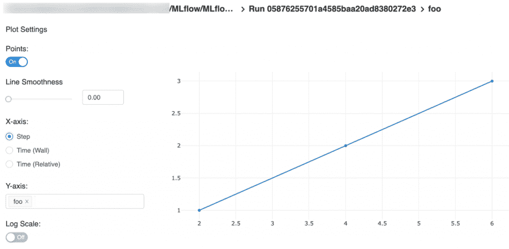

# Databricks MLflow 旨在简化机器学习管道的管理

> 原文：<https://thenewstack.io/databricks-mlflow-aims-to-simplify-management-of-machine-learning-pipelines/>

机器学习是这十年来最流行的技术之一。但是，随着越来越多的人接受和采用 ML，管理 ML 项目的复杂性也成比例地增加。

不像传统的软件开发，ML 是关于实验的。对于 ML 管道的每个阶段，都有大量的工具和开源项目可用。开发人员和数据科学家在选择最好的工具之前会尝试多种工具。模型的训练过程、超参数调整、评分和评估经常重复进行，直到结果令人满意。

开发、训练和推理环境需要在各种环境中一致地设置。从 Python 和 R 运行时到模块集合，每个环境都必须运行特定版本的语言、运行时、框架和工具。该环境应该在开发机器、数据中心中基于 CPU 的虚拟机以及公共云中由 GPU 支持的虚拟机之间保持一致。其中一个相关模块的微小版本差异会在培训和部署过程中造成巨大破坏。

来自 Databricks 的 MLflow 是一个解决这些挑战的开源框架。该项目旨在减轻配置环境、跟踪实验和部署训练模型进行推理的痛苦。

最近 Databricks 发布了 MLflow 1.0，可以用于主流用途。AWS 和 Azure 中也有 MLflow 项目的托管版本。

MLflow 可用于 Python 和 R 环境。该框架可以在 Linux、Mac 和 Windows 操作系统上通过一个 Python pip 命令轻松安装。一旦安装，该 API 可以很容易地与基于流行框架的现有和新的 ML 项目集成，这些框架包括 Scikit-learn、TensorFlow、Caffe2、PyTorch、MXNet、CNTK 和 ONNX。

MLflow 是三个组件的集合:跟踪、项目和模型。让我们仔细看看它们。

## 物流跟踪

MLflow 跟踪组件是一个 API 和 UI，用于在运行机器学习代码时记录训练参数、代码版本、指标和输出文件，并在以后可视化结果。它还附带了一个最小的用户界面，用于在一个仪表板中可视化指标。

跟踪 API 可以在 Python、R 和 Java 中使用。对于其他语言，有一个可以使用标准 HTTP 库调用的 REST API。

开发人员可以创建一个或多个单独运行的实验。每次运行都可以记录代码版本、开始和结束时间、源文件名、作为任意键/值对发送的指标，甚至数据集、序列化对象和训练模型等工件。

跟踪 API 可以将运行记录到本地文件、SQLAlchemy 兼容数据库或远程跟踪服务器。默认情况下，无论程序在哪里执行，MLflow Python API 日志都会在本地运行到 mlruns 目录中的文件中。通过配置 MLFLOW_TRACKING_URI，可以将日志发送到远程服务器。工件可以被重定向到远程对象存储和文件服务器，比如亚马逊 S3、Azure Storage、谷歌云存储、FTP、NFS 和 HDFS。

MLflow Tracking 是团队和个人开发人员比较和对比不同实验和运行结果的一个有价值的工具。

## MLflow 项目

MLflow 项目是打包可重用数据科学代码的标准声明格式。一个目录或 Github repo 可以包含一个带有环境定义的 YAML 文件。

该项目可能包含一个名为 MLProject 的文件，该文件有一个指向标准 conda.yaml 文件的指针。MLflow 依靠 Conda 创建一致且可重复的环境。在通过 conda.yaml 定义了依赖关系之后，项目文件还将包含一个入口点，该入口点通常是培训作业。

当通过 CLI 执行项目时，MLflow 首先配置 conda.yaml 中定义的 Conda 虚拟环境，然后激活该环境并执行入口点中提到的作业。这个过程可以在多个环境中重复，例如本地数据中心和公共云。

该项目还可以通过包含一个映像定义来构建为 Docker 容器映像，该映像定义将成为容器化环境的基础映像。每个项目文件还可能包含多个入口点，以创建多步骤工作流。当针对执行超参数调整的同一问题评估多个算法时，此功能非常有用。

MLflow 项目为数据科学和机器学习项目提供了一致、幂等和可重复的环境。

## ml 流程模型

MLflow 模型通过一致的模型服务机制简化了推理。它是包装机器学习模型的标准格式，可用于各种下游工具，如 Apache Spark。

每个 MLflow 模型都是一个包含任意文件的目录，以及该目录根目录中的一个 MLmodel 文件，该文件可以定义可以在其中查看模型的多种风格。这种风格与特定的框架相关联，例如 Scikit-learn。它还可以针对公共云中的 ML 平台，如 Amazon SageMaker 和 Azure ML。特定模型支持的所有风格都以 YAML 格式定义在它的 MLmodel 文件中。

MLflow 为从主流框架生成的模型提供了几种风格，包括 TensorFlow、Spark MLlib、PyTorch、Keras 和 ONNX。标准 Python 或 R 函数可用于基于 NumPy 或 Pandas 数据点执行推理。

MLflow 可以在本地将模型部署为本地 REST API 端点，或者直接对文件进行评分。此外，MLflow 可以用 REST API 端点将模型打包成自包含的 Docker 映像。该图像可用于将模型部署到各种环境，如 Kubernetes 和 Mesosphere。

MLflow Models API 提供了一种一致的机制来部署用于推理的模型。

在即将到来的一个教程中，我将向您介绍将 MLflow 与现有的机器学习项目集成在一起的步骤。敬请关注。

贾纳奇拉姆·MSV 的网络研讨会系列“机器智能和现代基础设施(MI2)”提供了涵盖前沿技术的信息丰富、见解深刻的会议。在 [http://mi2.live](http://mi2.live) 注册即将到来的 MI2 网络研讨会。

由**拍摄的特写图片**来自**像素。**

<svg xmlns:xlink="http://www.w3.org/1999/xlink" viewBox="0 0 68 31" version="1.1"><title>Group</title> <desc>Created with Sketch.</desc></svg>