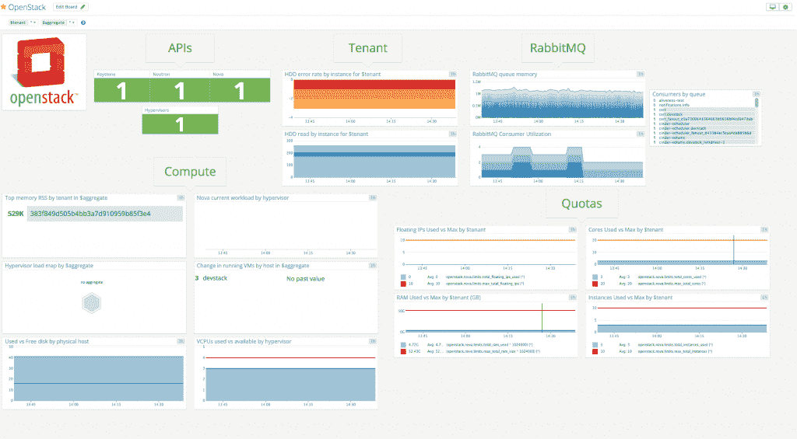

# Datadog Instruments OpenStack 用于更好的故障排除和性能管理

> 原文：<https://thenewstack.io/datadog-instruments-openstack-better-troubleshooting-performance-management/>

Datadog 扩展了其基于云的监控服务，因此它可以监控 OpenStack 的部署，以及在云托管软件上运行的应用程序。

“通过这种集成，您可以将 Datadog 的所有功能应用到您的 OpenStack 部署中，”Datadog 研究工程师 Evan Mouzakitis 在宣布更新的博客文章中写道。除了收集、可视化和聚合特定于 OpenStack 的指标之外，Datadog 还可以将指标与您的堆栈中的其他系统或软件相关联，就异常应用程序行为发出警报，自动检测异常值，等等

[Datadog](https://www.datadoghq.com/) 于 2010 年推出，利用 100 多个广泛使用的应用程序生成的运营数据，为[监控](https://thenewstack.io/datadog-kubecon-infrastructure/)面向网络和企业的应用程序提供服务，这些应用程序包括许多流行的服务器操作系统、数据库系统、应用程序、工具和服务。这些数据被收集到一个统一的视图中，然后可供管理员和开发人员用来排除故障、解决性能问题和加快部署周期。

Airbnb、网飞、EA、Spotify、华纳兄弟和 AdRoll 的网络规模运营都使用这项技术。该公司每天为其客户处理数千亿条记录。

借助最新发布的 5.6.1 版 Datadog 代理，用户现在可以捕获由 Nova(open stack 的计算控制器)和 Neutron(open stack 的网络管理模块)发出的指标。根据 Datadog 的说法，新的集成提供了对 OpenStack 所有层的可见性，包括以下能力:

*   调试 Nova、Neutron 和 Keystone APIs 中服务的性能和可用性控制平面问题。
*   发现和监控中子管理的虚拟机。
*   监控 Nova 虚拟机管理程序和可用计算资源。
*   允许管理员设置容量指标，如租户配额使用情况。

OpenStack 服务的一个早期用户是 Lithium Technologies，它是一家社交客户体验管理软件提供商。该公司运行 OpenStack 部署，Datadog 提供从底层基础架构到高层租户使用的指标。

“我们能够快速洞察使用模式，并积极应对任何潜在问题，”锂铅云平台工程师 Mike Tougeron 在一份声明中表示。“通过将当前使用情况与历史趋势进行比较，我们能够一目了然地为租户进行容量规划。”

当前的 Datadog 用户可以通过更新代理和对进行必要的配置更改来访问 OpenStack。该公司提供了[从 OpenStack 指标中获得最多](https://www.datadoghq.com/blog/openstack-monitoring-nova/)的文档。对于 Datadog 的新手来说，[公司为](https://app.datadoghq.com/signup)提供了为期两周的免费试用。

通过 Pixabay 的特征图像。

Datadog 是新堆栈的赞助商。

<svg xmlns:xlink="http://www.w3.org/1999/xlink" viewBox="0 0 68 31" version="1.1"><title>Group</title> <desc>Created with Sketch.</desc></svg>