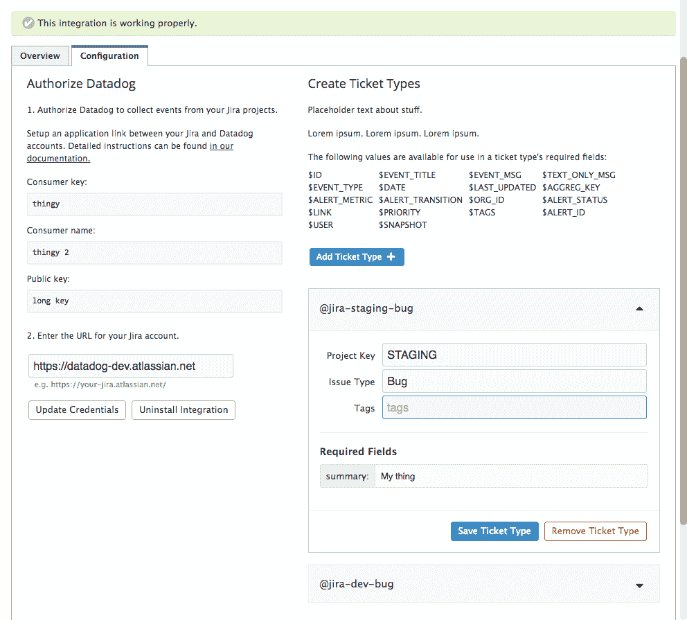

# Datadog 和吉拉将开发和运营部门与集成的问题跟踪结合起来

> 原文：<https://thenewstack.io/datadog-jira-bring-dev-ops-together-unified-issue-tracking/>

基础设施监控服务提供商 Datadog 最近[发布了与 Atlassian 的](https://docs.datadoghq.com/integrations/jira/)[吉拉](https://www.atlassian.com/software/jira)的新集成:一个管理软件开发过程的流行工具。我们联系了 [Datadog](https://www.datadoghq.com/) 产品经理 [Daniel Langer](https://www.linkedin.com/in/daniel-langer-84846548) 来了解更多关于这种整合以及 Datadog 服务的未来。

**对于那些可能还不了解 DataDog 的人，你会如何描述它**？

假设您在一个公共云、多个公共云或混合解决方案上。我们使您能够从各种产品中收集指标和事件数据，并将其存储在 Datadog 中。我们主要通过两种方式做到这一点。一种是通过位于虚拟机上的 Python 程序，将性能水平发送回 Datadog。我们也有 API 级别的集成，所以你可以与 AWS CloudWatch、Azure 和 Google 集成。

您可以从服务和平台获得 API 级别的指标数据。有了 Lambda 和 [Azure Functions](https://thenewstack.io/azure-functions-serverless-computing-handling-iot-devices/) 之类的东西，你就不会真的暴露一个虚拟机，但你还是想监控性能。我们还使您能够直接从您的代码向 Datadog 发送定制指标，使用[stat c](http://codewiki.wikidot.com/c:system-calls:stat)[系统调用]或 stat c 的一个分支向 Datadog 发送定制指标。

我们是基于时间序列的收集软件，因此我们会在所有这些不同的机器上从服务中及时同步您的数据，以便您可以在同一图表中、同一时间段内将指标重叠在彼此之上。你也可以在上面叠加事件来检查部署，这是一个 Github 推送。您可以看到事件是如何与指标相关联的，从而能够理解是什么导致了问题。

除了这些集成，我们还集成了第三方应用，如吉拉、Slack 和 Github。他们不太关心如何获得度量，而是更关心如何与工具集成。

**data dog 作为监控解决方案有何与众不同之处**？

使用动态基础架构是我们的一大优势。许多监控解决方案都是为静态环境构建的。

这种监控解决方案一直存在，他们现在试图宣称他们可以实现云，并处理这种现代基础架构的动态环境，但当你真正了解时，他们并不十分有效地监控这些高度动态的服务。我们有很多标记系统来标记这些东西。

**告诉我们你在吉拉的新整合**。

Datadog 的核心功能之一是我们的警报系统。您将警报设置为在基础架构中的几乎任何情况下触发。在您的指标上、在特定机器上、在事件发生时、在组合指标上或一组机器上，因为带有标记。

在这些警报中，您可以使用 Slack 之类的集成在警报触发时得到通知。现在我们有一个吉拉集成，允许您从这些数据狗警报自动创建吉拉票证。我们对此感到非常兴奋的原因是，它真的为吉拉使用 Datadog 的新方式打开了大门。

> 也许运营人员正在灭火，必须给开发部门发一封电子邮件，也许开发部门修复了错误，但是运营人员没有得到通知，他们在很短的时间内修复了错误。

传统上，吉拉是软件团队的强大工具，用于开发他们的敏捷过程，用于跟踪故事，你可以看到 [burndowns](http://www.agilenutshell.com/burndown) 。到目前为止，还没有一个很好的运营解决方案，如果有流程的话，可能是手动流程或从 data dog 向吉拉复制和粘贴警报。但是现在我们已经通过让你设置你的票并且让他们自动地用来自数据狗的信息创建来自动地跟踪进入吉拉的更大类型的问题的这个过程。

您可以详细查看您的基础架构，就在更传统的软件问题旁边，这有助于更好地协作，并有助于更好地了解您的基础架构和软件问题之间的关系，最终目标是减少停机时间并防止问题重复出现。

**作为一名负责生产服务正常运行的工程师，我注意到当停机发生时，很难创建适当的工单来确保问题得到正确跟踪。如果有一个能自动启动并管理我的票务工作流程的东西就好了。**

是的，没错。自动化是其中很重要的一部分，因为您已经通过设置阈值预先确定了什么看起来像是问题，所以当警报被触发时，它会自动为您创建吉拉卡，并使用您已经确定的相关信息填充它。所有这些都在开发人员使用的同一个工具中。

我们认为开发人员和运营人员紧密合作的想法必然是更快解决云中问题的更好方法。您可以将基础设施方面发生的事情以及它如何与软件相关联联系起来。不一定是两个世界分别运作。也许运营人员正在灭火，必须给开发部门发一封电子邮件，也许开发部门修复了错误，但是运营人员没有得到通知，他们在很短的时间内修复了错误。这是一种真正清理开发和运营之间所有中断的通信并更有效地跟踪这些问题的方法。

**我能否以编程方式指定谁接收票证，例如当前的待命工程师？或者说如果工程师 A 负责这一块基础设施，那么与之相关的所有票都要分配给那个工程师**？

我们确实有这样的懈怠。如果在某个环境中出现问题，它会被发送到您的空闲时间，这对于某些事情来说是好的，但对于跟踪来说却不是，这就是为什么吉拉的公告令人兴奋的原因。我们让您动态填充所有字段，其中一个可以是分配字段。您可以用某个特定的人来填充它，也可以在服务器所属的人的名字触发警报时生成它。

*对于那些有兴趣了解更多关于将吉拉与 Datadog 集成的人，Datadog HQ 博客上有一篇很棒的文章[，这是一篇关于在您的项目中实现集成的很好的教程。](https://www.datadoghq.com/blog/jira-issue-tracking/)*

通过 Pixabay 的特征图像。

<svg xmlns:xlink="http://www.w3.org/1999/xlink" viewBox="0 0 68 31" version="1.1"><title>Group</title> <desc>Created with Sketch.</desc></svg>