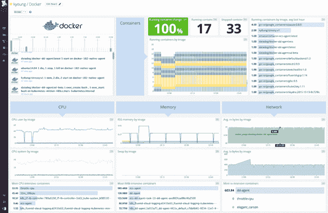
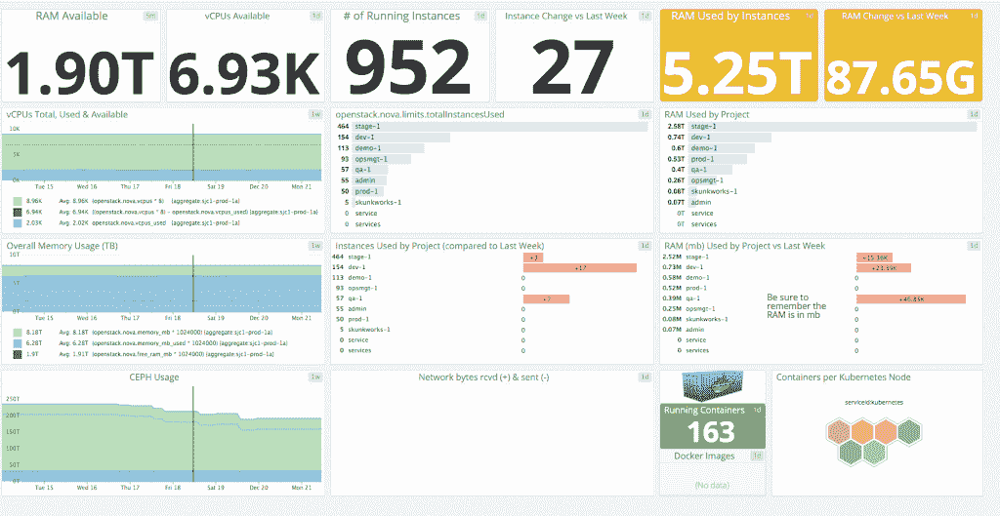
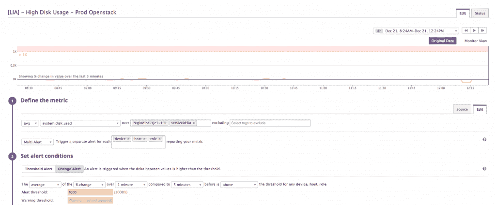

# Datadog 如何监控可扩展系统

> 原文：<https://thenewstack.io/datadog-monitors-scalable-systems/>

随着应用程序监控和容器监控的不断发展，企业发现自己面临着过去可能没有考虑过的问题。随着系统变得越来越复杂，为监控系统运行状况而部署的解决方案的可扩展性和可用性，在与其配对的系统的整体可扩展性和可用性方面，必须至少达到同等水平。随着越来越多的公司从内部解决方案转向完全在云中工作，动态扩展变得至关重要。无论是与 Kubernetes 合作、自动扩展还是通过另一个平台—系统监控平台也必须扩展以满足这些需求。

[Datadog](https://www.datadoghq.com/) 是一个诞生于云端的监控平台。因此，它了解公司在扩展应用程序时面临的挑战，并设计了解决方案来应对这些挑战。Datadog 的技术社区总监 Ilan Rabinovitch 说，Datadog 通过“将相关的监控和集成直接构建到我们的平台中”将这些知识传递给客户。“这意味着提供与我们为客户监控的基础架构一样动态配置的工具和警报，从数百个云平台和开源工具中收集现成的指标，并通过异常值检测等方法提供智能算法警报。”

## 按比例操作

当首先研究应用程序性能监控时，公司应该首先考虑他们想要收集的数据类型，并确定组织的主要关注点是什么。Rabinovitch 指出，对于任何有兴趣建立监控平台的组织来说，这都应该是主要的关注点。

拉比诺维奇说:“虽然知道给定集群的 CPU 或内存使用量可能高于正常水平可能很有意思，但是向你的团队报告资源使用情况是导致寻呼机疲劳的第一步。”。

Datadog 建议团队关注他们所谓的“工作指标”，即通过测量有用的输出来描述一个人的系统的顶级健康状况。一个组织所定义的有用指标将根据所服务的用例和客户群而有所不同。

使用 Datadog 大规模运行的码头工人仪表盘

Rabinovitch 提供了一个例子，如果一个组织是基于 web 服务的，那么“有用的输出”可能是指成功返回 API 调用、每秒处理的请求或其他度量的百分比。这些统计数据无疑比资源级警报更有助于提醒团队注意，因为它们清楚地表明了公司是否在毫无问题地为客户提供服务。

## 一切正常

Datadog 已经被大大小小的组织采用，尽管它最近被 Lithium 用来监控 OpenStack 和 [Kubernetes](http://kubernetes.io/) 集群以及部署在这些集群之上的应用程序。 [Lithium 使用 OpenStack](https://www.datadoghq.com/blog/how-lithium-monitors-openstack/) 不仅拼凑其生产和开发环境，还为其销售工程师拼凑其生产社区和演示环境。因此，Lithium 求助于 Datadog 来帮助它全天候监控 [OpenStack](https://www.openstack.org/) 。通过 Datadog，他们能够看到正在运行的实例总数、可用内存、指标增量等等。

在 Lithium 中监控 OpenStack 的 Datadog 仪表板

随着它继续被用于支持开源项目和平台，Datadog 还与 [Apache 软件基金会](https://www.datadoghq.com/blog/monitoring-apache-software-foundation-with-datadog/)合作，帮助非营利组织识别和解决其托管提供商的容量问题。随着 AWS、Kubernetes 和 Mesos 等云提供商上自动扩展主机的出现，环境处于不断变化的状态。

Rabinovitch 说:“这种不断的变化增加了操作的复杂性，并且很难使用预定义的阈值来警告异常，因为正常情况每分钟都在变化。”

为了更好地解读现代堆栈的使用和频率，Datadog 最近对 Docker 的使用和采用进行了一项研究，发现大多数主机倾向于同时运行大约四个容器。每个容器的寿命不到其主机寿命的四分之一，这意味着监控工具不应再将单个主机作为主要测量单位。Rabinovitch 指出，Datadog 跨系统边界进行监控，异常检测可以帮助用户通过算法检测任何异常，而不是依赖预设的阈值。

## 在后台

像许多其他软件服务提供商一样，Datadog 的团队已经接受了多语言的方式，尽管 Rabinovitch 指出“我们的大部分后端系统是用 GoLang 或 Python 编写的。也就是说，我们倾向于为工作选择合适的工具，因此技术可能会因团队而有所不同。”

在数据层，Datadog 与 Cassandra、PostgreSQL、Redis 和 Kafka 等商店合作。Datadog 还利用了一系列自主开发的专有系统，包括为其部分时间序列数据开发的定制数据库。

“我们大量使用 Chef 和[consult](https://www.consul.io/)来管理我们的应用程序部署和服务配置。运行在最终用户系统上收集指标的 Datadog 代理基于 python。我们通过 Github 将代理作为开源软件发布，”Rabinovitch 说。在收集指标时，Datadog 通过在用户实例或服务器上本地运行的代理来完成。然后，用户可以通过使用代理检查向代理提交指标，然后能够从其他第三方服务(如 MySQL、Docker 或 Cassandra)获取指标。

数据狗中的锂警报仪表板

或者，开发人员可以使用内置在 Datadog 代理中的 [statsd forwarder](https://docs.datadoghq.com/guides/dogstatsd/) 向 Datadog 提交自定义指标，或者通过大多数通用语言(Python、Ruby、.NET、Java 等)。然后，他们将依次存储这些度量，以便团队可以可视化和共享数据。Rabinovitch 指出，这包括可视化仪表板、关于服务健康的警报以及具有异常值检测等功能的分析。

无论您的团队是希望开始系统监控，还是目前处于领先地位，Datadog 都能为任何希望深入了解整个系统指标的团队提供可靠的解决方案。

<svg xmlns:xlink="http://www.w3.org/1999/xlink" viewBox="0 0 68 31" version="1.1"><title>Group</title> <desc>Created with Sketch.</desc></svg>