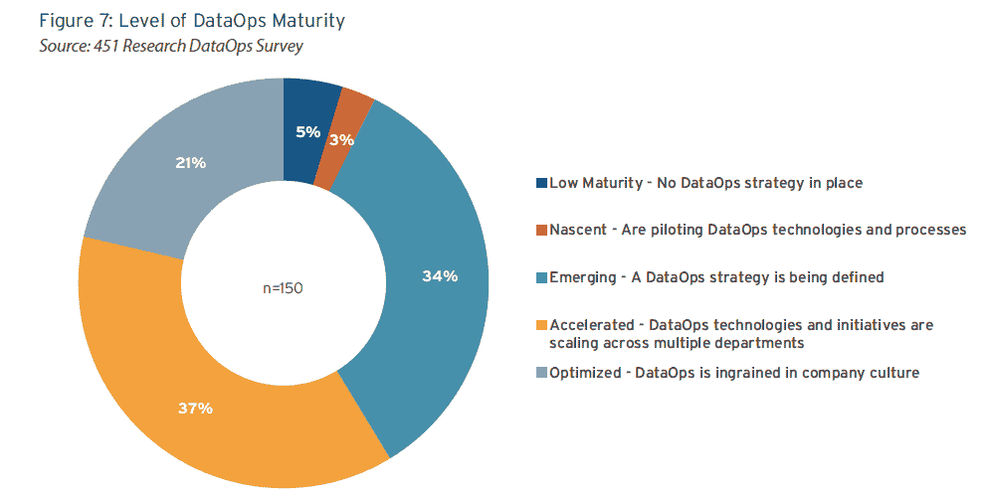
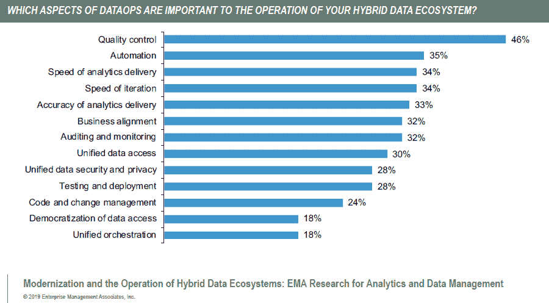
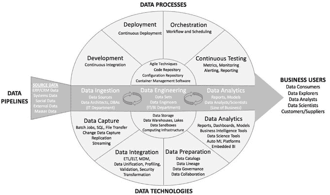

# 数据操作和“操作”术语的问题

> 原文：<https://thenewstack.io/dataops-and-the-problem-with-ops-terminology/>

几乎所有关于如何处理 IT 操作的趋势都有一个“Ops”的绰号: [DevOps](/category/devops/) 、 [DevSecOps](/automation-security-sdlc/) 、 [AIOps](/what-is-aiops-and-why-you-should-care/) 、MLOps、 [GitOps](/gitops-kubernetes-devops-iteration-focused-declarative-infrastructure/) 、NoOps、 [FinOps](/cloud-hangover-getting-a-grip-on-cloud-costs/) 等等。我们全心全意地相信，这些术语中的许多解释了真实的现象。然而，与 DataOps 的情况一样，急于重塑现有产品的品牌混淆了这些趋势的发展程度。

虽然有[的区别](https://medium.com/data-ops/dataops-is-not-just-devops-for-data-6e03083157b7)，但其核心 [DataOps](https://thenewstack.io/delving-dataops-matters/) 是应用于数据操作的 DevOps 流程。数据管道的自动化和团队间的协作是“现代”数据操作的两个关键特征。然而，多年来，管理数据库和其他数据平台一直是 IT 部门的核心职责。如果不能就数据运营的含义达成共识，市场将会混乱不堪。这里有一些研究可能被用来夸大这一趋势的重要性。

我们震惊地看到 90%的企业都在使用 DataOps，因此我们更深入地研究了基础的 451 研究报告，该报告基于由 [Delphix](https://www.delphix.com) 赞助的一项调查。该研究实际上表明，89%的受访者预计将增加数据运营技术的支出、投资或开发。然而，这项研究提供了一个面向过程的 DataOps 定义，允许任何公司说其产品或服务是 DataOps 技术。该报告调查了 150 名北美组织的代表，这些组织拥有 1，000 多名员工，管理着至少 2pb 的数据，他们对组织的数据管理战略有着深刻的理解。

根据该样本，71%的公司已经达到了数据运营成熟度。就像几年前的 DevOps 一样，似乎大多数大型企业都认为他们正在进行数据操作，但成熟度可能被大大夸大了。

来源:“数据运营为敏捷性、安全性和转型变革奠定基础”，由德尔福委托 451 Research 完成。出于调查目的，DataOps 被定义为“人员、流程和技术的结合，以实现更加敏捷和自动化的数据管理方法。它旨在提供更轻松的数据访问，以满足数据供应链中各利益相关方(开发人员、数据科学家、业务分析师、DevOps 专业人员等)的需求。)以支持广泛的使用案例。”

由 [Nexla](https://www.nexla.com) 委托进行的一项 2018 [关于“数据专业人士”的研究](https://www.nexla.com/data-operations-survey-2018/)中也使用了对数据操作的过于宽泛的定义，该研究发现，73%的受访者公司计划雇佣一些人来帮助数据操作。不幸的是，该研究没有区分数据库管理员、数据工程师、存储专业人员或其他各种职位。雇佣更多的数据管理员来支持像业务分析师这样的前端用户似乎是组织自动化和扩展的失败，证明了对数据运营的需求而不是其使用。

企业管理协会[的一项调查](https://www.stonebranch.com/resources/research-report-from-ematm-on-hybrid-data-ecosystems/)发现，对于集成多个数据平台的数据生态系统的运营而言，质量控制是 DataOps 的首要方面。质量控制是如何定义的，谁也说不准。自动化是第二重要的，接下来是一长串人们认为与数据操作相关的功能。这只是猜测，但我们相信，填写调查受访者的 It 和业务分析师中，很少有人会想到 MLOps(机器学习操作)。

来源:企业管理协会研究，由 [Stonebranch](https://www.stonebranch.com/resources/research-report-from-ematm-on-hybrid-data-ecosystems/) 提供。

新的 Stack 和 Lightbend 的数据流处理研究涉及数据管道。尽管我们的大多数受访者是开发人员或架构师，但 43 名数据工程师和数据科学家确实向我们讲述了他们使用持续集成和部署(CI/CD)工具来部署机器学习应用程序、模型或系统的经验。尽管基于一个小样本，68%的人说他们至少有些经验。

来源:埃克森集团。该图显示了 DataOps 企业解决方案的组件。许多具体技术的例子可以在数据厨房的[这篇文章](https://medium.com/data-ops/the-dataops-enterprise-software-industry-2019-a862904857ef)中找到。

Lightbend 是新堆栈的赞助商。

通过 Pixabay 的特征图像。

<svg xmlns:xlink="http://www.w3.org/1999/xlink" viewBox="0 0 68 31" version="1.1"><title>Group</title> <desc>Created with Sketch.</desc></svg>